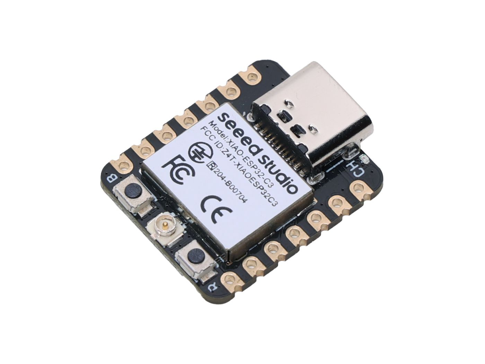

=========================
Seeed Studio XIAO ESP32C3
=========================

The `Seeed Studio XIAO ESP32C3 <https://wiki.seeedstudio.com/xiao_esp32c3_getting_started/>`_ is a general purpose board supplied by
Seeed Studio and it is compatible with the Espressif ESP32C3 ecosystem, sharing the same MCU as ESP32-C3-DevKitC.

Features
========

* 32­bit RISC­-V single ­core processor that operates at up to 160 MHz
* 400KB of SRAM, and 4MB of on-board flash memory
* USB Type-C interface
* Wireless: Complete 2.4GHz Wi-Fi subsystem;
* BLE: Bluetooth 5.0, Bluetooth mesh
* 1x UART, 1x I2C, 1x SPI,11x GPIO(PWM), 4x ADC
* 1 RESET button, 1 BOOT button

NSH Console
===========

The NuttShell (NSH) console is available over USB using the CDC/ACM
serial interface. To access the console, connect via a terminal emulator
at 115200 baud, 8 data bits, no parity, and 1 stop bit (115200-8N1).

Buttons
=======

The RESET and BOOT buttons can be used to enter "Bootloader" mode by
press and hold the BOOT key while powering up and then press the RESET key once.

Pin Mapping
===========
Pads numbered anticlockwise from USB connector.

===== ========== ==========
Pad   Signal     Notes
===== ========== ==========
0     GPIO02     D0/A0
1     GPIO03     D1/A1
2     GPIO04     D2/A2
3     GPIO05     D3/A3
4     GPIO06     D4/SDA
5     GPIO07     D5/SCL
6     GPIO21     D6/Default TX for UART0 serial console
7     GPIO20     D7/Default RX for UART0 serial console
8     GPIO08     D8/SCK
9     GPIO09     D9/MISO
10    GPIO10     D10/MOSI
11    3V3        Power output to peripherals
12    Ground
13    VIN        +5V Supply to board
===== ========== ==========

Power Supply
============
The working voltage of the MCU is 3.3V. Voltage input connected to
general I/O pins may cause chip damage if it’s higher than 3.3V.

Installation
============

1. Configure and build NuttX:

.. code-block:: console

  $ git clone https://github.com/apache/nuttx.git nuttx
  $ git clone https://github.com/apache/nuttx-apps.git apps
  $ cd nuttx
  $ make distclean
  $ ./tools/configure.sh xiao-esp32c3:usbnsh
  $ make V=1

2. Connect the Seeed Studio XIAO ESP32C3, and enter "Bootloader" mode,
then, flash the ``nuttx.hex`` file using ``esptool``:
(https://docs.espressif.com/projects/esptool/en/latest/esp32/)

Example command:

.. code-block:: bash

    make flash ESPTOOL_PORT=/dev/ttyACM0 ESPTOOL_BINDIR=./

Configurations
==============

nsh
---

Basic NuttShell configuration using serial (console enabled in UART0, exposed via
pins D6/TX and D7/RX, at 115200 bps).

usbnsh
------
Basic NuttShell configuration using CDC/ACM serial (console enabled in USB Port,
at 115200 bps).

.. code-block:: console

  NuttShell (NSH) NuttX-12.8.0
  nsh> uname -a
  NuttX 12.8.0 2c845426da-dirty Apr  6 2025 22:53:57 xtensa esp32c3-xiao

gpio
----
This configuration enabled NuttShell via USB and enabled gpio example.

Testing gpios:

========   ======   ==========
PIN/GPIO    Mode      Device
========   ======   ==========
D0/GPIO2   Output   /dev/gpio0
D1/GPIO3   Input    /dev/gpio1
========   ======   ==========

.. code-block:: console

  nsh> gpio -o 1 /dev/gpio0
  Driver: /dev/gpio0
    Output pin:    Value=1
    Writing:       Value=1
    Verify:        Value=1
  nsh> 
  nsh> gpio -o 0 /dev/gpio0
  Driver: /dev/gpio0
    Output pin:    Value=1
    Writing:       Value=0
    Verify:        Value=0
  nsh> gpio -w 1 /dev/gpio1
  Driver: /dev/gpio1
    Interrupt pin: Value=0
    Verify:        Value=1

wifi
----
This configuration enables a wlan network interface that can be configured and initialized 
using below commands::

    nsh> ifup wlan0
    nsh> wapi psk wlan0 mypasswd 3
    nsh> wapi essid wlan0 myssid 1
    nsh> renew wlan0

In this case a connection to AP with SSID ``myssid`` is done, using ``mypasswd`` as
password. IP address is obtained via DHCP using ``renew`` command. You can check
the result by running ``ifconfig`` afterwards.

.. code-block:: console

  NuttShell (NSH) NuttX-12.8.0
  nsh> uname -a
  NuttX  12.9.0 6b4bc72626-dirty Apr 26 2025 17:40:37 risc-v esp32c3-xiao
  nsh> ?
  help usage:  help [-v] [<cmd>]
  
      .           cp          expr        pkill       pwd         uname       
      [           cmp         false       ls          rm          umount      
      ?           dirname     fdinfo      mkdir       rmdir       unset       
      alias       date        free        mkrd        set         uptime      
      unalias     df          help        mount       sleep       usleep      
      arp         dmesg       hexdump     mv          source      watch       
      basename    echo        ifconfig    nslookup    test        xd          
      break       env         ifdown      pidof       time        wait        
      cat         exec        ifup        printf      true        
      cd          exit        kill        ps          truncate    
  
  Builtin Apps:
      dd           getprime     ostest       rand         sh           
      dumpstack    nsh          ping         renew        wapi         
  nsh> wapi psk wlan0 nuttxpwd 3
  nsh> wapi essid wlan0 nuttxnw 1
  nsh> renew wlan0
  nsh> ifconfig
  wlan0   Link encap:Ethernet HWaddr a0:85:e3:0e:4a:30 at RUNNING mtu 576
          inet addr:192.168.59.144 DRaddr:192.168.59.134 Mask:255.255.255.0
  
  nsh> ping 8.8.8.8
  PING 8.8.8.8 56 bytes of data
  56 bytes from 8.8.8.8: icmp_seq=0 time=50.0 ms
  56 bytes from 8.8.8.8: icmp_seq=1 time=40.0 ms
  56 bytes from 8.8.8.8: icmp_seq=2 time=30.0 ms
  56 bytes from 8.8.8.8: icmp_seq=3 time=60.0 ms
  56 bytes from 8.8.8.8: icmp_seq=4 time=100.0 ms
  56 bytes from 8.8.8.8: icmp_seq=5 time=100.0 ms
  56 bytes from 8.8.8.8: icmp_seq=6 time=140.0 ms
  56 bytes from 8.8.8.8: icmp_seq=7 time=40.0 ms
  56 bytes from 8.8.8.8: icmp_seq=8 time=50.0 ms
  56 bytes from 8.8.8.8: icmp_seq=9 time=30.0 ms
  10 packets transmitted, 10 received, 0% packet loss, time 10100 ms
  rtt min/avg/max/mdev = 30.000/64.000/140.000/34.985 ms
  nsh> nslookup google.com
  Host: google.com Addr: 142.251.128.238
  nsh> nslookup nuttx.apache.org
  Host: nuttx.apache.org Addr: 151.101.2.132
  nsh> 

ble
---
This configuration is used to enable the Bluetooth Low Energy (BLE) of
ESP32-C3 chip.

.. code-block:: console

  NuttShell (NSH) NuttX-12.8.0
  nsh> bt bnep0 scan start
  nsh> bt bnep0 scan stop
  nsh> bt bnep0 scan get
  Scan result:
   1.     addr:            a0:46:5a:22:ea:c4 type: 0
          rssi:            -92
          response type:   0
          advertiser data: 02 01 02 19 16 f1 fc 04 f9 6e e8 58 e6 33 58 26                         c5 4b bd 91 1c e0 4f b2 d9 51 455
   2.     addr:            a0:46:5a:22:ea:c4 type: 0
          rssi:            -91
          response type:   0
          advertiser data: 02 01 02 19 16 f1 fc 04 f9 6e e8 58 e6 33 58 26                         c5 4b bd 91 1c e0 4f b2 d9 51 455
   3.     addr:            a0:46:5a:22:ea:c4 type: 0
          rssi:            -100
          response type:   0
          advertiser data: 02 01 02 19 16 f1 fc 04 f9 6e e8 58 e6 33 58 26                         c5 4b bd 91 1c e0 4f b2 d9 51 455
   4.     addr:            a0:46:5a:22:ea:c4 type: 0
          rssi:            -100
          response type:   4
          advertiser data:
   5.     addr:            a0:46:5a:22:ea:c4 type: 0
          rssi:            -97
          response type:   0
          advertiser data: 02 01 02 19 16 f1 fc 04 f9 6e e8 58 e6 33 58 26        

