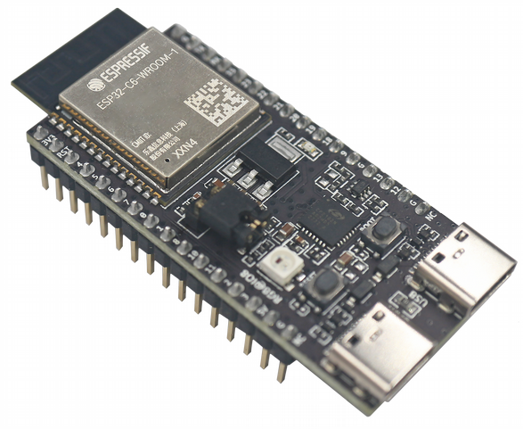
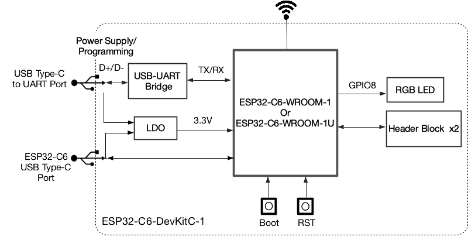
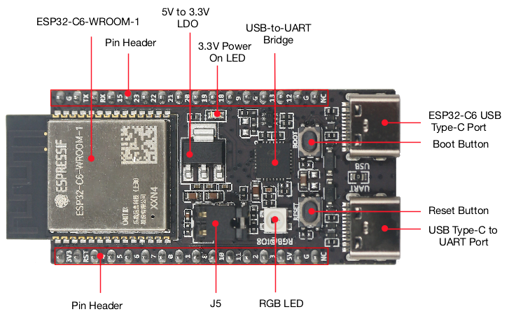
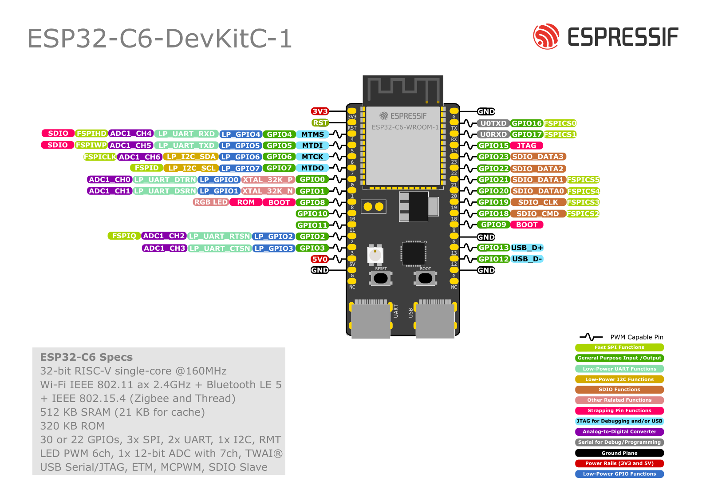

==================
ESP32-C6-DevKitC-1
==================

ESP32-C6-DevKitC-1 is an entry-level development board based on ESP32-C6-WROOM-1(U),
a general-purpose module with a 8 MB SPI flash. This board integrates complete Wi-Fi,
Bluetooth LE, Zigbee, and Thread functions. You can find the board schematic
`here <https://espressif-docs.readthedocs-hosted.com/projects/esp-dev-kits/en/latest/_static/esp32-c6-devkitc-1/schematics/esp32-c6-devkitc-1-schematics_v1.2.pdf>`_.

Most of the I/O pins are broken out to the pin headers on both sides for easy interfacing.
Developers can either connect peripherals with jumper wires or mount ESP32-C6-DevKitC-1 on
a breadboard.

    ESP32-C6-DevKitC-1 Board Layout

The block diagram below presents main components of the ESP32-C6-DevKitC-1.

    ESP32-C6-DevKitC-1 Electrical Block Diagram

Hardware Components
-------------------

    ESP32-C6-DevKitC-1 Hardware Components

Buttons and LEDs
================

Board Buttons
--------------
There are two buttons labeled Boot and RST. The RST button is not available
to software. It pulls the chip enable line that doubles as a reset line.

The BOOT button is connected to IO9. On reset it is used as a strapping
pin to determine whether the chip boots normally or into the serial
bootloader. After reset, however, the BOOT button can be used for software
input.

Board LEDs
----------

There is one on-board LED that indicates the presence of power.
Another WS2812 LED is connected to GPIO8 and is available for software.

Current Measurement
===================

The J5 headers on the ESP32-C6-DevKitC-1 can be used for measuring the current
drawn by the ESP32-C6-WROOM-1(U) module:

    - Remove the jumper: Power supply between the module and peripherals on the
      board is cut off. To measure the module's current, connect the board with an
      ammeter via J5 headers;
    - Apply the jumper (factory default): Restore the board's normal functionality.

.. note::
    When using 3V3 and GND pin headers to power the board, please remove the J5 jumper,
    and connect an ammeter in series to the external circuit to measure the module's current.

Pin Mapping
===========

    ESP32-C6-DevKitC-1 Pin Layout

Configurations
==============

All of the configurations presented below can be tested by running the following commands::

    $ ./tools/configure.sh esp32c6-devkitc:<config_name>
    $ make flash ESPTOOL_PORT=/dev/ttyUSB0 -j

Where <config_name> is the name of board configuration you want to use, i.e.: nsh, buttons, wifi...
Then use a serial console terminal like ``picocom`` configured to 115200 8N1.

adc
---

The ``adc`` configuration enables the ADC driver and the ADC example application.
ADC Unit 1 is registered to ``/dev/adc0`` with channels 0, 1, 2 and 3 enabled by default.
Currently, the ADC operates in oneshot mode.

More ADC channels can be enabled or disabled in ``ADC Configuration`` menu.

This example shows channels 0 and 1 connected to 3.3 V and channels 2 and 3 to GND (all readings
show in units of mV)::

    nsh> adc -n 1
    adc_main: g_adcstate.count: 1
    adc_main: Hardware initialized. Opening the ADC device: /dev/adc0
    Sample:
    1: channel: 0 value: 3611
    2: channel: 1 value: 3611
    3: channel: 2 value: 103
    4: channel: 3 value: 104

bmp180
------

This configuration enables the use of the BMP180 pressure sensor over I2C.
You can check that the sensor is working by using the ``bmp180`` application::

    nsh> bmp180
    Pressure value = 91531
    Pressure value = 91526
    Pressure value = 91525

capture
--------

The capture configuration enables the capture driver and the capture example, allowing
the user to measure duty cycle and frequency of a signal. Default pin is GPIO 18 with
an internal pull-up resistor enabled. When connecting a 50 Hz pulse with 50% duty cycle,
the following output is expected::

    nsh> cap
    cap_main: Hardware initialized. Opening the capture device: /dev/capture0
    cap_main: Number of samples: 0
    pwm duty cycle: 50 %
    pwm frequency: 50 Hz
    pwm duty cycle: 50 %
    pwm frequency: 50 Hz

coremark
--------

This configuration sets the CoreMark benchmark up for running on the maximum
number of cores for this system. It also enables some optimization flags and
disables the NuttShell to get the best possible score.

.. note:: As the NSH is disabled, the application will start as soon as the
  system is turned on.

efuse
-----

This configuration demonstrates the use of the eFuse driver. It can be accessed
through the ``/dev/efuse`` device file.
Virtual eFuse mode can be used by enabling `CONFIG_ESPRESSIF_EFUSE_VIRTUAL`
option to prevent possible damages on chip.

The following snippet demonstrates how to read MAC address:

.. code-block:: C

   int fd;
   int ret;
   uint8_t mac[6];
   struct efuse_param_s param;
   struct efuse_desc_s mac_addr =
   {
     .bit_offset = 1,
     .bit_count = 48
   };

   const efuse_desc_t* desc[] =
   {
       &mac_addr,
       NULL
   };
   param.field = desc;
   param.size = 48;
   param.data = mac;

   fd = open("/dev/efuse", O_RDONLY);
   ret = ioctl(fd, EFUSEIOC_READ_FIELD, &param);

To find offset and count variables for related eFuse,
please refer to Espressif's Technical Reference Manuals.

gpio
----

This is a test for the GPIO driver. It uses GPIO1 and GPIO2 as outputs and
GPIO9 as an interrupt pin.

At the nsh, we can turn the outputs on and off with the following::

    nsh> gpio -o 1 /dev/gpio0
    nsh> gpio -o 1 /dev/gpio1

    nsh> gpio -o 0 /dev/gpio0
    nsh> gpio -o 0 /dev/gpio1

We can use the interrupt pin to send a signal when the interrupt fires::

    nsh> gpio -w 14 /dev/gpio2

The pin is configured as a rising edge interrupt, so after issuing the
above command, connect it to 3.3V.

To use dedicated gpio for controlling multiple gpio pin at the same time
or having better response time, you need to enable
`CONFIG_ESPRESSIF_DEDICATED_GPIO` option. Dedicated GPIO is suitable
for faster response times required applications like simulate serial/parallel
interfaces in a bit-banging way.
After this option enabled GPIO4 and GPIO5 pins are ready to used as dedicated GPIO pins
as input/output mode. These pins are for example, you can use any pin up to 8 pins for
input and 8 pins for output for dedicated gpio.
To write and read data from dedicated gpio, you need to use
`write` and `read` calls.

The following snippet demonstrates how to read/write to dedicated GPIO pins:

.. code-block:: C

    int fd; = open("/dev/dedic_gpio0", O_RDWR);
    int rd_val = 0;
    int wr_mask = 0xffff;
    int wr_val = 3;

    while(1)
      {
        write(fd, &wr_val, wr_mask);
        if (wr_val == 0)
          {
            wr_val = 3;
          }
        else
          {
            wr_val = 0;
          }
        read(fd, &rd_val, sizeof(uint32_t));
        printf("rd_val: %d", rd_val);
      }

i2c
---

This configuration can be used to scan and manipulate I2C devices.
You can scan for all I2C devices using the following command::

    nsh> i2c dev 0x00 0x7f

To use slave mode, you can enable `ESPRESSIF_I2C0_SLAVE_MODE` option.
To use slave mode driver following snippet demonstrates how write to i2c bus
using slave driver:

.. code-block:: C

   #define ESP_I2C_SLAVE_PATH  "/dev/i2cslv0"
   int main(int argc, char *argv[])
     {
       int i2c_slave_fd;
       int ret;
       uint8_t buffer[5] = {0xAA};
       i2c_slave_fd = open(ESP_I2C_SLAVE_PATH, O_RDWR);
       ret = write(i2c_slave_fd, buffer, 5);
       close(i2c_slave_fd);
    }

i2schar
-------

This configuration enables the I2S character device and the i2schar example
app, which provides an easy-to-use way of testing the I2S peripheral,
enabling both the TX and the RX for those peripherals.

**I2S pinout**

============ ========== =========================================
ESP32-C3 Pin Signal Pin Description
============ ========== =========================================
0            MCLK       Master Clock
4            SCLK       Bit Clock (SCLK)
5            LRCK       Word Select (LRCLK)
18           DOUT       Data Out
19           DIN        Data In
============ ========== =========================================

After successfully built and flashed, run on the boards's terminal::

    nsh> i2schar

motor
-------

The motor configuration enables the MCPWM peripheral with support to brushed DC motor
control.

It creates a ``/dev/motor0`` device with speed and direction control capabilities
by using two GPIOs (GPIO21 and GPIO22) for PWM output. PWM frequency is configurable
from 25 Hz to 3 kHz, however it defaults to 1 kHz.
There is also support for an optional fault GPIO (defaults to GPIO9), which can be used
for quick motor braking. All GPIOs are configurable in ``menuconfig``.

mcuboot_nsh
--------------------

This configuration is the same as the ``nsh`` configuration, but it generates the application
image in a format that can be used by MCUboot. It also makes the ``make bootloader`` command to
build the MCUboot bootloader image using the Espressif HAL.

nsh
---

Basic configuration to run the NuttShell (nsh).

ostest
------

This is the NuttX test at ``apps/testing/ostest`` that is run against all new
architecture ports to assure a correct implementation of the OS.

pwm
---

This configuration demonstrates the use of PWM through a LED connected to GPIO8.
To test it, just execute the ``pwm`` application::

    nsh> pwm
    pwm_main: starting output with frequency: 10000 duty: 00008000
    pwm_main: stopping output

qencoder
---

This configuration demonstrates the use of Quadrature Encoder connected to pins
GPIO10 and GPIO11. You can start measurement of pulses using the following
command (by default, it will open ``\dev\qe0`` device and print 20 samples
using 1 second delay)::

    nsh> qe

rmt
---

This configuration configures the transmitter and the receiver of the
Remote Control Transceiver (RMT) peripheral on the ESP32-C6 using GPIOs 8
and 2, respectively. The RMT peripheral is better explained
`here <https://docs.espressif.com/projects/esp-idf/en/latest/esp32c6/api-reference/peripherals/rmt.html>`__,
in the ESP-IDF documentation. The minimal data unit in the frame is called the
RMT symbol, which is represented by ``rmt_item32_t`` in the driver:

The example ``rmtchar`` can be used to test the RMT peripheral. Connecting
these pins externally to each other will make the transmitter send RMT items
and demonstrates the usage of the RMT peripheral::

    nsh> rmtchar

**WS2812 addressable RGB LEDs**

This same configuration enables the usage of the RMT peripheral and the example
``ws2812`` to drive addressable RGB LEDs::

    nsh> ws2812

Please note that this board contains an on-board WS2812 LED connected to GPIO8
and, by default, this config configures the RMT transmitter in the same pin.

rtc
---

This configuration demonstrates the use of the RTC driver through alarms.
You can set an alarm, check its progress and receive a notification after it expires::

    nsh> alarm 10
    alarm_daemon started
    alarm_daemon: Running
    Opening /dev/rtc0
    Alarm 0 set in 10 seconds
    nsh> alarm -r
    Opening /dev/rtc0
    Alarm 0 is active with 10 seconds to expiration
    nsh> alarm_daemon: alarm 0 received

sdm
---

This configuration enables the support for the Sigma-Delta Modulation (SDM) driver
which can be used for LED dimming, simple dac with help of an low pass filter either
active or passive and so on. ESP32-C6 supports 1 group of SDM up to 4 channels with
any GPIO up to user. This configuration enables 1 channel of SDM on GPIO5. You can test
DAC feature with following command with connecting simple LED on GPIO5

    nsh> dac -d 100 -s 10 test

After this command you will see LED will light up in different brightness.

spi
--------

This configuration enables the support for the SPI driver.
You can test it by connecting MOSI and MISO pins which are GPIO7 and GPIO2
by default to each other and running the ``spi`` example::

    nsh> spi exch -b 2 "AB"
    Sending:	AB
    Received:	AB

If SPI peripherals are already in use you can also use bitbang driver which is a
software implemented SPI peripheral by enabling `CONFIG_ESPRESSIF_SPI_BITBANG`
option.

spiflash
--------

This config tests the external SPI that comes with the ESP32-C6 module connected
through SPI1.

By default a SmartFS file system is selected.
Once booted you can use the following commands to mount the file system::

    nsh> mksmartfs /dev/smart0
    nsh> mount -t smartfs /dev/smart0 /mnt

sta_softap
----------

With this configuration you can run these commands to be able
to connect your smartphone or laptop to your board::

  nsh> ifup wlan1
  nsh> dhcpd_start wlan1
  nsh> wapi psk wlan1 mypasswd 3
  nsh> wapi essid wlan1 nuttxap 1

In this case, you are creating the access point ``nuttxapp`` in your board and to
connect to it on your smartphone you will be required to type the password ``mypasswd``
using WPA2.

.. tip:: Please refer to :ref:`ESP32 Wi-Fi SoftAP Mode <esp32_wi-fi_softap>`
  for more information.

The ``dhcpd_start`` is necessary to let your board to associate an IP to your smartphone.

timer
-----

This config test the general use purpose timers. It includes the 4 timers,
adds driver support, registers the timers as devices and includes the timer
example.

To test it, just run the following::

  nsh> timer -d /dev/timerx

Where x in the timer instance.

twai
----

This configuration enables the support for the TWAI (Two-Wire Automotive Interface) driver.
You can test it by connecting TWAI RX and TWAI TX pins which are GPIO0 and GPIO2 by default
to an external transceiver or connecting TWAI RX to TWAI TX pin by enabling
the `CONFIG_CAN_LOOPBACK` option (``Device Drivers -> CAN Driver Support -> CAN loopback mode``)
and running the ``can`` example::

    nsh> can
    nmsgs: 0
    min ID: 1 max ID: 2047
    Bit timing:
      Baud: 1000000
      TSEG1: 15
      TSEG2: 4
        SJW: 3
      ID:    1 DLC: 1

usbconsole
----------

This configuration tests the built-in USB-to-serial converter found in ESP32-C6.
``esptool`` can be used to check the version of the chip and if this feature is
supported.  Running ``esptool.py -p <port> chip_id`` should have ``Chip is
ESP32-C6`` in its output.
When connecting the board a new device should appear, a ``/dev/ttyACMX`` on Linux
or a ``/dev/cu.usbmodemXXX`` om macOS.
This can be used to flash and monitor the device with the usual commands::

    make download ESPTOOL_PORT=/dev/ttyACM0
    minicom -D /dev/ttyACM0

watchdog
--------

This configuration tests the watchdog timers. It includes the 1 MWDTS,
adds driver support, registers the WDTs as devices and includes the watchdog
example application.

To test it, just run the following command::

    nsh> wdog -i /dev/watchdogX

Where X is the watchdog instance.

wifi
----

Enables Wi-Fi support. You can define your credentials this way::

    $ make menuconfig
    -> Application Configuration
        -> Network Utilities
            -> Network initialization (NETUTILS_NETINIT [=y])
                -> WAPI Configuration

Or if you don't want to keep it saved in the firmware you can do it
at runtime::

    nsh> wapi psk wlan0 mypasswd 3
    nsh> wapi essid wlan0 myssid 1
    nsh> renew wlan0

.. tip:: Please refer to :ref:`ESP32 Wi-Fi Station Mode <esp32_wi-fi_sta>`
  for more information.
