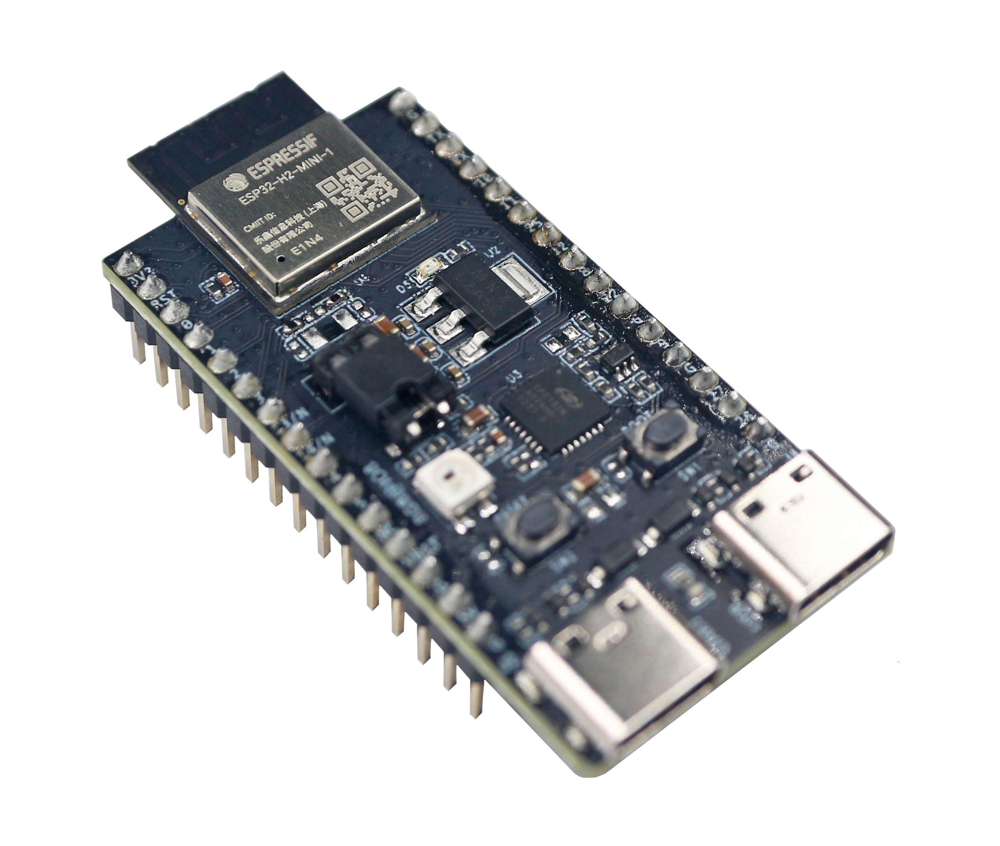
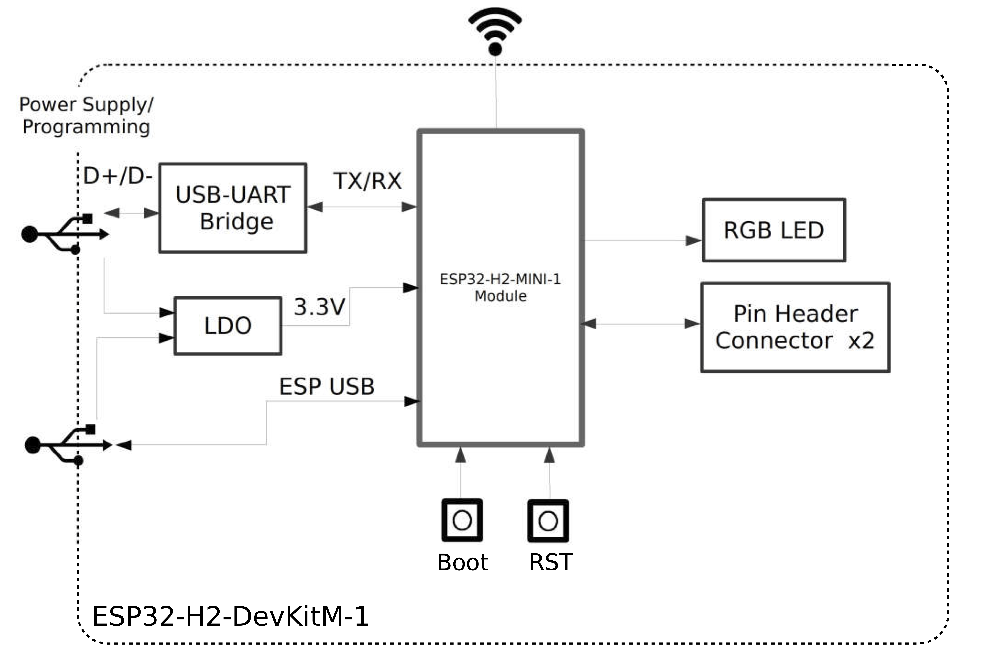
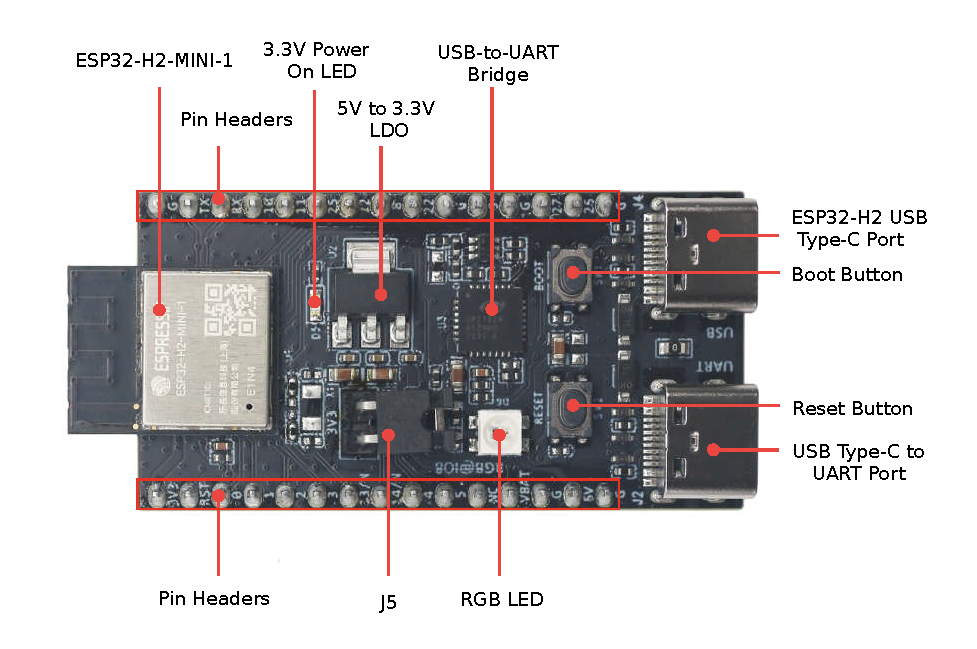
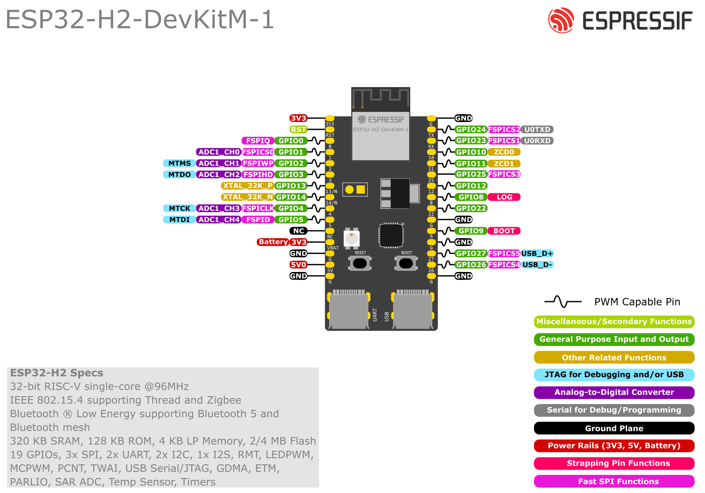

==================
ESP32-H2-DevKitM-1
==================

ESP32-H2-DevKitM-1 is an entry-level development board based on Bluetooth® Low Energy and
IEEE 802.15.4 combo module ESP32-H2-MINI-1 or ESP32-H2-MINI-1U. You can find the board schematic
`here <https://espressif-docs.readthedocs-hosted.com/projects/esp-dev-kits/en/latest/_static/esp32-h2-devkitm-1/esp32-h2-devkitm-1_v1.2_schematics_20230306.pdf>`_.

Most of the I/O pins on the ESP32-H2-MINI-1/1U module are broken out to the pin headers on 
both sides of this board for easy interfacing. Developers can either connect peripherals with
jumper wires or mount ESP32-H2-DevKitM-1 on a breadboard.

    ESP32-H2-DevKitM-1 Board Layout

The block diagram below presents main components of the ESP32-H2-DevKitM-1.

    ESP32-H2-DevKitM-1 Electrical Block Diagram

Hardware Components
-------------------

    ESP32-H2-DevKitM-1 Hardware Components

Buttons and LEDs
================

Board Buttons
--------------
There are two buttons labeled Boot and RST. The RST button is not available
to software. It pulls the chip enable line that doubles as a reset line.

The BOOT button is connected to IO9. On reset it is used as a strapping
pin to determine whether the chip boots normally or into the serial
bootloader. After reset, however, the BOOT button can be used for software
input.

Board LEDs
----------

There is one on-board LED that indicates the presence of power.
Another WS2812 LED is connected to GPIO8 and is available for software.

Current Measurement
===================

The J5 headers on ESP32-H2-DevKitM-1 can be used for measuring the current
drawn by the ESP32-H2-MINI-1/1U module:

    - Remove the jumper: Power supply between the module and peripherals on the
      board is cut off. To measure the module's current, connect the board with an
      ammeter via J5 headers;
    - Apply the jumper (factory default): Restore the board's normal functionality.

.. note::
    When using 3V3 and GND pin headers to power the board, please remove the J5 jumper,
    and connect an ammeter in series to the external circuit to measure the module's current.

Pin Mapping
===========

    ESP32-H2-DevKitM-1 Pin Layout

Configurations
==============

All of the configurations presented below can be tested by running the following commands::

    $ ./tools/configure.sh esp32h2-devkit:<config_name>
    $ make flash ESPTOOL_PORT=/dev/ttyUSB0 -j

Where <config_name> is the name of board configuration you want to use, i.e.: nsh, buttons, wifi...
Then use a serial console terminal like ``picocom`` configured to 115200 8N1.

coremark
--------

This configuration sets the CoreMark benchmark up for running on the maximum
number of cores for this system. It also enables some optimization flags and
disables the NuttShell to get the best possible score.

.. note:: As the NSH is disabled, the application will start as soon as the
  system is turned on.

gpio
----

This is a test for the GPIO driver. It uses GPIO1 and GPIO2 as outputs and
GPIO9 as an interrupt pin.

At the nsh, we can turn the outputs on and off with the following::

    nsh> gpio -o 1 /dev/gpio0
    nsh> gpio -o 1 /dev/gpio1

    nsh> gpio -o 0 /dev/gpio0
    nsh> gpio -o 0 /dev/gpio1

We can use the interrupt pin to send a signal when the interrupt fires::

    nsh> gpio -w 14 /dev/gpio2

The pin is configured as a rising edge interrupt, so after issuing the
above command, connect it to 3.3V.

nsh
---

Basic configuration to run the NuttShell (nsh).

ostest
------

This is the NuttX test at ``apps/testing/ostest`` that is run against all new
architecture ports to assure a correct implementation of the OS.

pwm
---

This configuration demonstrates the use of PWM through a LED connected to GPIO8.
To test it, just execute the ``pwm`` application::

    nsh> pwm
    pwm_main: starting output with frequency: 10000 duty: 00008000
    pwm_main: stopping output

rmt
---

This configuration configures the transmitter and the receiver of the
Remote Control Transceiver (RMT) peripheral on the ESP32-H2 using GPIOs 8
and 2, respectively. The RMT peripheral is better explained
`here <https://docs.espressif.com/projects/esp-idf/en/latest/esp32h2/api-reference/peripherals/rmt.html>`__,
in the ESP-IDF documentation. The minimal data unit in the frame is called the
RMT symbol, which is represented by ``rmt_item32_t`` in the driver:

.. figure:: rmt_symbol.png
   :align: center

The example ``rmtchar`` can be used to test the RMT peripheral. Connecting
these pins externally to each other will make the transmitter send RMT items
and demonstrates the usage of the RMT peripheral::

    nsh> rmtchar

**WS2812 addressable RGB LEDs**

This same configuration enables the usage of the RMT peripheral and the example
``ws2812`` to drive addressable RGB LEDs::

    nsh> ws2812

Please note that this board contains an on-board WS2812 LED connected to GPIO8
and, by default, this config configures the RMT transmitter in the same pin.

rtc
---

This configuration demonstrates the use of the RTC driver through alarms.
You can set an alarm, check its progress and receive a notification after it expires::

    nsh> alarm 10
    alarm_daemon started
    alarm_daemon: Running
    Opening /dev/rtc0
    Alarm 0 set in 10 seconds
    nsh> alarm -r
    Opening /dev/rtc0
    Alarm 0 is active with 10 seconds to expiration
    nsh> alarm_daemon: alarm 0 received

sotest
------

This config is to run apps/examples/sotest.

timer
-----

This config test the general use purpose timers. It includes the 4 timers,
adds driver support, registers the timers as devices and includes the timer
example.

To test it, just run the following::

  nsh> timer -d /dev/timerx

Where x in the timer instance.

usbconsole
----------

This configuration tests the built-in USB-to-serial converter found in ESP32-H2.
``esptool`` can be used to check the version of the chip and if this feature is
supported.  Running ``esptool.py -p <port> chip_id`` should have ``Chip is
ESP32-H2`` in its output.
When connecting the board a new device should appear, a ``/dev/ttyACMX`` on Linux
or a ``/dev/cu.usbmodemXXX`` om macOS.
This can be used to flash and monitor the device with the usual commands::

    make download ESPTOOL_PORT=/dev/ttyACM0
    minicom -D /dev/ttyACM0

watchdog
--------

This configuration tests the watchdog timers. It includes the 1 MWDTS,
adds driver support, registers the WDTs as devices and includes the watchdog
example application.

To test it, just run the following command::

    nsh> wdog -i /dev/watchdogX

Where X is the watchdog instance.
