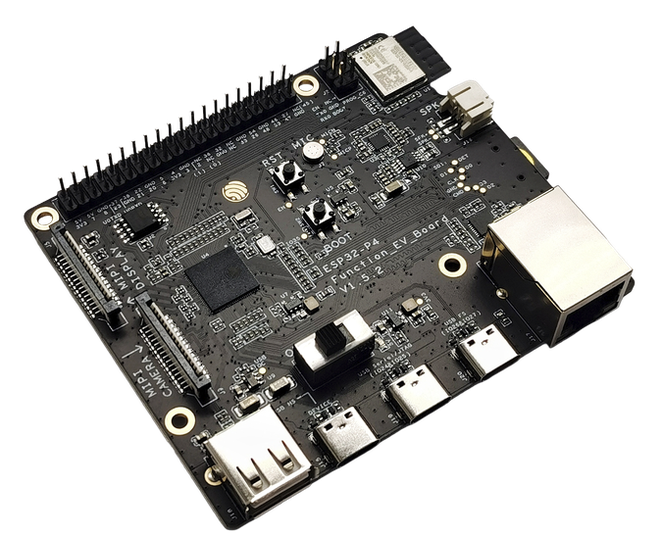

==========================
ESP32-P4-Function-EV-Board
==========================

.. tags:: chip:esp32p4, arch:risc-v, vendor:espressif

   ESP32-P4-Function-EV-Board v1.5.2

ESP32-P4-Function-EV-Board is a multimedia development board based on the
ESP32-P4 chip. The board pairs ESP32-P4 with external peripherals that showcase
its rich feature set, such as USB 2.0, MIPI-CSI/DSI, an H.264 encoder, audio
codec, and a 7-inch capacitive touch LCD with a resolution of 1024 x 600.

Additionally, the board integrates a 2.4 GHz Wi‑Fi 6 and Bluetooth LE module
(``ESP32-C6-MINI-1``) for wireless connectivity. Most I/O pins are broken out to
pin headers for easy interfacing, allowing rapid prototyping for applications such
as smart displays, network cameras, and audio devices.

The board is available in two hardware revisions:

* **v1.5.2** (current): replaces the external CP2102N USB-to-UART bridge with
  the ESP32-P4's built-in USB Serial/JTAG interface, and adds a dedicated
  USB Full-speed port. This is the recommended revision for new designs.
* **v1.4** (legacy): uses a CP2102N USB-to-UART bridge chip connected to
  UART0 (GPIO37/GPIO38) for flashing and serial debugging.

For full board details refer to the official user guides:

* `ESP32-P4-Function-EV-Board v1.5.2 User Guide <https://docs.espressif.com/projects/esp-dev-kits/en/latest/esp32p4/esp32-p4-function-ev-board/user_guide.html>`_ (current)
* `ESP32-P4-Function-EV-Board v1.4 User Guide <https://docs.espressif.com/projects/esp-dev-kits/en/latest/esp32p4/esp32-p4-function-ev-board/user_guide_v1.4.html>`_ (legacy)

Features
========

* Based on ESP32-P4 SoC (RISC-V), featuring powerful image and voice processing
* In-package PSRAM (16 MB or 32 MB depending on chip variant)
* Rich multimedia I/O: USB 2.0, MIPI-CSI/DSI, H.264 encoder
* 7" 1024x600 capacitive touch LCD (via adapter board)
* On-board audio path: ES8311 codec + NS4150B audio power amplifier
* On-board microphone and speaker connector (up to 3 W into 4 Ω)
* Expansion header with the majority of GPIOs broken out (header ``J1``)
* External wireless module: ``ESP32-C6-MINI-1`` providing Wi‑Fi 6 and BLE
* Multiple USB-C ports: USB 2.0 OTG High-Speed, USB Full-speed (v1.5.2) or
  USB Power-in (v1.4), and USB Serial/JTAG (v1.5.2) or USB-to-UART via
  CP2102N (v1.4) for flashing and debug

.. note::
   Wireless connectivity is provided by the on-board ``ESP32-C6-MINI-1`` module.
   The ESP32-P4 itself does not integrate Wi‑Fi/BLE radios.

Buttons and LEDs
================

Board Buttons
-------------

* ``BOOT`` button: controls boot mode on reset; available for software input after boot.
* ``RST`` button: resets the board (chip enable / reset line), not software-controlled.

Board LEDs
----------

* A power indicator LED may be present depending on hardware revision.
* No dedicated user-programmable LED is provided on the core board; LCD backlight is PWM-controlled instead (see below).

Display and Camera
==================

The LCD adapter connects to the ESP32-P4 MIPI DSI connector (J3 on adapter).
Default control pins on the EV board are:

* ``GPIO27``: LCD Reset (``RST_LCD``)
* ``GPIO26``: LCD Backlight PWM (``PWM``)

Connection summary (refer to the user guide for images and full directions):

* LCD adapter ``J3`` header → EV-Board MIPI DSI connector (ribbon cable in reverse direction)
* LCD adapter ``RST_LCD`` (``J6``) → ``GPIO27`` (header ``J1``)
* LCD adapter ``PWM`` (``J6``) → ``GPIO26`` (header ``J1``)
* LCD adapter power: via its USB on ``J1`` or by wiring 5V/GND from the EV-Board

The camera adapter connects to the MIPI CSI connector (ribbon cable in forward direction).

Pin Mapping
===========

Most ESP32-P4 GPIOs are exposed on the header block ``J1``. The EV-Board user
guide documents the full pinout and header numbering; see the "Header Block"
tables in the user guide for details. Selected defaults used on this board:

===== =========================== ============================================
Pin   Signal/Function             Notes
===== =========================== ============================================
26    PWM (LCD backlight)         Default backlight control
27    RST_LCD (LCD reset)         Default LCD reset control
37    U0TXD                       Default UART0 TX exposed on header
38    U0RXD                       Default UART0 RX exposed on header
===== =========================== ============================================

Power Supply
============

The board can be powered via any of the USB Type‑C ports. The available ports
differ by hardware revision:

* **v1.5.2**: USB 2.0 Type-C Port (OTG High-Speed), USB Full-speed Port, or
  USB Serial/JTAG Port.
* **v1.4**: USB 2.0 Type-C Port (OTG High-Speed), USB Power-in Port, or
  USB-to-UART Port (CP2102N bridge).

If the debug cable cannot provide enough current, use a separate power adapter
connected to any available USB‑C port.

Installation
============

Follow the ESP32-P4 chip documentation for toolchain setup and required tools
(:doc:`/platforms/risc-v/esp32p4/index`). In summary:

* Install a RISC‑V GCC toolchain (e.g., xPack riscv-none-elf-gcc)
* Install ``esptool.py`` (``pipx install esptool`` recommended or use a venv)
* Optionally, set up ``openocd-esp32`` for JTAG debugging

Building NuttX
==============

All configurations can be selected using the board identifier with the NuttX build
tools. The basic shell configuration:

.. code-block:: console

    $ ./tools/configure.sh esp32p4-function-ev-board:nsh
    $ make -j$(nproc)

Flashing
========

Use the standard flashing flow. Replace ``<port>`` with the serial device exposed
by the board:

* **v1.5.2**: the USB Serial/JTAG port creates a CDC ACM device, typically
  ``/dev/ttyACM0``. Please note that most of the configs use UART0 (GPIO37/GPIO38)
  as the serial console (except for `usbconsole`). For UART0-based terminal, an external
  USB-to-UART bridge is required to be attached to UART0 port (GPIO37/GPIO38) pins and the
  board requires to be manually set to download mode by pressing the BOOT button and then
  the RST button (releasing the RST before the BOOT button).
* **v1.4**: the on-board CP2102N USB-to-UART bridge creates a USB-serial device, typically
  ``/dev/ttyUSB0``.

Connect the appropriate USB‑C port and run:

.. code-block:: console

    $ make -j$(nproc) flash ESPTOOL_PORT=<port> ESPTOOL_BINDIR=./

After flashing, connect a serial console at 115200 8N1 to interact with NSH.

Configurations
==============

All of the configurations presented below can be tested by running the following commands::

    $ ./tools/configure.sh esp32p4-function-ev-board:<config_name>
    $ make -j

Where ``<config_name>`` is one of the names listed below (e.g., ``nsh``, ``adc``).
Then use a serial console terminal like ``picocom`` configured to 115200 8N1.

adc
---

Enables the ADC driver. ADC unit(s) are registered (``/dev/adc0`` as ADC1).
Attenuation, mode, and channel set can be adjusted in ``ADC Configuration``.

bmp180
------

Enables the BMP180 pressure sensor over I2C. Use the ``bmp180`` app to read samples.

buttons
-------

Demonstrates the buttons subsystem. Run ``buttons`` and press the board's BOOT button
to see samples appearing.

capture
-------

Enables the capture driver and the capture example to measure duty cycle/frequency
of an external signal.

crypto
------

Enables cryptographic hardware support for SHA algorithms and a ``/dev/crypto`` node.

efuse
-----

Enables the eFuse driver (supports virtual eFuses). Access via ``/dev/efuse``.

gpio
----

Tests the GPIO driver. Provides examples for output control and edge-triggered interrupts.

i2c
---

Enables I2C utilities. ``i2c dev 0x00 0x7f`` can scan the bus.

i2schar
-------

Enables the I2S character device and ``i2schar`` example for TX/RX testing over I2S0.

motor
-----

Enables the MCPWM peripheral for brushed DC motor control (``/dev/motor0``).

nsh
---

Basic configuration to run the NuttShell (NSH).

ostest
------

Runs OS tests from ``apps/testing/ostest``.

pwm
---

Demonstrates PWM via LEDC. The ``pwm`` app toggles output with default frequency/duty.

qencoder
--------

Enables Quadrature Encoder support via PCNT. The ``qe`` sample reads pulses on the configured pins.

random
------

Demonstrates the hardware RNG.

rmt
---

Configures an RMT TX/RX pair and the ``rmtchar`` example. Also includes ``ws2812`` for addressable LEDs.

rtc
---

Demonstrates RTC alarms via the ``alarm`` app.

sdm
---

Enables Sigma-Delta Modulation (SDM) driver for LED dimming/simple DAC; see ``dac`` test.

spi
---

Enables SPI master driver. Loop MOSI↔MISO and run ``spi exch -b 2 "AB"`` to verify.

spiflash
--------

Tests the external SPI flash via SPI1. Defaults to SmartFS; see ``mksmartfs``/``mount`` instructions.

spislv
------

Enables SPI2 Slave mode for testing host-to-device transactions.

temperature_sensor
------------------

Enables the internal temperature sensor and related character device/uORB options.

tickless
--------

Enables tickless scheduling for reduced idle power.

timers
------

Demonstrates general-purpose timers via the ``timer`` example.

twai
----

Enables the Two-Wire Automotive Interface (CAN/TWAI). Loopback testing is available via Kconfig.

usbconsole
----------

Tests the USB Serial/JTAG console. On v1.5.2 this uses the ESP32-P4's built-in
USB Serial/JTAG peripheral exposed on the dedicated USB Serial/JTAG port
(``/dev/ttyACM0``).
On v1.4, an external cable is required to be attached to USB Serial/JTAG port (GPIO24/GPIO25).

watchdog
--------

Demonstrates MWDT/RWDT watchdog timers via the ``wdog`` app.

Related Documentation
=====================

* User Guide (current): `ESP32-P4-Function-EV-Board v1.5.2 <https://docs.espressif.com/projects/esp-dev-kits/en/latest/esp32p4/esp32-p4-function-ev-board/user_guide.html>`_
* User Guide (legacy): `ESP32-P4-Function-EV-Board v1.4 <https://docs.espressif.com/projects/esp-dev-kits/en/latest/esp32p4/esp32-p4-function-ev-board/user_guide_v1.4.html>`_
* ESP32-P4 Product Overview: `ESP32-P4 Product Overview <https://docs.espressif.com/projects/esp-hardware-design-guidelines/en/latest/esp32p4/product-overview.html>`_
* ESP32-P4 TRM: `ESP32-P4 Technical Reference Manual (v1.3) <https://documentation.espressif.com/esp32-p4-chip-revision-v1.3_technical_reference_manual_en.pdf>`_
