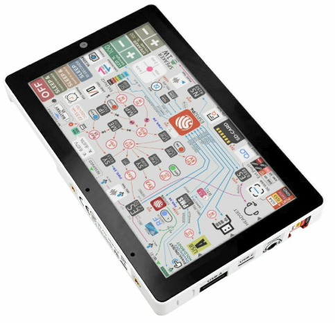
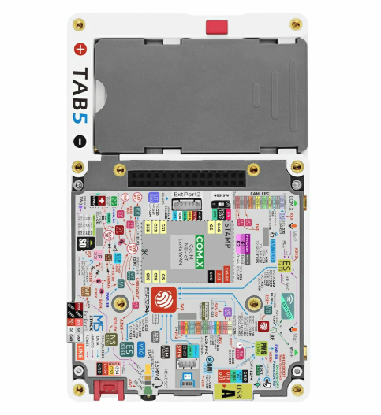

.. _esp32p4-tab5:

==============
M5Stack Tab5
==============

.. tags:: chip:esp32p4, arch:risc-v, vendor:espressif

   M5Stack Tab5 (front)

The `M5Stack Tab5 <https://docs.m5stack.com/en/products/sku/k145>`_ is a
portable HMI tablet built around the ESP32-P4 (dual RISC-V) application
processor, paired with an ESP32-C6 companion module for Wi-Fi 6 / BLE /
Thread connectivity over SDIO.

This NuttX port brings up the parts of the board that work with the upstream
ESP32-P4 drivers only — no out-of-tree driver patches are required.  The
display and the other peripherals are **not** implemented yet; their pin
assignments are documented below so they can be added later.

   M5Stack Tab5 (rear): PCB, NP-F550 battery bay and M5-Bus connector

Features
========

* ESP32-P4 (dual RISC-V @ 360 MHz), 16 MB flash, 32 MB Octal PSRAM
* ESP32-C6-MINI-1U companion (Wi-Fi 6 / BLE / Thread) over SDIO2
* 5" MIPI-DSI IPS display, 1280x720 (ILI9881C), GT911 capacitive touch
* ES8388 audio codec + NS4150B speaker amp, ES7210 microphone array
* SC2356 2 MP MIPI-CSI camera
* BMI270 6-axis IMU, RX8130CE RTC, INA226 power monitor
* Two PI4IOE5V6408 I2C IO expanders
* NP-F550 battery via IP2326 charger, USB Type-C (OTG) + Type-A host
* RS485 (SIT3088), microSD, M5-Bus 30-pin + Grove HY2.0-4P

Supported features
==================

+------------------------+--------------------------------------------------+
| Peripheral             | Status                                           |
+========================+==================================================+
| UART / USB-Serial-JTAG | Yes (NSH console on the USB-C port, ``ttyACM``)  |
+------------------------+--------------------------------------------------+
| I2C0                   | Yes (``/dev/i2c0``, SDA=GPIO31, SCL=GPIO32)      |
+------------------------+--------------------------------------------------+
| PSRAM                  | Yes (32 MB Octal)                                |
+------------------------+--------------------------------------------------+
| GPIO / BOOT button     | Yes                                              |
+------------------------+--------------------------------------------------+

Not yet implemented (pins and I2C addresses documented below):

* MIPI-DSI display (ILI9881C) and GT911 touch
* Audio (ES8388 / ES7210), camera (SC2356)
* INA226 power monitor — battery rail, 5 mOhm shunt (bus voltage = battery
  voltage; positive current = discharging, negative = charging)
* RX8130CE RTC, microSD, ESP32-C6 Wi-Fi

Pin mapping
===========

============ =========================================================
GPIO         Function
============ =========================================================
5            M5-Bus SCK
6            PC_TX (debug UART)
7            PC_RX (debug UART)
8-15         ESP32-C6 SDIO2 bus (D3-D0, IO2, RST, CK, CMD)
16, 17       M5-Bus general / PB_IN
18           M5-Bus MOSI
19           M5-Bus MISO
20           RS485 TX
21           RS485 RX
22           LCD backlight enable (LEDA, via ME2212 boost)
23           Touch interrupt (TP_INT, GT911)
26           I2S DSDIN (audio data to ES8388)
27           I2S SCLK (audio bit clock)
29           I2S LRCK (audio word clock)
30           I2S / camera MCLK
31           I2C0 SDA (touch, audio, IMU, RTC, power-mon, IO exp)
32           I2C0 SCL
34           RS485 direction (DE/RE)
35           BOOT button
36           Camera MCLK
37           M5-Bus TXD0
38           M5-Bus RXD0
39           SD DAT0 (SPI MISO)
40           SD DAT1 (SPI CS in microSD NAND mode)
41           SD DAT2 (SPI SCK)
42           SD DAT3 (SPI MOSI)
43           SD CLK
44           SD CMD
52           M5-Bus PB_OUT
53           Grove SDA
54           Grove SCL
============ =========================================================

.. note::
   The MIPI-DSI data/clock lanes are dedicated MIPI pins (powered by
   ``VDD_MIPI_DPHY``) and are not part of the GPIO matrix.  The panel has no
   GPIO reset line (``BSP_LCD_RST = NC``); it is reset by the board power-on
   reset.  ``LCD_EN`` and ``TOUCH_EN`` are driven by IO expander 0x43
   (P4 = LCD_EN, P5 = TOUCH_EN).

I2C device address map
======================

======= ====================================================
Address Device
======= ====================================================
0x10    ES8388 audio codec
0x14    GT911 touch controller
0x32    RX8130CE RTC
0x40    ES7210 microphone array
0x41    INA226 power monitor
0x43    PI4IOE5V6408-1 IO expander (LCD_EN / TOUCH_EN)
0x44    PI4IOE5V6408-2 IO expander (USB / Wi-Fi enables)
0x68    BMI270 IMU
======= ====================================================

Chip revision
=============

The Tab5 ships with ESP32-P4 **revision v1.0**.  The ``nsh`` defconfig sets
``CONFIG_ESP32P4_SELECTS_REV_LESS_V3=y`` accordingly.  A harmless boot warning
is printed because the upstream default targets rev >= 3.0.

Configurations
==============

nsh
---

Basic NuttShell configuration (console enabled over the USB Serial/JTAG port,
exposed as ``/dev/ttyACM0`` on the host).  Brings up the I2C0 bus.

Building and flashing
=====================

.. code-block:: console

   $ ./tools/configure.sh esp32p4-tab5:nsh
   $ make -j

The NuttX image must be flashed at offset ``0x2000`` (the SIMPLE_BOOT
application offset for the ESP32-P4):

.. code-block:: console

   $ esptool.py -c esp32p4 -p /dev/ttyACM0 -b 921600 write_flash 0x2000 nuttx.bin

Then open the console:

.. code-block:: console

   $ picocom -b 115200 /dev/ttyACM0
   nsh>
