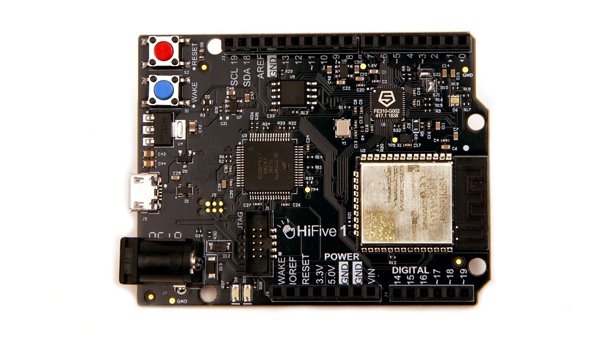

=============
HiFive1 Rev B
=============

.. tags:: arch:riscv, vendor:sifive, experimental

.. todo::

   There is currently no support for GPIO/SPI/I2C/RTC/WDT/PWM, or RISC-V user
   mode. If you are interested in adding one of these features, please see
   :doc:`/contributing/index`.

   The HiFive1 Rev B development board.

You can learn more about this board on the vendor's documentation page:
https://www.sifive.com/boards/hifive1-rev-b#documentation

Features
========

* Off-chip WiFi/Bluetooth networking
* 2 UART interfaces
* 9 PWM pins
* 19 digital IO pins
* 1 SPI controller with 3 CS pins
* 1 I2C interface
* 32Mbit SPI flash memory off-chip

Power Supply
============

The board operates at 3V3 and 1V8 logic levels, but I/O voltage are all 3V3. It
can be supplied by a 5V USB input or a 7-12V jack.

Installation
============

1. Download and install the toolchain:

   .. code:: console

      $ curl https://static.dev.sifive.com/dev-tools/riscv64-unknown-elf-gcc-8.3.0-2019.08.0-x86_64-linux-ubuntu14.tar.gz

2. Download and install the J-Link Software Documentation Pack from
   https://www.segger.com/downloads/jlink/.

   .. code:: console

      $ sudo apt install JLink_Linux_V656b_x86_64.deb

If you are planning to run NuttX on the QEMU version of this board, you will
need to build and install QEMU:

.. code:: console

   $ git clone https://github.com/qemu/qemu
   $ cd qemu
   $ ./configure --target-list=riscv32-softmmu
   $ make
   $ sudo make install

Building NuttX
==============

If building QEMU, make sure to select the option
``CONFIG_ARCH_CHIP_FE310_QEMU=y`` in the Kconfig menu (``make menuconfig``).

Flashing
========

Flash NuttX with the J-Link and run:

.. code:: console

   $ picocom -b 115200 /dev/ttyACM0

   $ /opt/SEGGER/JLink_V656b/JLinkGDBServer -device FE310

   $ riscv64-unknown-elf-gdb ./nuttx
   (gdb) target extended-remote:2331
   (gdb) load nuttx
   (gdb) c

If running on QEMU, you can use the following command:

.. code:: console

   $ qemu-system-riscv32 -nographic -machine sifive_e -kernel ./nuttx

Configurations
==============

To configure NuttX, use the following command:

.. code:: console

   $ ./tools/configure.sh hifive1-revb:<config>

Where ``<config>`` is one of the configurations listed below.

nsh
---

A simple configuration including the NSH shell.
