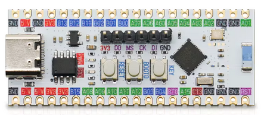

=============
GD32VW553-HMQ
=============

The GD32VW553-HMQ is the generic evaluation board for the GD32VW553HMQ6
(Nuclei N307, Wi-Fi 6 + BLE 5.3).  It carries an on-board USB/Serial port
provides the USB serial console.

   The GD32VW553-HMQ board.

Features
========

- GD32VW553HMQ (QFN40, 4096 KB flash,
  320 KB SRAM) and a PCB antenna
- USB/Serial COM port over the USB Type-C connector
- One LED on PC13
- BOOT0/BOOT1 buttons, a power jumper and a reset button (NRST)

Serial Console
==============

The console is UART0 (PB15 TX / PA8 RX), wired to the USB/Serial port.
It shows up on the host as ``/dev/ttyUSB0`` at 115200 8N1.

LEDs
====

One LED sit on GPIO PC13 and is driven push-pull, active HIGH.

====== ==== =========================================
LED    Pin  Meaning in the vendor SDK
====== ==== =========================================
LED1   PC13 CPU running
====== ==== =========================================

With ``CONFIG_USERLED`` they belong to the application and are exposed as
``/dev/userleds``.  With ``CONFIG_ARCH_LEDS`` the OS takes them over instead
and uses them to show its state: LED1 comes on once NuttX has started.

Flashing
========

The board is programmed with OpenOCD through a JTAG Probe. The GigaDevice
OpenOCD fork (shipped with the vendor SDK) is required::

  $ openocd -f openocd_gdlink.cfg \
            -c "program nuttx.bin 0x08000000 verify reset exit"

NuttX is linked at 0x08000000, bypassing the vendor MBL bootloader.

.. note::
   The chip mask ROM uses the first 0x200 bytes of SRAM.  The linker script
   starts the application at 0x20000200 for that reason; do not move it.

If you prefer to use JLink, you wire this way:

========= =====================
JLink Pin GD32VW553 board Pin
========= =====================
1 Vref    3V3
5 TDI     DI
7 TMS     MS
9 TCK     CK
13 TDO    DO
15 RESET  RST
25 GND    GND
========= =====================

You can run JLinkExe on Linux this way::

  $ sudo JLinkExe -if jtag
  J-Link> connect
  Device position in JTAG chain (IRPre,DRPre) <Default>: -1,-1 => Auto-detect
  JTAGConf>
  Specify target interface speed [kHz]. <Default>: 4000 kHz
  Speed>
  The selected device "GD32VW533HMQ6" is unknown to this software version.
  Device "GD32VW553HMQ6" selected.
  J-Link> loadbin nuttx.hex, 0 

Flash layout
============

The full map is in the :doc:`chip documentation <../../index>`.  What matters
when flashing this board:

======================== ============== ====================================
Range                    Size           Purpose
======================== ============== ====================================
0x08000000 -- 0x083db000 3948 KiB       Available to the firmware.  This is
                                        what the linker script gives out;
                                        overflowing it is a link error
0x083db000 -- 0x083fb000 128 KiB        progmem / LittleFS
0x083fb000 -- 0x08400000 20 KiB         **Wi-Fi NVDS** -- do not erase
======================== ============== ====================================

For reference, the configurations use a small part of that budget: ``nsh``
135 KiB (3%), ``wifi`` 610 KiB (15%) and ``sta_softap`` 613 KiB (16%).
The ``ble`` config (BLE on top of ``wifi``) brings the image to about 971 KiB (25%).

.. warning::
   The **last** pages of the flash are not free: the Wi-Fi NVDS holds the RF
   calibration data and the MAC address, and erasing it breaks the radio.  The
   progmem region ends exactly where the NVDS begins.

The region handed to progmem is set with
``CONFIG_GD32VW55X_PROGMEM_START_ADDR`` and ``CONFIG_GD32VW55X_PROGMEM_SIZE``;
nothing outside it is ever erased or written.

Configurations
==============

Each configuration is built with::

  $ ./tools/configure.sh gd32vw553k-start:<config>
  $ make

nsh
---

Basic NuttShell configuration over the UART2 console.  No radio.

wifi
----

NSH plus the Wi-Fi station support.  The interface is registered as ``wlan0``
with the MAC address read from the chip eFuse, and is driven with the standard
network tools::

  nsh> wapi scan wlan0
  nsh> wapi psk wlan0 <passphrase> 3
  nsh> wapi essid wlan0 <ssid> 1
  nsh> ifup wlan0
  nsh> renew wlan0
  nsh> ifconfig
  nsh> ping 8.8.8.8

.. note::
   Use ``ifup wlan0``, not ``ifconfig wlan0 up``: ``ifconfig`` interprets its
   second argument as an IP address.

.. note::
   The station is WPA2-only. A WPA3-transition network (WPA2/WPA3 mixed
   mode) associates through WPA2-PSK; a WPA3(SAE)-only network is refused
   up front with ``ENOTSUP`` and a console message naming the unsupported
   AKM, instead of letting the prebuilt supplicant attempt the SAE
   handshake (which faults).

The RTC and the SNTP client are enabled, so the clock can be set from the
network::

  nsh> ntpcstart
  nsh> date

sta_softap
----------

NSH plus the Wi-Fi softAP: the board becomes an access point and a DHCP server.
The single-VIF firmware does station *or* AP at a time (not both at once), so
this is a softAP, not the simultaneous STA+AP of some other parts.

Bring it up with the standard tools::

  nsh> wapi mode  wlan0 3            # 3 = master (softAP)
  nsh> wapi psk   wlan0 12345678 3   # WPA2-PSK
  nsh> wapi essid wlan0 nuttxwifi 1  # start the AP
  nsh> dhcpd_start wlan0             # DHCP server, in the background

A client then sees ``nuttxwifi``, associates with WPA2, and gets an address
from the 10.0.0.0/24 pool (the AP is 10.0.0.1).

.. note::
   Use WPA2, not WPA3.  The SAE (WPA3) handshake on the AP side is deep on the
   stack; with the default task stacks it overflows inside the elliptic-curve
   crypto and faults.  This configuration raises ``CONFIG_INIT_STACKSIZE`` to
   8192 and ``CONFIG_DEFAULT_TASK_STACKSIZE`` to 4096 for the same reason -- the
   radio tasks need the headroom.

.. note::
   ``dhcpd_start`` spawns the server as a background task and returns.  The
   plain ``dhcpd`` command, confusingly, runs the server *blocking* in the
   foreground.

ble
---

``wapi`` plus BLE (``CONFIG_GD32VW55X_BLE``) and the demo GATT service
(``CONFIG_GD32VW55X_BLE_GATT_DEMO``).  The board advertises a connectable set
named ``NuttX`` and registers a minimal "transparent UART" service (16-bit
UUIDs ``0xffe0`` / RX ``0xffe1`` / TX ``0xffe2``). Advertising restarts on
every disconnection, so the device stays discoverable across connections. A
central connects, discovers the service, and a write to the RX characteristic
is logged on the board console::

  nsh> BLE RX (11): Hello world

.. note::
   The central -> board write is exercised with a write command
   (write-without-response), which is reliable.  The prebuilt vendor
   controller does not complete a write-request (write-with-response) or the
   CCCD subscribe issued by a Linux BlueZ host, so the TX **notification** echo
   (board -> central) is best exercised from a phone app such as nRF Connect.
   This is why BLE keeps ``CONFIG_EXPERIMENTAL``.

ostest
------

``nsh`` plus the NuttX OS test suite (``CONFIG_TESTING_OSTEST``).  Run it from
the shell to exercise the scheduler, synchronisation primitives and the FPU
context switch::

  nsh> ostest
  ...
  ostest_main: Exiting with status 0

The ``rr_test`` (round-robin with a 30000-prime workload) makes the full run
take a couple of minutes on this core; every sub-test reports ``nerrors=0``.

Status
======

All seven configurations were validated on hardware:

- ``nsh``: boots, console, heap and task list are healthy.
- ``wifi``: full station path over a live AP -- ``wapi scan`` lists the nearby
  networks, WPA2 associates through the four-way handshake, DHCP obtains an
  address, and ``ping`` reaches the internet.
- ``sta_softap``: the board's own AP -- a client sees the SSID, associates with
  WPA2, gets an address from the board's DHCP server, and pings the board.
- ``ble``: advertises ``NuttX``, a central connects, the demo GATT service
  enumerates, and a write to the RX characteristic is received on the board
  console (central -> board).
- ``ostest``: the OS test suite runs to completion (every sub-test reports
  ``nerrors=0`` and it ends with ``ostest_main: Exiting with status 0``).

BLE (``CONFIG_GD32VW55X_BLE``) is marked EXPERIMENTAL and off by default.  The
prebuilt ``libble`` is an all-in-one controller plus RivieraWaves host with no
HCI transport, so the port drives the vendor host directly (it does not
register a NuttX ``bt_driver_s``).  The ``ble`` configuration enables it along
with a demo GATT service; see that section above for what is validated and the
notification caveat.  A reusable test tool for this is kept with the
out-of-tree port notes.

.. note::
   ``CONFIG_ARCH_LEDS`` must stay off on this board.  With the OS driving the
   LEDs, the serial console dies in the Wi-Fi configurations (the console UART
   shares the work queue path); the LEDs belong to the application
   (``CONFIG_USERLED``), and every defconfig here disables ``ARCH_LEDS``
   explicitly.
