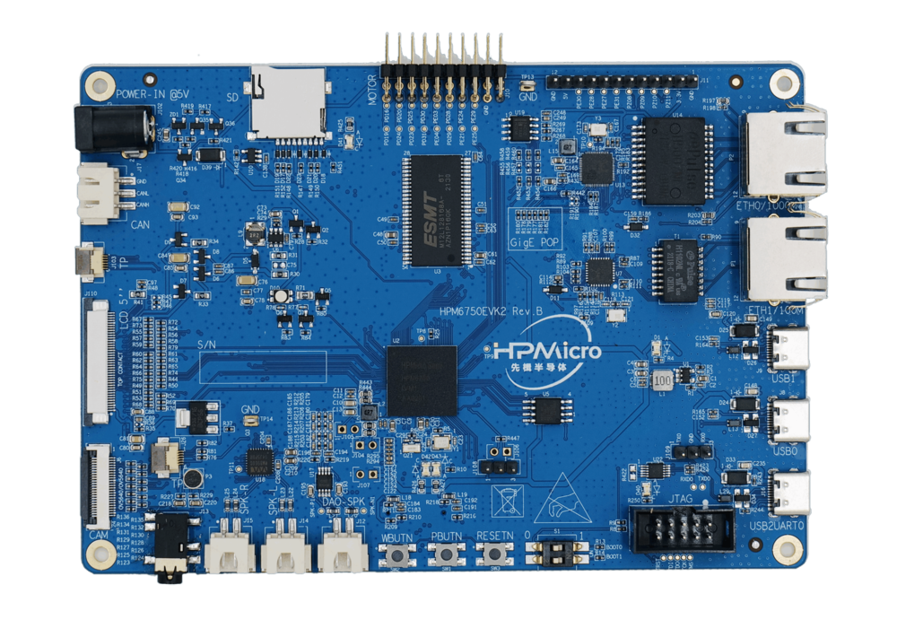

===========
HPM6750EVK2
===========

.. tags:: arch:riscv, vendor:hpmicro, experimental

   The HPM6750EVK2 development board.

More documentation about this board from the vendor can be found `here
<https://hpm-sdk.readthedocs.io/en/latest/boards/hpm6750evk2/README_en.html>`_.

Features
========

* Dual-core MCU 816MHz
* 2MB on-chip RAM
* 256Mb SDRAM
* 1000Mbit Ethernet PHY
* 128Mb QSPI NOR flash
* SD/eMMC interface
* LCD connector
* DVP camera connector
* Audio mic input
* 3x USBC 2.0 connectors
* Motor control expansion port

Buttons and LEDs
================

S1 dip switch:

* OFF, OFF: boot from QSPI flash
* OFF, ON: serial boot
* ON, OFF: ISP

There are three buttons:

* PBUTN (SW1): power button, TinyUF2 boot button, GPIO button
* WBUTN (SW2): wake-up button
* RESET (SW3): reset button

There is also an RGB LED.

Installation
============

Download and install the toolchain:

.. code:: console

   $ curl https://github.com/hpmicro/riscv-gnu-toolchain/releases/tag/2022.05.15

You will also need OpenOCD. Install ``hpmicro sdk_env`` and ensure that OpenOCD
is in the path (``sdk_env/tools/openocd``).

Building NuttX
==============

.. note::

   If you want to switch the GNU riscv64 toolchain to the GNU riscv32 toolchain,
   you will need to select ``System type -> Toolchain Selection -> Generic GNU
   GNU RV32 toolchain`` in the Kconfig menu (``make menuconfig``). Make sure
   that the HPMicro GNU riscv32 toolchain is installed and in your ``PATH``.

Flashing
========

Debug NuttX with OpenOCD and run:

.. code:: console

   $ picocom -b 115200 /dev/ttyACM0

When using fireDAP, the command is as follows (ensure
``sdk_env/hpm_sdk/boards/openocd`` is in your PATH):

.. code:: console

   $ openocd -f probes/cmsis_dap.cfg -f soc/hpm6750-single-core.cfg -f boards/hpm6750evk2.cfg

   $ riscv32-unknown-elf-gdb ./nuttx
   (gdb) target extended-remote [ip_addr]:3333
   (gdb) load
   (gdb) c

Configurations
==============

To configure NuttX, you can use the following command in the NuttX directory:

.. code:: console

   $ ./tools/configure.sh hpm6750evk2:<config>

Where ``<config>`` is one the configurations listed below.

nsh
---

A simple configuration with the NSH shell.
