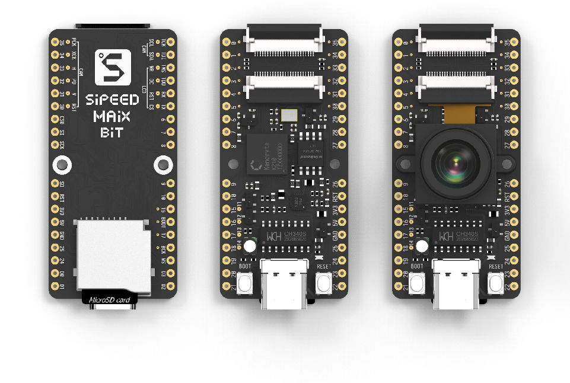

========
Maix Bit
========

.. tags:: experimental, arch:risc-v, chip:k210, vendor:sipeed

   The Maix Bit development board.

The Maix Bit is a RISC-V AI IoT development board.

Features
========

* K210 RISC-V AI Chip
* Dual-core
* Independent FPU
* 64-bit
* 8MB on-chip SRAM
* Double precision FPU with multiplication, division and square root

.. warning::

   There is currently no support for the FPU, or RISC-V User mode. Peripherals
   such as GPIO, SPI and I2C are also currently unsupported.

.. todo::

   If you are intersted in using this board, please consider contributing
   implementations for the above missing features.

Installation
============

1. Download and install toolchain and openocd-k210

   .. code:: console

      $ curl https://static.dev.sifive.com/dev-tools/riscv64-unknown-elf-gcc-8.3.0-2019.08.0-x86_64-linux-ubuntu14.tar.gz
      $ export PATH=$PATH:/$TOOL_CHAIN_PATH/bin

2. Build openocd-k210

   .. code:: console

      $ git clone https://github.com/kendryte/openocd-kendryte
      $ cd openocd-kendryte
      $ ./bootstrap & ./configure & make

Flashing
========

Download and run NuttX from SRAM (not SPI-Flash):

.. code:: console

   $ picocom -b 115200 /dev/ttyUSB0
   $ sudo ./src/openocd -s ./tcl -f ./tcl/kendryte.cfg -m 0
   $ riscv64-unknown-elf-gdb ./nuttx
   (gdb) target extended-remote :3333
   (gdb) load nuttx
   (gdb) c

Write ``nuttx.bin`` to SPI-Flash:

.. code:: console

   $ pip3 install kflash
   $ kflash -p /dev/ttyUSB0 -b 1500000 ./nuttx/nuttx.bin

.. note::

   The ``kflash_gui`` is not recommended because it's unstable.

QEMU Process
============

In order to run this board's version of NuttX on QEMU, make the following
adjustments:

QEMU Installation
-----------------

Installing and building QEMU can be done with:

.. code:: console

   $ git clone https://github.com/qemu/qemu
   $ cd qemu
   $ ./configure --target-list=riscv64-softmmu
   $ make
   $ sudo make install

Building NuttX for QEMU
-----------------------

Building NuttX follows the same process, but you will need to modify your chosen
configuration to include the option ``CONFIG_K210_WITH_QEMU=y``.

Running on QEMU
---------------

Run the following:

.. code:: console

   $ qemu-system-riscv64 -nographic -machine sifive_u -bios ./nuttx

.. note::

   To run Nuttx for kostest, ``gdb`` needs to be used to load both
   ``nuttx_user.elf`` and ``nuttx``.

   .. code:: console

      $ qemu-system-riscv64 -nographic -machine sifive_u -s -S
      $ riscv64-unknown-elf-gdb -ex 'target extended-remote:1234' -ex 'load nuttx_user.elf' -ex 'load nuttx' -ex 'c'

Configurations
==============

Configurations can be selected using the following configure tool command:

.. code:: console

   $ ./tools/configure.sh maix-bit:<config>

Where ``<config>`` can be replaced by the name of any configuration listed
below.

nsh
---

A simple configuration with NSH running.
