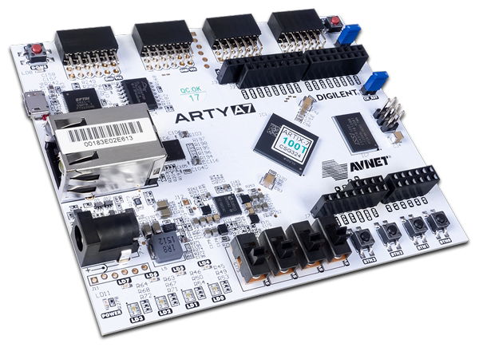

=======
Arty A7
=======

.. tags:: arch:riscv, vendor:sifive, experimental

.. todo::

      There is currently no support for GPIO, SPI, I2C, RTC, WDT or PWM. There
      is also no support for RISC-V user mode yet. If you are interested in
      contributing one of these features, please see :doc:`/contributing/index`.

   The Arty A7 development board

The Arty A7 is an Artix 7 FPGA development board. There is some external
documentation about the board itself (and its datasheets) `here
<https://digilent.com/reference/programmable-logic/arty-a7/start>`_.

Features
========

* 450MHz internal clock
* 16MB QSPI flash
* 10/100Mbps Ethernet
* 256MB DDR3 @333MHz
* JTAG programmable
* 5200 logic slices
* 1800Kbits of block RAM

Buttons and LEDs
================

The board has:

* 4 switches
* 4 buttons
* 1 RESET LED
* 1 User LED
* 4 User RGB LEDs

Power Supply
============

The board can be supplied power over USB, or a 7-15V 2.5mm coaxial supply. The
logic level of the A7 is 3V3.

Installation
============

You will need to download the tool-chain for this board:

.. code:: console

   $ curl https://static.dev.sifive.com/dev-tools/riscv64-unknown-elf-gcc-8.3.0-2019.08.0-x86_64-linux-ubuntu14.tar.gz

Flashing
========

1. Follow the instructions on https://github.com/enjoy-digital/litex to build
   the vexriscv softcore fpga gateware and flash to Arty A7 board:

.. code:: console

   $ cd litex-boards/litex_boards/targets
   $ ./digilent_arty.py --with-ethernet --with-sdcard --uart-baudrate 1000000 --cpu-type=vexriscv --cpu-variant=secure --build --load --flash

2. Next, set up a TFTP server on your host machine, copy ``nuttx.bin`` to your
   ``tftpboot`` directory and change its name to ``boot.bin``.

3. Setup the wired connection (UART and TFTP) between your A7 board and host
   machine.

4. Run the following command:

   .. code:: console

      $ minicom -b 1000000 /dev/ttyUSB1 # The default baudrate on litex vexriscv is 1e6

   When you see the bios prompt ``litex>``, type ``netboot`` and press "Enter".
   You should then see the NSH prompt.

Configurations
==============

You can configure NuttX for this board using:

.. code:: console

   $ ./tools/configure.sh arty_a7:<config>

Where ``<config>`` is the name of one of the configurations listed below.

nsh
---

A simple configuration with the NSH shell.
