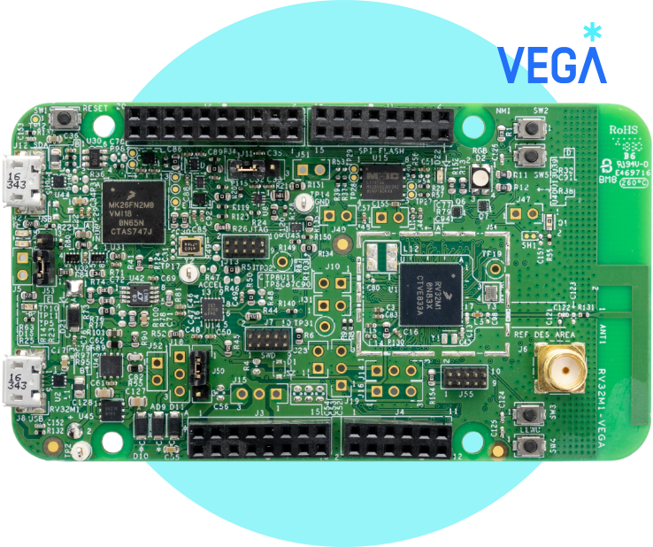

===========
RV32M1-VEGA
===========

.. tags:: arch:riscv, vendor:vega, experimental

   The RV32M1-VEGA development board.

The RV32M1 is a heterogeneous SoC including an ARM Cortex-M4 CPU, an ARM
Cortex-M0+ CPU, a RISC-V RI5CY CPU, and a RISC-V ZERO_RISCY CPU. The SOC
integrates 1.25 MB flash, 384 KB SRAM, and a variety of peripherals.

Refer to https://open-isa.org for further information about this board.

.. note::

   Currently NuttX is ported to RV32M1 RI5CY only. RI5CY is RV32IMC RISC-V CPU
   with PULP extensions features:

   * Post-Incrementing load and stores,
   * Multiply-Accumulate extensions,
   * ALU extensions,
   * Hardware Loops.

Features
========

* On-board OpenSDA Debug Adapter,
* USB Device Port,
* FXOS8700CQ Digital Combo Sensor: 3D Accelerometer + 3D Magnetometer,
* Wirless Abilities: BLE, Generic FSK, and IEEE Std.802.15.4(Thread),
* ONE user RGB LED,
* Four user push-buttons,
* 4 MB external SPI Flash,
* Micro-SD Card Slot on the backside,
* Arduino R3 Compatible IO Header.

Buttons and LEDs
================

The RV32M1-VEGA board has **one** user RGB LED; only the red part of the LED is
used to indicate an interrupt request is being serviced.

================= ======================= ==== ===== =====
SYMBOL             Meaning                RED* GREEN  BLUE
================= ======================= ==== ===== =====
LED_STARTED       NuttX has been started  OFF  OFF   OFF
LED_HEAPALLOCATE  Heap has been allocated OFF  OFF   OFF
LED_IRQSENABLED   Interrupts enabled      OFF  OFF   OFF
LED_STACKCREATED  Idle stack created      OFF  OFF   OFF
LED_INIRQ         In an interrupt**       OFF  OFF   OFF
LED_SIGNAL        In a signal handler***  OFF  OFF   OFF
LED_ASSERTION     An assertion failed     OFF  OFF   OFF
LED_PANIC         The system has crashed  OFF  OFF   OFF
LED_CPU           Interrupt service       ON   OFF   OFF
================= ======================= ==== ===== =====

Four tactile buttons are populated on RV32M1-VEGA board:

==== ==== ===============
NAME PIN  EXTERNAL-PULLUP
==== ==== ===============
SW2  PA0  YES
SW3  PE8  NO
SW4  PE9  NO
SW5  PE12 NO
==== ==== ===============

All of these buttons can be used as interrupt and wake up sources, while SW2 can
be an alternative NMI Source.

ITCM
====

A 64KB ITCM is coupled with M4 Cores, RI5CY CPU or ARM Cortex-M4 CPU. If the
ITCM is selected, Critical Codes including but not limited to Exception Vectors,
Interrupt Service Routines will be placed in ITCM.

TSTMR
=====

TSTMR Module is embedded in RV32M1 to provide system time stamp. It runs off
1MHz with a 56-bit counter, and can be adopted to get more accurate delay
counting. If the module is selected, a hardware delay method will replace
``up_mdelay`` and ``up_udelay``, the built-in software delay methods.

Pin Mapping
===========

LPUART Pins
-----------

LPUART0:

* RX: PC7, PB25, PA2
* TX: PC8, PB26, PA3

LPUART1:

* RX: PB2, PC29, PA2, PA25
* TX: PB3, PC30, PA3, PA26

LPUART2:

* RX: PB11, PB18, PB1
* TX: PB12, PB19, PB0

LPUART3:

* RX: PB28, PE8, PE29
* TX: PB29, PE9, PE30

LPUART0 is enabled in most configurations. RX and TX are configured on pins PC7
and PC8, respectively. These two above pins are connected to onboard Debug
Adapter which provides a USB- TTL serial channel.

Installation
============

It is preferable to use OPEN ISA gcc Toolchain to exploit RV32M1 RI5CY
capabilities, though the generic GNU RVG Toolchain can generate binary codes
running on RV32M1 RI5CY without any problems. To switch generic GNU RVG
Toolchain to OPEN ISA Toolchain, the following option must be selected in the
Kconfig menu:

.. code:: text

   Board Selection  --->
     [*] Utilize OPEN ISA Toolchain

Make sure the OPEN ISA Toolchain has been installed and can be found in ``PATH``.

Building NuttX
==============

The RI5CY Core supports hardware loop with 6 hardware loop registers assistance,
these registers could be overwritten when contexts switch. If code is generated
by OPEN ISA Toolchain and ``CONFIG_ARCH_RISCV_INTXCPT_EXTREGS`` is not less than
6, the RI5CY specific architecture flag will be passed to the ``gcc`` compiler.
In that case, the 6 hardware loop registers must be saved and restored in
interrupt routines with the general purpose registers.

You will see the following lines in Make.defs file:

.. code:: make

   ARCHCPURV32IM = -march=rv32imc -mabi=ilp32

   ifeq ($(CONFIG_RV32M1_OPENISA_TOOLCHAIN),y)
     ifdef CONFIG_ARCH_RISCV_INTXCPT_EXTREGS
       ifeq ($(filter 0 1 2 3 4 5 , $(CONFIG_ARCH_RISCV_INTXCPT_EXTREGS)),)
         ARCHCPURV32IM = -march=rv32imcxpulpv2
       endif
     endif
   endif

   ARCHCPUFLAGS = $(ARCHCPURV32IM)

``CONFIG_ARCH_RISV_INTXCPT_EXTREGS`` could be configured in the following menu:

.. code:: text

   System Type  --->
     [*] RISC-V Integer Context Extensions
     (6)   Number of Extral RISC-V Integer Context Registers

Flashing
========

To program the RV32M1, OpenOCD from OPEN ISA and an external JTAG adapter are
prerequisites. There are 2 tested JTAG adapters:

* Segger Jlink EDU mini
* SiPEED USB JTAG Adapter

The Segger Jlink EDU mini can connect J55 header on RV32M1-VEGA board directly
while SiPEED USB JTAG Adapter has to co-operate with an adapter board to setup
wires connection. Compared to the Segger Jlink EDU Mini adapter, SiPEED USB JTAG
Adapter is cheaper but not inferior.

With SiPEED USB Jtag Adapter, some patches must be applied to ``rv32m1_ri5cy.cfg``:

.. code:: diff

   --- a/rv32m1_ri5cy.cfg
   +++ b/rv32m1_ri5cy.cfg
   @@ -2,7 +2,11 @@ set _WORKAREASIZE 0x2000

    adapter_khz 1000

   -interface jlink
   +interface ftdi
   +ftdi_vid_pid 0x0403 0x6010
   +ftdi_layout_init 0x0508 0x0f1b
   +ftdi_layout_signal nTRST -data 0x0200 -noe 0x0100
   +ftdi_layout_signal nSRST -data 0x0800 -noe 0x0400
    transport select jtag

    set _WORKAREASIZE 0x1000

Make sure that RV32M1 boots RI5CY, and you do this **ONLY ONCE**. Refer to
RV32M1-VEGA quick start guide for more details.

.. note::

  OPEN ISA Toolchain and ``rv32m1_ri5cy.cfg`` are contained in the RV32M1 SDK,
  and the RV32M1-VEGA quick start guide can be found at the following link:
  https://open-isa.org/downloads/

.. warning::

    ``riscv64-unknown-elf-gdb`` can not debug RV32M1 RISC-V Cores currently. GDB
    from the OPEN ISA Toolchain seems to be the only option and can even debug
    ELF files generated by ``risc64-unknown-elf-*`` tools.

Configurations
==============

You can configure NuttX using the following command:

.. code:: console

   $ ./tools/configure.sh rv32m1-vega:<config>

Where ``<config>`` is one of the configurations listed below.

All of the configurations can be compiled by the generic GNU RVG Toolchain and
OPEN ISA Toolchain.

buttons
-------

This configuration is a variant of the NSH configuration used for demonstrating
the four buttons on RV32M1-VEGA board.

Example usage of buttons:

1. Start the buttons daemon:

   .. code:: console

      nsh> buttons

2. Press and release SW2, SW3, SW4, SW5 as you wish. The button press/release
   event messages will display in the console accordingly.

nsh
---

This configuration is basic. ``getprime`` is included in this configuration to
determine performance of RV32M1 RI5CY Core.

nsh-itcm
--------

This configuration is a variant of the NSH configuration used for demonstrating
ITCM. When ITCM is selected, RI5CY Exception Vectors and Interrupt Service
Routines are placed in ITCM. Performance can be calculated by ``getprime``, and
you might find it deteriorated a little ironically. The drawback may be caused
by long jump frequently between ITCM and flash. Besides, an instruction cache is
enabled always after RI5CY resets, and amelioration could not be achieved with
even ITCM enabled.

.. todo::

   What if codes fulfill the 64KB ITCM ?
