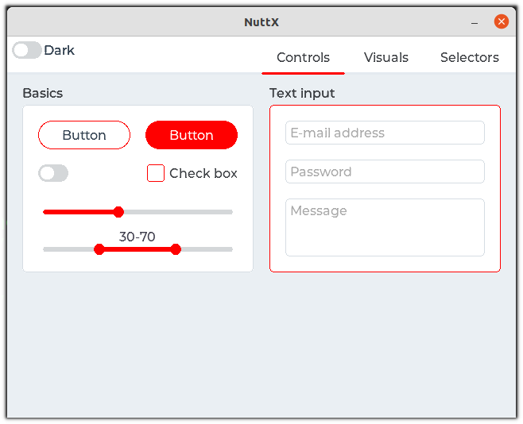

===
SIM
===

It is possible to run NuttX in a simulator called ``sim``, but some features
currently are supported only on Linux host (i.e.: Bluetooth, I2C, SPI, etc).

Using ``sim`` you can test many of NuttX features without a supported board.
Examples of supported features: Audio, Bluetooth, ELF, I2C, SPI, LVGL, Flash
File System, NX Serves, NX Demos, NX Window Manager, ROMFS, Network: TCP,
UDP, IP,6LoWPAN, and many more.

Toolchain
=========

All you need is your machine ``gcc`` working.

Compiling
=========

All you need to do is select your desired board profile configuratioon
(see: nuttx/sim/sim/sim/configs for the listing) ::

    $ make distclean

    $ ./tools/configure.sh sim:nsh

    $ make

Running
=======

When the compilation finishes it will create a ``nuttx`` binary, then run it::

    $ ./nuttx 
    login: admin
    password: Administrator
    User Logged-in!

    NuttShell (NSH) NuttX-10.1.0
    MOTD: username=admin password=Administrator
    nsh> ?
    help usage:  help [-v] [<cmd>]

      .         cd        echo      hexdump   mkfatfs   pwd       source    unset     
      [         cp        exec      kill      mkrd      readlink  test      usleep    
      ?         cmp       exit      losetup   mount     rm        time      xd        
      basename  dirname   false     ln        mv        rmdir     true      
      break     dd        free      ls        poweroff  set       uname     
      cat       df        help      mkdir     ps        sleep     umount    

    Builtin Apps:
      sh     hello  nsh    
    nsh> uname -a
    NuttX 10.1.0 508215581f Sep  3 2021 10:47:34 sim sim
    nsh>

Running LVGL
============

It is possible to run the LVGL Demo directly in the NuttX simulator ::

    $ make distclean

    $ ./tools/configure.sh sim:lvgl

    $ make -j

    $ ./nuttx

You should see a window with the touch calibration and then the LVGL demo:

   LVGL Demo running in the NuttX's simulator

Running VNC Server
==================

NuttX supports a VNC server, so it means even boards without a LCD display
could export a display interface over network. Also you can test it on NuttX
simulator before getting it working on your board, just follow these steps ::

    $ make distclean

    $ ./tools/configure.sh sim:vncserver

    $ make -j

    $ ./nuttx

Open a new terminal and execute ::

    $ remmina -c vnc://localhost

You should see some squares in different colors displayed in remmina:

.. figure:: images/vnc.png
   :align: center
   :width: 100%

   remmina connected to sim's VNC Server
