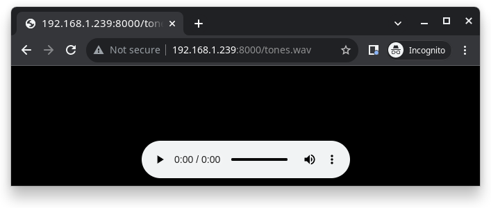

=============
ESP32 DevKitC
=============

The `ESP32 DevKitC <https://docs.espressif.com/projects/esp-idf/en/latest/esp32/hw-reference/modules-and-boards.html#esp32-devkitc-v4>`_ is a development board for the ESP32 SoC from Espressif, based on a ESP-WROOM-32 module. You can find the original V2 version and the newer V4 variant. They are
pin compatible.

.. list-table::
   :align: center

   * - .. figure:: esp32-core-board-v2.jpg
          :align: center

          ESP32 DevKitC/Core V2

     - .. figure:: esp32-devkitc-v4-front.jpg
          :align: center

          ESP32 DevKitC V4

Features
========

  - ESP32 WROOM Module
  - USB-to-UART bridge via micro USB port
  - Power LED
  - EN and BOOT buttons (BOOT accessible to user)
  - SPI FLASH (size varies according to model

Serial Console
==============

UART0 is, by default, the serial console. It connects to the on-board
CP2102 converter and is available on the USB connector USB CON8 (J1).

It will show up as /dev/ttypUSB[n] where [n] will probably be 0 (is it 1
on my PC because I have a another device at ttyUSB0).

Buttons and LEDs
================

Board Buttons
-------------

There are two buttons labeled Boot and EN. The EN button is not available
to software. It pulls the chip enable line that doubles as a reset line.

The BOOT button is connected to IO0. On reset it is used as a strapping
pin to determine whether the chip boots normally or into the serial
bootloader. After reset, however, the BOOT button can be used for software
input.

Board LEDs
----------

There are several on-board LEDs for that indicate the presence of power
and USB activity. None of these are available for use by software.

Ethernet
========

ESP32 has a 802.11 hardware MAC, so just connects to external PHY chip.
Due to the limited number of GPIOs in ESP32, it's recommended to use RMII to
connect to an external PHY chip. Current driver also only supports RMII option.

The RMII GPIO pins are fixed, but the SMI and functional GPIO pins are optional.

RMII GPIO pins are as following:

========== =============
ESP32 GPIO PHY Chip GPIO
========== =============
IO25       RXD[0]
IO26       RXD[1]
IO27       CRS_DV
IO0        REF_CLK
IO19       TXD[0]
IO21       TX_EN
IO22       TXD[1]
========== =============

SMI GPIO pins (default option) are as following:

========== =============
ESP32 GPIO PHY Chip GPIO
========== =============
IO18       MDIO
IO23       MDC
========== =============

Functional GPIO pins(default option) are as following:

========== =============
ESP32 GPIO PHY Chip GPIO
========== =============
IO5        Reset_N
========== =============

Espressif has an `official Ethernet development
board <https://docs.espressif.com/projects/esp-idf/en/latest/esp32/hw-reference/esp32/get-started-ethernet-kit.html>`_.

This driver has been tested according to this board and ESP32 core
board + LAN8720 module. If users have some issue about using this driver,
please refer the upper official document, specially the issue that GPIO0
causes failing to bring the ESP32 chip up.

I2S
===

ESP32 has two I2S peripherals accessible using either the generic I2S audio
driver or a specific audio codec driver
(`CS4344 <https://www.cirrus.com/products/cs4344-45-48/>`__ bindings are
available at the moment). The generic I2S audio driver enables using both
the receiver module (RX) and the transmitter module (TX) without using any
specific codec. Also, it's possible to use the I2S character device driver
to bypass the audio subsystem and write directly to the I2S peripheral.

.. note:: The I2S peripheral is able to work on two functional modes
  internally: 16 and 32-bit width.
  ESP32's I2S driver, however, uses an internal buffer to enable inserting
  padding bytes and provide the ability to play 8, 16, 24 or 32-bits/sample
  audio files. Sample rate and data width are automatically set by the upper
  half audio driver.

.. note:: Also, it's possible to use 8, 16, 24, and 32-bit-widths writing
  directly to the I2S character device. Just make sure to set the bit-width::

    $ make menuconfig
    -> System Type
        -> ESP32 Peripheral Selection
            -> I2S
                -> I2S0/1
                    -> Bit Witdh

  And make sure the data stream buffer being written to the I2S peripheral is
  aligned to the next boundary i.e. 16 bits for the 8 and 16-bit-widths and
  32 bits for 24 and 32-bit-widths.

The following configurations use the I2S peripheral::
  * :ref:`platforms/xtensa/esp32/boards/esp32-devkitc/index:audio`
  * :ref:`platforms/xtensa/esp32/boards/esp32-devkitc/index:i2schar`
  * :ref:`platforms/xtensa/esp32/boards/esp32-devkitc/index:nxlooper`

Pin Mapping
===========

.. todo:: To be updated

===== ========== ==========
Pin   Signal     Notes
===== ========== ==========
?     ?          ?
===== ========== ==========

Configurations
==============

All of the configurations presented below can be tested by running the following commands::

    $ ./tools/configure.sh esp32-devkitc:<config_name>
    $ make flash ESPTOOL_PORT=/dev/ttyUSB0 -j

Where <config_name> is the name of board configuration you want to use, i.e.: nsh, buttons, wifi...
Then use a serial console terminal like ``picocom`` configured to 115200 8N1.

audio
-----

This configuration uses the I2S0 peripheral and an externally connected audio
codec to play an audio file streamed over an HTTP connection while connected
to a Wi-Fi network.

**Audio Codec Setup**

The CS4344 audio codec is connected on the following pins:

========== ========== =========================================
ESP32 Pin  CS4344 Pin Description
========== ========== =========================================
0          MCLK       Master Clock
4          SCLK       Serial Clock
5          LRCK       Left Right Clock (Word Select)
18         SDIN       Serial Data In on CS4344. (DOUT on ESP32)
========== ========== =========================================

**Simple HTTP server**

Prepare a PCM-encoded (`.wav`) audio file with 16 or 24 bits/sample (sampled at
16~48kHz). This file must be placed into a folder in a computer that could
be accessed on the same Wi-Fi network the ESP32 will be connecting to.

Python provides a simple HTTP server. ``cd`` to the audio file folder on the
PC and run::

    $ python3 -m http.server
    Serving HTTP on 0.0.0.0 port 8000 (http://0.0.0.0:8000/)

Look for your PC IP address and test playing the prepared audio on your
browser:

After successfully built and flashed, connect the board to the Wi-Fi network::

    nsh> wapi psk wlan0 mypasswd 3
    nsh> wapi essid wlan0 myssid 1
    nsh> renew wlan0

Once connected, open NuttX's player and play the file according to its file
name and the IP address of the HTTP server::

    nsh> nxplayer
    nxplayer> play http://192.168.1.239:8000/tones.wav

autopm
------

This configuration makes the device automatically enter the low power consumption mode
when in the idle state, powering off the cpu and other peripherals.

In minimum power save mode, the station wakes up every DTIM to receive a beacon. The broadcast
data will not be lost because it is transmitted after DTIM. However, it can not save much more
power if DTIM is short as the DTIM is determined by the access point.

ble
---

This configuration is used to enable Bluetooth Low Energy support for this board. You can scan
for Bluetooth devices using the following commands::

    NuttShell (NSH) NuttX-10.2.0
    nsh> ifconfig
    bnep0   Link encap:UNSPEC at DOWN
            inet addr:0.0.0.0 DRaddr:0.0.0.0 Mask:0.0.0.0
    wlan0   Link encap:Ethernet HWaddr ac:67:b2:53:8b:ec at UP
            inet addr:10.0.0.2 DRaddr:10.0.0.1 Mask:255.255.255.0
    nsh> bt bnep0 scan start
    nsh> bt bnep0 scan stop
    nsh> bt bnep0 scan get
    Scan result:
    1.     addr:           63:14:2f:b9:9f:83 type: 1
          rssi:            -90
          response type:   3
          advertiser data: 1e ff 06 00 01 09 20 02 7c 33 a3 a7 cd c9 44 5b
    2.     addr:           52:ca:05:b5:ad:77 type: 1
          rssi:            -82
          response type:   3
          advertiser data: 1e ff 06 00 01 09 20 02 03 d1 21 57 bf 19 b3 7a
    3.     addr:           46:8e:b2:cd:94:27 type: 1
          rssi:            -92
          response type:   2
          advertiser data: 02 01 1a 09 ff c4 00 10 33 14 12 16 80 02 0a d4
    4.     addr:           46:8e:b2:cd:94:27 type: 1
          rssi:            -92
          response type:   4
          advertiser data: 18 09 5b 4c 47 5d 20 77 65 62 4f 53 20 54 56 20
    5.     addr:           63:14:2f:b9:9f:83 type: 1
          rssi:            -80
          response type:   3
        advertiser data: 1e ff 06 00 01 09 20 02 7c 33 a3 a7 cd c9 44 5b

blewifi
-------

Combines the capabilities of the ``ble`` and ``wifi`` configurations. ESP32 has only one 2.4 GHz
ISM band RF module, which is shared by Bluetooth (BT & BLE) and Wi-Fi, so Bluetooth can't receive
or transmit data while Wi-Fi is receiving or transmitting data and vice versa. Under such circumstances,
ESP32 uses the time-division multiplexing method to receive and transmit packets.

bmp280
------

This configuration enables the use of the BMP280 temperature and pressure sensor over I2C.
You can check that the sensor is working by using the ``sensortest`` application::

    nsh> sensortest baro0
    baro0: timestamp:66870000 value1:1008.37 value2:31.70
    baro0: timestamp:66890000 value1:1008.31 value2:31.70

buttons
-------

This configuration shows the use of the buttons subsystem. It can be used by executing
the ``buttons`` application and pressing on any of the available board buttons::

    nsh> buttons
    buttons_main: Starting the button_daemon
    buttons_main: button_daemon started
    button_daemon: Running
    button_daemon: Opening /dev/buttons
    button_daemon: Supported BUTTONs 0x01
    nsh> Sample = 1
    Sample = 0

coremark
--------

This configuration sets the CoreMark benchmark up for running on the maximum
number of cores for this system. It also enables some optimization flags and
disables the NuttShell to get the best possible score.

.. note:: As the NSH is disabled, the application will start as soon as the
  system is turned on.

cxx
---

Development enviroment ready for C++ applications. You can check if the setup
was successfull by running ``cxxtest``::

    nsh> cxxtest
    Test ofstream ================================
    printf: Starting test_ostream
    printf: Successfully opened /dev/console
    cout: Successfully opened /dev/console
    Writing this to /dev/console
    Test iostream ================================
    Hello, this is only a test
    Print an int: 190
    Print a char: d
    Test std::vector =============================
    v1=1 2 3
    Hello World Good Luck
    Test std::map ================================
    Test C++17 features ==========================
    File /proc/meminfo exists!
    Invalid file! /invalid
    File /proc/version exists!

efuse
-----

A ``wifi`` configuration with the eFuse driver enabled. It can be accessed
through the ``/dev/efuse`` device file.

elf
---

This configuration uses apps/examples/elf in order to test the ELF loader.
It can be tested by executing the ``elf`` application.

i2schar
-------

This configuration enables the I2S character device and the i2schar example
app, which provides an easy-to-use way of testing the I2S peripherals (I2S0
and I2S1), enabling both the TX and the RX for those peripherals.

**I2S0 pinout**

========== ========== =========================================
ESP32 Pin  Signal Pin Description
========== ========== =========================================
0          MCLK       Master Clock
4          BCLK       Bit Clock (SCLK)
5          WS         Word Select (LRCLK)
18         DOUT       Data Out
19         DIN        Data IN
========== ========== =========================================

**I2S1 pinout**

========== ========== =========================================
ESP32 Pin  Signal Pin Description
========== ========== =========================================
22         BCLK       Bit Clock (SCLK)
23         WS         Word Select (LRCLK)
25         DOUT       Data Out
26         DIN        Data IN
========== ========== =========================================

After successfully built and flashed, run on the boards's terminal::

    i2schar -p /dev/i2schar[0-1]

The corresponding output should show related debug informations.

knsh
----

This is identical to the nsh configuration except that (1) NuttX
is built as PROTECTED mode, monolithic module and the user applications
are built separately and, as a consequence, (2) some features that are
only available in the FLAT build are disabled.

Protected Mode support for ESP32 relies on the PID Controller peripheral
for implementing isolation between Kernel and Userspace.

By working together with the MMU and Static MPUs of the ESP32, the PID
Controller is able to restrict the application access to peripherals, on-chip
memories (Internal ROM and Internal SRAM) and off-chip memories (External
Flash and PSRAM).

.. warning::
    * The PID Controller driver is in **EXPERIMENTAL** state, so please
      consider the Protected Mode feature for ESP32 a **Proof-of-Concept**.
    * The PID Controller **does not** prevent the application from accessing
      CPU System Registers.

leds
----

This configuration uses the on-board LED (or an external LED connected to GPIO2)
to demonstrate the use of the userleds subsystem::

    nsh> leds
    leds_main: Starting the led_daemon
    leds_main: led_daemon started
    led_daemon (pid# 3): Running
    led_daemon: Opening /dev/userleds
    led_daemon: Supported LEDs 0x01
    led_daemon: LED set 0x01
    led_daemon: LED set 0x00
    led_daemon: LED set 0x01
    led_daemon: LED set 0x00
    led_daemon: LED set 0x01

max6675
-------

This configuration enables the use of the MAX6675 temperature sensor over SPI.
The following pin configuration is used to connect the sensor:

===== =======
Pin   Signal
===== =======
15    CS
14    SCK
12    MISO
===== =======

You can check that the sensor is working by using the ``max6675`` application::

    nsh> max6675
    Unable to open file /dev/temp1
    Unable to open file /dev/temp2
    Unable to open file /dev/temp3
    Starting...
    Channel SSP0/SPI1 Device 0: Temperature = 24!
    Channel SSP0/SPI1 Device 1: Not enabled!
    Channel SSP1/SPI2 Device 0: Not enabled!
    Channel SSP1/SPI2 Device 1: Not enabled!

mcp2515
-------

This config is used to communicate with MCP2515 CAN over SPI chip.
SPI3 is used and kept with the default IOMUX pins, i.e.:

===== =======
Pin   Signal
===== =======
5     CS
18    SCK
23    MOSI
19    MISO
===== =======

The MCP2515 interrupt (INT) pin is connected to the pin 22 of the
ESP32-Devkit.

mcuboot_nsh
--------------------

This configuration is the same as the ``nsh`` configuration, but it generates the application
image in a format that can be used by MCUboot. It also makes the ``make bootloader`` command to
build the MCUboot bootloader image using the Espressif HAL.

mcuboot_slot_confirm
--------------------

This configuration is used to represent an MCUboot update image that needs to be confirmed
after flashing. The image can be confirmed by using the following command::

    nsh> mcuboot_confirm
    Application Image successfully confirmed!

For more information, check `this demo <https://www.youtube.com/watch?v=Vzy0rl-ixbc>`_.

mcuboot_update_agent
--------------------

This configuration is used to represent an MCUboot image that contains an update agent
to perform OTA updates. First, you will have to setup a HTTP server to provide the update
image. To do that, we can run a simple Python server on the same folder that contains our
binary file on the computer::

    sudo python -m http.server 8080

After this, we can use NSH to connect to our network and use the agent to perform the firmware
update::

    nsh> ifup wlan0
    nsh> wapi mode wlan0 2
    nsh> wapi psk wlan0 mypasswd 3
    nsh> wapi essid wlan0 myssid 1
    nsh> renew wlan0
    nsh> mcuboot_agent http://<SERVER_IP>:8080/nuttx.bin

For more information, check `this demo <https://www.youtube.com/watch?v=Vzy0rl-ixbc>`_.

modbus
------

This configurations shows how to use this device as a ModBus RTU Slave. After
configuring the desired pins on menuconfig and wiring the RS485 converter, you
can enable the ModBus to respond to queries::

    nsh> modbus -e

Now you will be able to read the ModBus registers using an application like ``mbpoll``.
For more information, check `this video <https://www.youtube.com/watch?v=bLUGLJIjt4E>`_.

module
------

This config is to run apps/examples/module.

mqttc
-----

This configuration tests the MQTT-C publisher example.

From the host, start the broker and subscribe to the :code:`test` topic.  Using
``mosquitto`` this should be::

    $ mosquitto&
    $ mosquitto_sub -t test

From the NSH, connect to an access point::

    nsh> wapi psk wlan0 mypasswd 3
    nsh> wapi essid wlan0 myssid 1
    nsh> renew wlan0

Publish to the broker::

    nsh> mqttc_pub -h 192.168.1.11

The default behavior is to publish the message :code:`test`.  The following should be
outputted::

    nsh> mqttc_pub -h 192.168.1.11
         Success: Connected to broker!
         Success: Published to broker!

         Disconnecting from 192.168.1.11

From the host the message :code:`test` should be outputted.

ms5611
------

This configuration enables the use of the MS5611 pressure sensor over I2C.
You can check that the sensor is working by using the ``sensortest`` application::

    nsh> sensortest baro0
    baro0: timestamp:66870000 value1:1008.37 value2:31.70
    baro0: timestamp:66890000 value1:1008.31 value2:31.70

nsh
---

Basic NuttShell configuration (console enabled in UART0, exposed via
USB connection by means of CP2102 converter, at 115200 bps).

nxdiag
------

This configuration enables the NuttX diagnostics tool. By default, it will
gather information about the NuttX system, its configuration, the compilation
and linking flags used, the host system PATH and Espressif specific information.
It can be used by executing the ``nxdiag`` application::

    nsh> nxdiag --all
    Nxdiag Report:

    NuttX RTOS info:
            Hostname:
            Release: 10.4.0
            Build: 75e13a67ba-dirty May 24 2023 14:53:27
            Arch: xtensa
            Config: esp32-devkitc:nxdiag

    NuttX CFLAGS:
            -fno-common
            -Wall
            ...

nxlooper
--------

This configuration uses the I2S1 peripheral as an I2S receiver and the I2S0
peripheral as an I2S transmitter. The idea is to capture an I2S data frame
using an I2S peripheral and reproduce the captured data on the other.

**Receiving data on I2S1**

The I2S1 will act as a receiver (master mode), capturing data from DIN, which
needs to be connected to an external source as follows:

========== ========== =========================================
ESP32 Pin  Signal Pin Description
========== ========== =========================================
22         BCLK       Bit Clock (SCLK)
23         WS         Word Select (LRCLK)
26         DIN        Data IN
========== ========== =========================================

**Transmitting data on I2S0**

The I2S0 will act as a transmitter (master mode), replicating the data
captured on I2S1. The pinout for the transmitter is as follows:

========== ========== =========================================
ESP32 Pin  Signal Pin Description
========== ========== =========================================
0          MCLK       Master Clock
4          BCLK       Bit Clock (SCLK)
5          WS         Word Select (LRCLK)
18         DOUT       Data Out
========== ========== =========================================

.. note:: The audio codec CS4344 can be connected to the transmitter pins
  to reproduce the captured data if the receiver's source is an audio data.

**nxlooper**

The ``nxlooper`` application captures data from the audio device with receiving
capabilities (the I2S1 on this example) and forwards the audio data frame to
the audio device with transmitting capabilities (the I2S0 on this example).

After successfully built and flashed, run on the boards' terminal::

  nsh> nxlooper
  nxlooper> loopback

.. note:: ``loopback`` command default arguments for the channel configuration,
  the data width and the sample rate are, respectively, 2 channels,
  16 bits/sample and 48KHz. These arguments can be supplied to select
  different audio formats, for instance::

    nxlooper> loopback 2 8 44100

oneshot
-------

This config demonstrate the use of oneshot timers present on the ESP32.
To test it, just run the ``oneshot`` example::

    nsh> oneshot
    Opening /dev/oneshot
    Maximum delay is 4294967295999999
    Starting oneshot timer with delay 2000000 microseconds
    Waiting...
    Finished

ostest
------

This is the NuttX test at ``apps/testing/ostest`` that is run against all new
architecture ports to assure a correct implementation of the OS. The default
version is for a single CPU but can be modified for an SMP test by adding::

  CONFIG_SMP=y
  CONFIG_SMP_NCPUS=2
  CONFIG_SPINLOCK=y

pm
--

This configuration enables the CPU power management through governors.

psram
-----

This config tests the PSRAM driver over SPIRAM interface.
You can use the ramtest command to test the PSRAM memory. We are testing
only 64KB on this example (64 * 1024), but you can change this number to
2MB or 4MB depending on PSRAM chip used on your board::

    nsh> ramtest -w 0x3F800000 65536
    RAMTest: Marching ones: 3f800000 65536
    RAMTest: Marching zeroes: 3f800000 65536
    RAMTest: Pattern test: 3f800000 65536 55555555 aaaaaaaa
    RAMTest: Pattern test: 3f800000 65536 66666666 99999999
    RAMTest: Pattern test: 3f800000 65536 33333333 cccccccc
    RAMTest: Address-in-address test: 3f800000 65536

psram_usrheap
-------------

This configuration works just like ``psram`` but allocating the user
heap on the PSRAM.

pwm
---

This configuration demonstrates the use of PWM through a LED connected to GPIO12.
To test it, just execute the ``pwm`` application::

    nsh> pwm
    pwm_main: starting output with frequency: 10000 duty: 00008000
    pwm_main: stopping output

random
------

This configuration shows the use of the ESP32's True Random Number Generator with
entropy sourced from Wi-Fi and Bluetooth noise.
To test it, just run ``rand`` to get 32 randomly generated bytes::

    nsh> rand
    Reading 8 random numbers
    Random values (0x3ffe0b00):
    0000  98 b9 66 a2 a2 c0 a2 ae 09 70 93 d1 b5 91 86 c8  ..f......p......
    0010  8f 0e 0b 04 29 64 21 72 01 92 7c a2 27 60 6f 90  ....)d!r..|.'`o.

rmt
---

This configuration enables usage of Remote Control Transceiver (RMT) module and
example ``ws2812esp32`` demonstrating the usage of **RMT** by driving RGB LEDs.
To test the module connect a Data pin of RGB LED compatible with WS2812
to ESP32 GPIO 4 and run::

    nsh> ws2812esp32 0 <number_of_leds_on_strip>

rtc
---

This configuration demonstrates the use of the RTC driver through alarms.
You can set an alarm, check its progress and receive a notification after it expires::

    nsh> alarm 10
    alarm_daemon started
    alarm_daemon: Running
    Opening /dev/rtc0
    Alarm 0 set in 10 seconds
    nsh> alarm -r
    Opening /dev/rtc0
    Alarm 0 is active with 10 seconds to expiration
    nsh> alarm_daemon: alarm 0 received

smp
---

Another NSH configuration, similar to nsh, but also enables
SMP operation. It differs from the nsh configuration only in these
additional settings:

SMP is enabled::

  CONFIG_SMP=y
  CONFIG_SMP_NCPUS=2
  CONFIG_SPINLOCK=y

The apps/testing/smp test is included::

  CONFIG_TESTING_SMP=y
  CONFIG_TESTING_SMP_NBARRIER_THREADS=8
  CONFIG_TESTING_SMP_PRIORITY=100
  CONFIG_TESTING_SMP_STACKSIZE=2048

sotest
------

This config is to run ``apps/examples/sotest``.

spiflash
--------

This config tests the external flash memory that comes with the ESP32 module
connected through SPI1.

By default a SmartFS file system is selected.
Once booted you can use the following commands to mount the file system::

    nsh> mksmartfs /dev/smart0
    nsh> mount -t smartfs /dev/smart0 /mnt

Note that mksmartfs is only needed the first time.

sta_softap
----------

With this configuration you can run these commands to be able
to connect your smartphone or laptop to your board::

  nsh> ifup wlan1
  nsh> dhcpd_start wlan1
  nsh> wapi psk wlan1 mypasswd 3
  nsh> wapi essid wlan1 nuttxap 1

In this case, you are creating the access point ``nuttxapp`` in your board and to
connect to it on your smartphone you will be required to type the password ``mypasswd``
using WPA2.

.. tip:: Please refer to :ref:`ESP32 Wi-Fi SoftAP Mode <esp32_wi-fi_softap>`
  for more information.

The ``dhcpd_start`` is necessary to let your board to associate an IP to your smartphone.

tickless
--------

This configuration enables the support for tickless scheduler mode.

timer
-----

This config test the general use purpose timers. It includes the 4 timers,
adds driver support, registers the timers as devices and includes the timer
example.

To test it, just run the following::

  nsh> timer -d /dev/timerx

Where x in the timer instance.

twai
----

This configuration enables the support for the TWAI (Two-Wire Automotive Interface) driver.
You can test it by connecting TWAI RX and TWAI TX pins which are GPIO0 and GPIO2 by default
to a external transceiver or connecting TWAI RX to TWAI TX pin by enabling
the ``Device Drivers -> CAN Driver Support -> CAN loopback mode`` option and running the ``can`` example::

    nsh> can
    nmsgs: 0
    min ID: 1 max ID: 2047
    Bit timing:
      Baud: 1000000
      TSEG1: 15
      TSEG2: 4
        SJW: 3
      ID:    1 DLC: 1

wamr_wasi_debug
---------------

This config is an example to use wasm-micro-runtime.
It can run both of wasm bytecode and AoT compiled modules.

This example uses littlefs on ESP32's SPI flash to store wasm modules.

1. Create a littlefs image which contains wasm modules.

   https://github.com/jrast/littlefs-python/blob/master/examples/mkfsimg.py
   is used in the following example::

      % python3 mkfsimg.py \
        --img-filename ..../littlefs.bin \
        --img-size 3080192 \
        --block-size 4096 \
        --prog-size 256 \
        --read-size 256 \
        ..../wasm_binary_directory

2. Write the NuttX image and the filesystem to ESP32::

      % esptool.py \
        --chip esp32 \
        --port /dev/tty.SLAB_USBtoUART \
        --baud 921600 \
        write_flash \
        0x1000 ..../bootloader-esp32.bin \
        0x8000 ..../partition-table-esp32.bin \
        0x10000 nuttx.bin \
        0x180000 ..../littlefs.bin

3. Mount the filesystem and run a wasm module on it::

      nsh> mount -t littlefs /dev/esp32flash /mnt
      nsh> iwasm /mnt/....

wifi
----

Enables Wi-Fi support. You can define your credentials this way::

    $ make menuconfig
    -> Application Configuration
        -> Network Utilities
            -> Network initialization (NETUTILS_NETINIT [=y])
                -> WAPI Configuration

Or if you don't want to keep it saved in the firmware you can do it
at runtime::

    nsh> wapi psk wlan0 mypasswd 3
    nsh> wapi essid wlan0 myssid 1
    nsh> renew wlan0

.. tip:: Please refer to :ref:`ESP32 Wi-Fi Station Mode <esp32_wi-fi_sta>`
  for more information.

wifi_smp
--------

This configuration is similar to ``wifi``. It also enables multiple cores on the CPU.

watchdog
--------

This config test the watchdog timers. It includes the 2 MWDTS,
adds driver support, registers the WDTs as devices and includes the watchdog
example.

To test it, just run the following::

  nsh> wdog -i /dev/watchdogx

Where x is the watchdog instance.

watcher
-------

This configuration is an example of monitoring watchdog interrupts. To test it, enable
the watcher daemon with ``watcher`` and monitor the tasks using ``watched``::

    nsh> watcher
    Watcher Daemon has started!
    nsh> watched
    Starting watched tasks
    Creating Watched Task 1 - It will not feed the dog
    Creating Watched Task 2 - It will feed the dog
    Creating Watched Task 3 - It will feed the dog
    Creating Watched Task 4 - It will not feed the dog
    nsh> *** Printing Tasks Status ***
    Watched Task 1 starved the dog.
    Watched Task 2 fed the dog.
    Watched Task 3 fed the dog.
    Watched Task 4 fed the dog.
    *** Printing Tasks Status ***
    Watched Task 1 starved the dog.
    Watched Task 2 fed the dog.
    Watched Task 3 fed the dog.
    Watched Task 4 starved the dog.

wifinsh
-------

The ``wifinsh`` is similar to the ``wifi`` board example, but it will connect
automatically to your Access Point (Wi-Fi Router) and will run telnet daemon
in the board. Then you can connect to your board from your computer using the
telnet program.

After configuring the ``esp32-devkit:wifinsh`` you need to define your creden-
tials in the menuconfig. You can define your credentials this way::

    $ make menuconfig
    -> Application Configuration
        -> Network Utilities
            -> Network initialization (NETUTILS_NETINIT [=y])
                -> WAPI Configuration

Find your board IP using ``nsh> ifconfig`` and then from your computer::

    $ telnet 192.168.x.y

Where x and y are the last two numbers of the IP that your router gave to
your board.

wifishare
---------

The ``wifishare`` let your ESP32 board to work as Access Point (WiFi Router)
and WiFi Station at same time. This way your board will connect to a real
WiFi Router (from your ISP for example) and will offer WiFi connection to other
devices and share WiFi connection with them.

After configuring the ``esp32-devkit:wifishare`` you need to define your
credentials in the menuconfig. You can define your credentials this way::

    $ make menuconfig
    -> Application Configuration
        -> Network Utilities
            -> Network initialization (NETUTILS_NETINIT [=y])
                -> WAPI Configuration

After compile and flash your board you need to confirm you have two interfaces:

    nsh> ifconfig
    wlan0   Link encap:Ethernet HWaddr bc:dd:c2:d4:a9:ec at RUNNING mtu 1504
            inet addr:192.168.0.7 DRaddr:192.168.0.1 Mask:255.255.255.0

    wlan1   Link encap:Ethernet HWaddr bc:dd:c2:d4:a9:ed at DOWN mtu 1504
            inet addr:0.0.0.0 DRaddr:0.0.0.0 Mask:0.0.0.0

Now you need to configure your wlan1 to become a WiFi Access Point:

    nsh> dhcpd_start wlan1
    nsh> wapi psk wlan1 mypasswd 3
    nsh> wapi essid wlan1 nuttxap 1

And you need to make the route to your WiFi Router (i.e. 192.168.0.1) the default route:

    nsh> addroute default 192.168.0.1 wlan0
    nsh> route
    SEQ   TARGET          NETMASK         ROUTER
       1. 0.0.0.0         0.0.0.0         192.168.0.1

Finally we will setup an iptables rule to NAT the wlan0 interface:

    nsh> iptables -t nat -A POSTROUTING -o wlan0 -j MASQUERADE

After connectig a client (i.e. Linux computer) to the `nuttxap` Access Point
you can confirm it is working this way:

    $ ifconfig
    lo: flags=73<UP,LOOPBACK,RUNNING>  mtu 65536
            inet 127.0.0.1  netmask 255.0.0.0
            inet6 ::1  prefixlen 128  scopeid 0x10<host>
            loop  txqueuelen 1000  (Local Loopback)
            RX packets 5666  bytes 547514 (547.5 KB)
            RX errors 0  dropped 0  overruns 0  frame 0
            TX packets 5666  bytes 547514 (547.5 KB)
            TX errors 0  dropped 0 overruns 0  carrier 0  collisions 0
    
    wlp0s20f3: flags=4163<UP,BROADCAST,RUNNING,MULTICAST>  mtu 1500
            inet 10.0.0.4  netmask 255.255.255.0  broadcast 10.0.0.255
            inet6 xxxx::xxxx:xxx:xxxx:xx  prefixlen 64  scopeid 0x20<link>
            ether xx:xx:xx:xx:xx:xx  txqueuelen 1000  (Ethernet)
            RX packets 127217  bytes 146539379 (146.5 MB)
            RX errors 0  dropped 0  overruns 0  frame 0
            TX packets 37079  bytes 23604536 (23.6 MB)
            TX errors 0  dropped 0 overruns 0  carrier 0  collisions 0
    
    $ ping 10.0.0.1
    PING 10.0.0.1 (10.0.0.1) 56(84) bytes of data.
    64 bytes from 10.0.0.1: icmp_seq=1 ttl=64 time=3.28 ms
    64 bytes from 10.0.0.1: icmp_seq=2 ttl=64 time=9.72 ms
    64 bytes from 10.0.0.1: icmp_seq=3 ttl=64 time=2.63 ms
    64 bytes from 10.0.0.1: icmp_seq=4 ttl=64 time=18.9 ms
    64 bytes from 10.0.0.1: icmp_seq=5 ttl=64 time=4.82 ms
    
    $ ping 8.8.8.8
    PING 8.8.8.8 (8.8.8.8) 56(84) bytes of data.
    64 bytes from 8.8.8.8: icmp_seq=1 ttl=111 time=63.0 ms
    64 bytes from 8.8.8.8: icmp_seq=2 ttl=111 time=51.4 ms
    64 bytes from 8.8.8.8: icmp_seq=3 ttl=111 time=55.0 ms
    64 bytes from 8.8.8.8: icmp_seq=4 ttl=111 time=64.3 ms
    64 bytes from 8.8.8.8: icmp_seq=5 ttl=111 time=52.8 ms

That is it. You can use this 8.8.8.8 as DNS to resolve names.

Debugging with OpenOCD
======================

Akizukidenshi FT232HL
---------------------

Akizukidenshi's FT232HL, a FT232H based JTAG adapter
(http://akizukidenshi.com/catalog/g/gK-06503/) with JP3 and JP4 closed,
and connected to ESP32 as:

+------------------+-------------+
| ESP32-DevKitC V4 | FT232HL     |
+=======+==========+=============+
| J2    |  J3      | J2          |
+-------+----------+-------------+
| IO13  |          | AD0   (TCK) |
+-------+----------+-------------+
| IO12  |          | AD1   (TDI) |
+-------+----------+-------------+
|       |  IO15    | AD2   (TDO) |
+-------+----------+-------------+
| IO14  |          | AD3   (TMS) |
+-------+----------+-------------+
| GND   |          | GND         |
+-------+----------+-------------+

can be used with ESP-IDF version of openocd with::

    % openocd -f board/esp32-wrover-kit-1.8v.cfg
