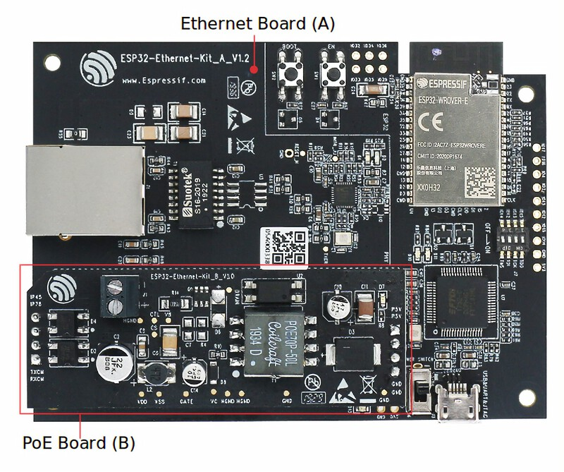
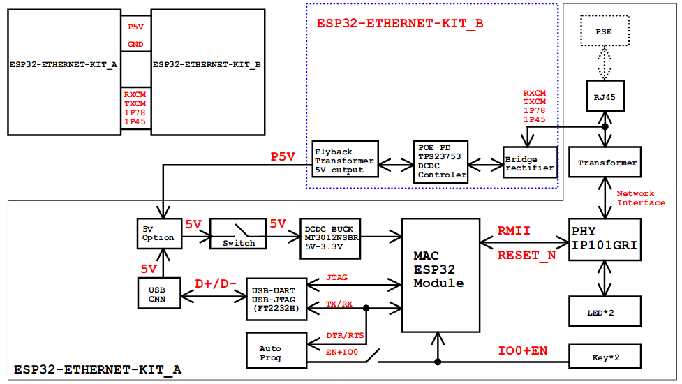

..
    Ported from ESP-IDF documentation https://docs.espressif.com/projects/esp-idf/en/latest/esp32/hw-reference/esp32/get-started-ethernet-kit.html

=======================
ESP32-Ethernet-Kit V1.2
=======================

The ESP32-Ethernet-Kit is an Ethernet-to-Wi-Fi development board that enables Ethernet
devices to be interconnected over Wi-Fi. At the same time, to provide more flexible power
supply options, the ESP32-Ethernet-Kit also supports power over Ethernet (PoE).
You can find the board schematic `here <https://dl.espressif.com/dl/schematics/SCH_ESP32-Ethernet-Kit_A_V1.2_20200528.pdf>`_.

    ESP32-Ethernet-Kit V1.2 Board Layout

It consists of two development boards, the Ethernet board A and the PoE board B.
The Ethernet board (A) contains Bluetooth/Wi-Fi dual-mode ESP32-WROVER-E module and IP101GRI,
a Single Port 10/100 Fast Ethernet Transceiver (PHY). The PoE board (B) provides power over
Ethernet functionality. The A board can work independently, without the board B installed.

    ESP32-Ethernet-Kit V1.2

For the application loading and monitoring, the Ethernet board (A) also features FTDI FT2232H
chip - an advanced multi-interface USB bridge. This chip enables to use JTAG for direct debugging
of ESP32 through the USB interface without a separate JTAG debugger.

The block diagram below presents main components of the ESP32-Ethernet-Kit.

    ESP32-Ethernet-Kit V1.2 Electrical Block Diagram

Features
========

    - ESP32-WROVER-E Module
    - JTAG through USB
    - Ethernet
    - Power over Ethernet (PoE)
    - USB-to-UART bridge via micro USB port

Functional Description
======================

The following figures describe the key components, interfaces, and controls of the ESP32-Ethernet-Kit.

Ethernet Board (A)
------------------

.. figure:: esp32-ethernet-kit-a-v1.2-layout.jpg
    :alt: ESP32-Ethernet-Kit - Ethernet board (A) layout
    :figclass: align-center

    ESP32-Ethernet-Kit - Ethernet board (A) layout

PoE Board (B)
-------------

This board converts power delivered over the Ethernet cable (PoE) to provide a power supply
for the Ethernet board (A). The main components of the PoE board (B) are shown on the image below.

.. figure:: esp32-ethernet-kit-b-v1.0-layout.png
    :alt: ESP32-Ethernet-Kit - PoE board (B) layout
    :figclass: align-center

    ESP32-Ethernet-Kit - PoE board (B) layout

The PoE board (B) has the following features:

    - Support for IEEE 802.3at
    - Power output: 5 V, 1.4 A

To take advantage of the PoE functionality the RJ45 Port of the Ethernet board (A) should be connected
with an Ethernet cable to a switch that supports PoE. When the Ethernet board (A) detects 5 V power output
from the PoE board (B), the USB power will be automatically cut off.

Function Switch
===============

When in On position, this DIP switch is routing listed GPIOs to FT2232H to provide JTAG functionality.
When in Off position, the GPIOs may be used for other purposes.

=======  ================
DIP SW   GPIO Pin
=======  ================
 1       GPIO13
 2       GPIO12
 3       GPIO15
 4       GPIO14
=======  ================

RMII Clock Selection
====================

The ethernet MAC and PHY under RMII working mode need a common 50 MHz reference clock (i.e. RMII clock)
that can be provided either externally, or generated from internal ESP32 APLL (not recommended).

RMII Clock Sourced Externally by PHY
------------------------------------

By default, the ESP32-Ethernet-Kit is configured to provide RMII clock for the IP101GRI PHY's 50M_CLKO output.
The clock signal is generated by the frequency multiplication of 25 MHz crystal connected to the PHY.
For details, please see the figure below.

.. figure:: esp32-ethernet-kit-rmii-clk-from-phy.png
    :align: center
    :scale: 80%
    :alt: RMII Clock from IP101GRI PHY
    :figclass: align-center

    RMII Clock from IP101GRI PHY

Please note that the PHY is reset on power up by pulling the RESET_N signal down with a resistor.
ESP32 should assert RESET_N high with GPIO5 to enable PHY. Only this can ensure the power-up of system.
Otherwise ESP32 may enter download mode (when the clock signal of REF_CLK_50M is at a high logic level during
the GPIO0 power-up sampling phase).

RMII Clock Sourced Internally from ESP32's APLL
-----------------------------------------------

Another option is to source the RMII Clock from internal ESP32 APLL, see figure below.
The clock signal coming from GPIO0 is first inverted, to account for transmission line delay,
and then supplied to the PHY.

.. figure:: esp32-ethernet-kit-rmii-clk-to-phy.png
    :align: center
    :scale: 80%
    :alt: RMII Clock from ESP Internal APLL
    :figclass: align-center

    RMII Clock from ESP Internal APLL

To implement this option, users need to remove or add some RC components on the board.
For details please refer to the `ESP32-Ethernet-Kit V1.2 Ethernet board (A) schematic <https://dl.espressif.com/dl/schematics/SCH_ESP32-Ethernet-Kit_A_V1.2_20200528.pdf>`_,
sheet 2, location D2. Please note that if the APLL is already used for other purposes
(e.g. I2S peripheral), then you have no choice but use an external RMII clock.

Serial Console
==============

UART0 is, by default, the serial console. It connects to the on-board
CP2102N bridge and is available on the USB connector.

It will show up as /dev/ttyUSB[n] where [n] will probably be 0.

Buttons and LEDs
================

Board Buttons
-------------

There are two buttons labeled Boot and EN. The EN button is not available
to software. It pulls the chip enable line that doubles as a reset line.

The BOOT button is connected to IO0. On reset it is used as a strapping
pin to determine whether the chip boots normally or into the serial
bootloader. After reset, however, the BOOT button can be used for software
input.

Board LEDs
----------

There are several on-board LEDs for that indicate the presence of power
and USB activity. None of these are available for use by software.

Pin Mapping
===========

.. csv-table::
    :header: ESP32-WROVER-E,IP101GRI,UART,JTAG,GPIO,Comments

    S_VP,,,,IO36,
    S_VN,,,,IO39,
    IO34,,,,IO34,
    IO35,,,,IO35,
    IO32,,,,IO32,
    IO33,,,,IO33,
    IO25,RXD[0],,,,
    IO26,RXD[1],,,,
    IO27,CRS_DV,,,,
    IO14,,,TMS,IO14,
    IO12,,,TDI,IO12,
    IO13,,,TCK,IO13,
    IO15,,,TDO,IO15,
    IO2,,,,IO2,
    IO0,REF_CLK,,,,See note 1
    IO4,,,,IO4,
    IO16,,,,IO16 (NC),See note 2
    IO17,,,,IO17 (NC),See note 2
    IO5,Reset_N,,,,See note 1
    IO18,MDIO,,,,
    IO19,TXD[0],,,,
    IO21,TX_EN,,,,
    RXD0,,RXD,,,
    TXD0,,TXD,,,
    IO22,TXD[1],,,,
    IO23,MDC,,,,

.. note::

    1. To prevent the power-on state of the GPIO0 from being affected by the clock output on the PHY side,
    the RESET_N signal to PHY defaults to low, turning the clock output off. After power-on you can control
    RESET_N with GPIO5 to turn the clock output on. See also `RMII Clock Sourced Externally by PHY`_. For
    PHYs that cannot turn off the clock output through RESET_N, it is recommended to use a crystal module
    that can be disabled/enabled externally. Similarly like when using RESET_N, the oscillator module should
    be disabled by default and turned on by ESP32 after power-up.
    For a reference design please see `ESP32-Ethernet-Kit V1.2 Ethernet board (A) schematic <https://dl.espressif.com/dl/schematics/SCH_ESP32-Ethernet-Kit_A_V1.2_20200528.pdf>`_.

    2. The ESP32 pins GPIO16 and GPIO17 are not broken out to the ESP32-WROVER-E module and therefore not available for use.

Configurations
==============

All of the configurations presented below can be tested by running the following commands::

    $ ./tools/configure.sh esp32-ethernet-kit:<config_name>
    $ make flash ESPTOOL_PORT=/dev/ttyUSB0 -j

Where <config_name> is the name of board configuration you want to use, i.e.: nsh, buttons, wifi...
Then use a serial console terminal like ``picocom`` configured to 115200 8N1.

autopm
------

This configuration makes the device automatically enter the low power consumption mode
when in the idle state, powering off the cpu and other peripherals.

In minimum power save mode, the station wakes up every DTIM to receive a beacon. The broadcast
data will not be lost because it is transmitted after DTIM. However, it can not save much more
power if DTIM is short as the DTIM is determined by the access point.

buttons
-------

This configuration shows the use of the buttons subsystem. It can be used by executing
the ``buttons`` application and pressing on any of the available board buttons::

    nsh> buttons
    buttons_main: Starting the button_daemon
    buttons_main: button_daemon started
    button_daemon: Running
    button_daemon: Opening /dev/buttons
    button_daemon: Supported BUTTONs 0x01
    nsh> Sample = 1
    Sample = 0

ethernet
--------

This configuration is similar to ``wifi`` but uses the Ethernet interface instead
of the WiFi one. It also automatically configures the IP and DNS addresses of the
device. It currently uses the following static configuration:

    - IP: 192.168.15.100 (0xc0a80f64)
    - Gateway: 192.168.15.1 (0xc0a80f01)
    - Netmask: 255.255.255.0 (0xffffff00)
    - DNS: 8.8.8.8 (0x08080808)

nsh
---

Basic NuttShell configuration (console enabled in UART0, exposed via
USB connection by means of CP2102 converter, at 115200 bps).

oneshot
-------

This config demonstrate the use of oneshot timers present on the ESP32.
To test it, just run the ``oneshot`` example::

    nsh> oneshot
    Opening /dev/oneshot
    Maximum delay is 4294967295999999
    Starting oneshot timer with delay 2000000 microseconds
    Waiting...
    Finished

rtc
---

This configuration demonstrates the use of the RTC driver through alarms.
You can set an alarm, check its progress and receive a notification after it expires::

    nsh> alarm 10
    alarm_daemon started
    alarm_daemon: Running
    Opening /dev/rtc0
    Alarm 0 set in 10 seconds
    nsh> alarm -r
    Opening /dev/rtc0
    Alarm 0 is active with 10 seconds to expiration
    nsh> alarm_daemon: alarm 0 received

wifi
----

Enables Wi-Fi support. You can define your credentials this way::

    $ make menuconfig
    -> Application Configuration
        -> Network Utilities
            -> Network initialization (NETUTILS_NETINIT [=y])
                -> WAPI Configuration

Or if you don't want to keep it saved in the firmware you can do it
at runtime::

    nsh> wapi psk wlan0 mypasswd 3
    nsh> wapi essid wlan0 myssid 1
    nsh> renew wlan0