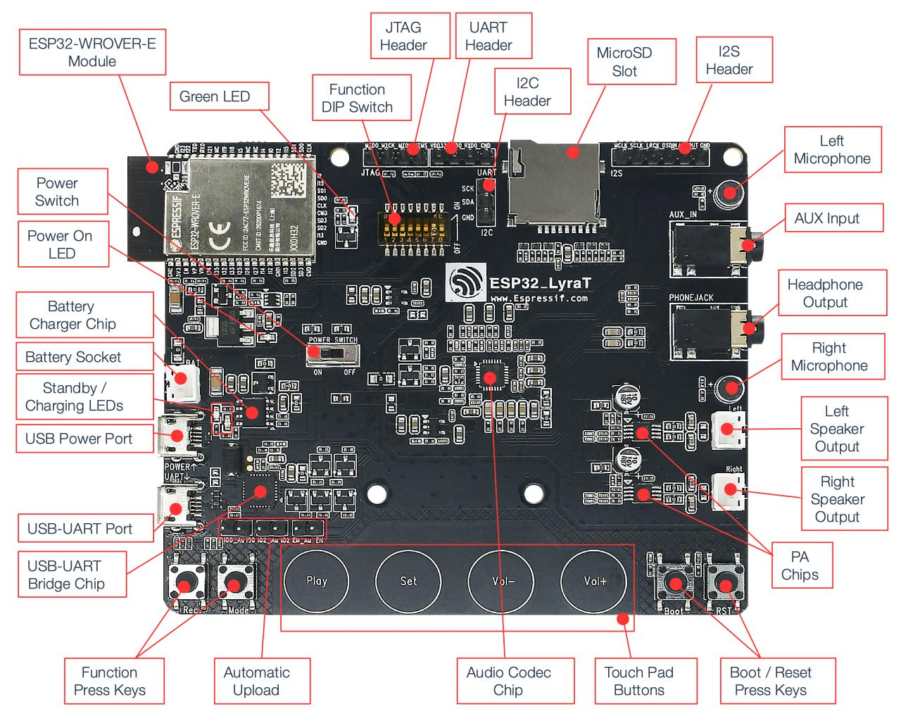
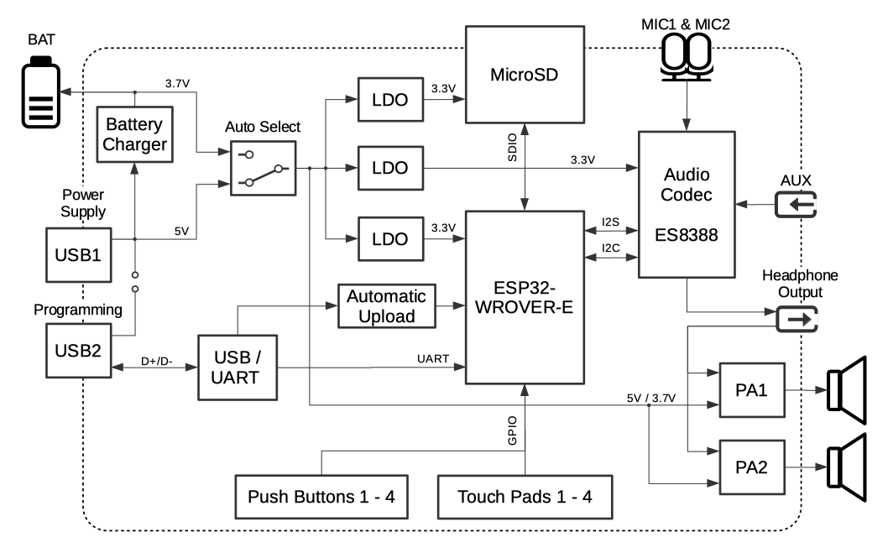

..
    Ported from ESP-ADF documentation https://espressif-docs.readthedocs-hosted.com/projects/esp-adf/en/latest/design-guide/dev-boards/board-esp32-lyrat-v4.3.html

================
ESP32-LyraT V4.3
================

The ESP32-LyraT development board is a hardware platform designed for the
dual-core ESP32 audio applications, e.g., Wi-Fi or BT audio speakers,
speech-based remote controllers, smart-home appliances with audio
functionality(ies), etc. You can find the board schematic `here <https://dl.espressif.com/dl/schematics/ESP32-LYRAT_V4.3-20220119.pdf>`_.

    ESP32-LyraT V4.3 Board Layout

The block diagram below presents main components of the ESP32-LyraT.

    ESP32-LyraT V4.3 Electrical Block Diagram

Features
========

    - ESP32-WROVER-E Module
    - JTAG Interface
    - MicroSD Slot
    - Audio Codec Chip
    - Battery Charger Chip
    - Touch Pad Buttons

Serial Console
==============

UART0 is, by default, the serial console. It connects to the on-board
CP2102N bridge and is available on the USB connector.

It will show up as /dev/ttyUSB[n] where [n] will probably be 0.

Buttons and LEDs
================

Board Buttons
-------------

Two key labeled *Rec* and *Mode*. They are routed to **ESP32-WROVER-E Module**
and intended for developing and testing a UI for audio applications using
dedicated API.

Four touch pads labeled *Play*, *Sel*,  *Vol+* and *Vol-*.
They are routed to **ESP32-WROVER-E Module** and intended for development and
testing of a UI for audio applications using dedicated API. **They are currently
not supported as the driver is in development.**

There are two buttons labeled Boot and EN. The EN button pulls the chip enable
line that doubles as a reset line. The BOOT button is connected to IO0. On
reset it is used as a strapping pin to determine whether the chip boots
normally or into the serial bootloader.

Entering of the ESP32 into upload mode may be done in two ways:

* Manually by pressing both **Boot** and **RST** keys and then releasing first
  **RST** and then **Boot** key.
* Automatically by software performing the upload. The software is using
  **DTR** and **RTS** signals of the serial interface to control states of
  **EN**, **IO0** and **IO2** pins of the ESP32. This functionality is enabled
  by installing jumpers in three headers **JP23**, **JP24** and **JP25**.
  Remove all jumpers after upload is complete.

Board LEDs
----------

A general purpose green LED controlled by the **ESP32-WROVER-E Module** to
indicate certain operation states of the audio application using dedicated
API. It can also be used by the user for other purposes.

The **Standby** green LED indicates that power has been applied to the
**Micro USB Port**. The **Charging** red LED indicates that a battery
connected to the **Battery Socket** is being charged.

Audio Codec
===========

**This is currently unsupported. Drivers still in development.**

The Audio Codec Chip, `ES8388 <http://www.everest-semi.com/pdf/ES8388%20DS.pdf>`_,
is a low power stereo audio codec with a headphone amplifier. It consists
of 2-channel ADC, 2-channel DAC, microphone amplifier, headphone amplifier
, digital sound effects, analog mixing and gain functions. It is
interfaced with **ESP32-WROVER-E Module** over I2S and I2S buses to
provide audio processing in hardware independently from the audio
application.

It also provides:

    - Onboard microphone connected to IN1 of the **Audio Codec Chip**.
    - Auxiliary input socket connected to IN2 (left and right channel) of the
      **Audio Codec Chip**. Use a 3.5 mm stereo jack to connect to this socket.
    - Output socket to connect headphones with a 3.5 mm stereo jack.

    .. note::
        The socket may be used with mobile phone headsets and is compatible
        with OMPT standard headsets only. It does work with CTIA headsets.
        Please refer to `Phone connector (audio) <https://en.wikipedia.org/wiki/Phone_connector_(audio)#TRRS_standards>`_
        on Wikipedia.

    - Output socket to connect a speaker. The 4-ohm and 3-watt speaker is
      recommended. The pins have a 2.00 mm / 0.08" pitch.

The development board uses two mono Class D amplifier ICs, model number NS4150
with maximum output power of 3W and operating voltage from 3.0V to 5.25V.
The audio input source is the digital-to-analog converter (DAC) output of the
ES8388. Audio output supports two external speakers.
An optional audio output is a pair of headphones feed from the same DACs as
the amplifier ICs.

To switch between using headphones and speakers, the board provides a digital
input signal to detect when a headphone jack is inserted and a digital output
signal to enable or disable the amplifier ICs. In other words selection
between speakers and headphones is under software control instead of using
mechanical contacts that would disconnect speakers once a headphone jack is
inserted.

.. note::
    The codec implementation on the LyraT board was validated using 16-bit,
    44.1kHz WAV files. Other configurations might not work as expected.

SD card
=======

The development board supports a MicroSD card in SPI/1-bit/4-bit modes,
and can store or play audio files in the MicroSD card. Note that **JTAG**
cannot be used and should be disconnected by setting **Function DIP
Switch** when **MicroSD Card** is in operation, because some of signals
are shared by both devices.

Enable MicroSD Card in 1-wire Mode
----------------------------------

Set **Function DIP Switch** to:

+---------+-----------------+
|  DIP SW | Position        |
+=========+=================+
|    1    |    OFF          |
+---------+-----------------+
|    2    |    OFF          |
+---------+-----------------+
|    3    |    OFF          |
+---------+-----------------+
|    4    |    OFF          |
+---------+-----------------+
|    5    |    OFF          |
+---------+-----------------+
|    6    |    OFF          |
+---------+-----------------+
|    7    |    OFF :sup:`1` |
+---------+-----------------+
|    8    |    n/a          |
+---------+-----------------+

1. **AUX Input** detection may be enabled by toggling the DIP SW 7 *ON*.
   Note that the **AUX Input** signal pin should not be be plugged in when the
   system powers up. Otherwise the ESP32 may not be able to boot correctly.

In this mode:

* **JTAG** functionality is not available
* *Vol-* touch button is available for use with the API

Enable MicroSD Card in 4-wire Mode
----------------------------------

Set **Function DIP Switch** to:

+---------+-----------+
|  DIP SW | Position  |
+=========+===========+
|    1    |    ON     |
+---------+-----------+
|    2    |    ON     |
+---------+-----------+
|    3    |    OFF    |
+---------+-----------+
|    4    |    OFF    |
+---------+-----------+
|    5    |    OFF    |
+---------+-----------+
|    6    |    OFF    |
+---------+-----------+
|    7    |    OFF    |
+---------+-----------+
|    8    |    n/a    |
+---------+-----------+

In this mode:

* **JTAG** functionality is not available
* *Vol-* touch button is not available for use with the API
* **AUX Input** detection from the API is not available

JTAG
====

Provides access to the **JTAG** interface of **ESP32-WROVER-E Module**.
It may be used for debugging, application upload, as well as implementing
several other functions.

Enable JTAG
-----------

Set **Function DIP Switch** to:

+---------+-----------+
|  DIP SW | Position  |
+=========+===========+
|    1    |    OFF    |
+---------+-----------+
|    2    |    OFF    |
+---------+-----------+
|    3    |    ON     |
+---------+-----------+
|    4    |    ON     |
+---------+-----------+
|    5    |    ON     |
+---------+-----------+
|    6    |    ON     |
+---------+-----------+
|    7    |    ON     |
+---------+-----------+
|    8    |    n/a    |
+---------+-----------+

In this mode:

* **MicroSD Card** functionality is not available, remove the card from the slot
* *Vol-* touch button is not available for use with the API
* **AUX Input** detection from the API is not available

Battery
=======

The board has a constant current & constant voltage linear charger for single cell
lithium-ion batteries AP5056. Used for charging of a battery connected to
the **Battery Socket** over the **Micro USB Port**.

.. note::
    Please verify if polarity on the battery plug matches polarity of the
    socket as marked on the board's soldermask besides the socket.

.. note::
    The **Power On Switch** does not affect/disconnect the Li-ion
    battery charging.

Pin Mapping
===========

Several pins ESP32 module are allocated to the on board hardware. Some of
them, like GPIO0 or GPIO2, have multiple functions. Please refer to the table
below.

+-----------+------+-------------------------------------------------------+
| GPIO Pin  | Type | Function Definition                                   |
+===========+======+=======================================================+
| SENSOR_VP | I    | Audio **Rec** (PB)                                    |
+-----------+------+-------------------------------------------------------+
| SENSOR_VN | I    | Audio **Mode** (PB)                                   |
+-----------+------+-------------------------------------------------------+
| IO32      | I/O  | Audio **Set** (TP)                                    |
+-----------+------+-------------------------------------------------------+
| IO33      | I/O  | Audio **Play** (TP)                                   |
+-----------+------+-------------------------------------------------------+
| IO27      | I/O  | Audio **Vol+** (TP)                                   |
+-----------+------+-------------------------------------------------------+
| IO13      | I/O  | JTAG **MTCK**, MicroSD **D3**, Audio **Vol-** (TP)    |
+-----------+------+-------------------------------------------------------+
| IO14      | I/O  | JTAG **MTMS**, MicroSD **CLK**                        |
+-----------+------+-------------------------------------------------------+
| IO12      | I/O  | JTAG **MTDI**, MicroSD **D2**, Aux signal **detect**  |
+-----------+------+-------------------------------------------------------+
| IO15      | I/O  | JTAG **MTDO**, MicroSD **CMD**                        |
+-----------+------+-------------------------------------------------------+
| IO2       | I/O  | Automatic Upload, MicroSD **D0**                      |
+-----------+------+-------------------------------------------------------+
| IO4       | I/O  | MicroSD **D1**                                        |
+-----------+------+-------------------------------------------------------+
| IO34      | I    | MicroSD insert **detect**                             |
+-----------+------+-------------------------------------------------------+
| IO0       | I/O  | Automatic Upload, I2S **MCLK**                        |
+-----------+------+-------------------------------------------------------+
| IO5       | I/O  | I2S **SCLK**                                          |
+-----------+------+-------------------------------------------------------+
| IO25      | I/O  | I2S **LRCK**                                          |
+-----------+------+-------------------------------------------------------+
| IO26      | I/O  | I2S **DSDIN**                                         |
+-----------+------+-------------------------------------------------------+
| IO35      | I    | I2S **ASDOUT**                                        |
+-----------+------+-------------------------------------------------------+
| IO19      | I/O  | Headphone jack insert **detect**                      |
+-----------+------+-------------------------------------------------------+
| IO22      | I/O  | Green LED indicator                                   |
+-----------+------+-------------------------------------------------------+
| IO21      | I/O  | PA Enable output                                      |
+-----------+------+-------------------------------------------------------+
| IO18      | I/O  | I2C **SDA**                                           |
+-----------+------+-------------------------------------------------------+
| IO23      | I/O  | I2C **SCL**                                           |
+-----------+------+-------------------------------------------------------+

* (TP) - touch pad
* (PB) - push button

There are several pin headers available to connect external components, check
the state of particular signal bus or debug operation of ESP32. Note that some
signals are shared.

UART Header / JP2
-----------------

+---+-------------+
|   | Header Pin  |
+===+=============+
| 1 | 3.3V        |
+---+-------------+
| 2 | TX          |
+---+-------------+
| 3 | RX          |
+---+-------------+
| 4 | GND         |
+---+-------------+

I2S Header / JP4
----------------

+---+----------------+-------------+
|   | I2C Header Pin | ESP32 Pin   |
+===+================+=============+
| 1 | MCLK           | GPIO0       |
+---+----------------+-------------+
| 2 | SCLK           | GPIO5       |
+---+----------------+-------------+
| 1 | LRCK           | GPIO25      |
+---+----------------+-------------+
| 2 | DSDIN          | GPIO26      |
+---+----------------+-------------+
| 3 | ASDOUT         | GPIO35      |
+---+----------------+-------------+
| 3 | GND            | GND         |
+---+----------------+-------------+

I2C Header / JP5
----------------

+---+----------------+-------------+
|   | I2C Header Pin | ESP32 Pin   |
+===+================+=============+
| 1 | SCL            | GPIO23      |
+---+----------------+-------------+
| 2 | SDA            | GPIO18      |
+---+----------------+-------------+
| 3 | GND            | GND         |
+---+----------------+-------------+

JTAG Header / JP7
-----------------

+---+---------------+-------------+
|   | ESP32 Pin     | JTAG Signal |
+===+===============+=============+
| 1 | MTDO / GPIO15 | TDO         |
+---+---------------+-------------+
| 2 | MTCK / GPIO13 | TCK         |
+---+---------------+-------------+
| 3 | MTDI / GPIO12 | TDI         |
+---+---------------+-------------+
| 4 | MTMS / GPIO14 | TMS         |
+---+---------------+-------------+

.. note::
    **JTAG** cannot be used if **MicroSD Card** is enabled.

Configurations
==============

All of the configurations presented below can be tested by running the following commands::

    $ ./tools/configure.sh esp32-lyrat:<config_name>
    $ make flash ESPTOOL_PORT=/dev/ttyUSB0 -j

Where <config_name> is the name of board configuration you want to use, i.e.: nsh, buttons, wifi...
Then use a serial console terminal like ``picocom`` configured to 115200 8N1.

audio
-----

This configuration uses the I2S0 peripheral and the ES8388 audio codec
present on the LyraT board to play an audio file streamed over HTTP
while connected to a Wi-Fi network.

**Simple HTTP server**

Prepare a PCM-encoded (`.wav`) audio file with 16 bits/sample (sampled at
44.1kHz). This file must be placed into a folder in a computer that could
be accessed on the same Wi-Fi network the ESP32 will be connecting to.

Python provides a simple HTTP server. `cd` to the audio file folder on the
PC and run::

  $ python3 -m http.server

  Serving HTTP on 0.0.0.0 port 8000 (http://0.0.0.0:8000/)

Look for your PC IP address and test playing the prepared audio on your
browser:

.. figure:: esp32-lyrat-v4.3-audio-config-file.png
          :align: center

After successfully built and flashed, connect the board to the Wi-Fi network::

  $ nsh> wapi psk wlan0 mypasswd 1
  $ nsh> wapi essid wlan0 myssid 1
  $ nsh> renew wlan0

Once connected, open NuttX's player and play the file according to its file
name and the IP address of the HTTP server (For example `tones.wav` and
`192.168.1.239:8000`, respectively)::

  $ nsh> nxplayer
  $ nxplayer> play http://192.168.1.239:8000/tones.wav

.. note::
    The codec implementation on the LyraT board was validated using 16-bit,
    44.1kHz WAV files. Other configurations might not work as expected.

buttons
-------

This configuration shows the use of the buttons subsystem. It can be used by executing
the ``buttons`` application and pressing on any of the available board buttons::

    nsh> buttons
    buttons_main: Starting the button_daemon
    buttons_main: button_daemon started
    button_daemon: Running
    button_daemon: Opening /dev/buttons
    button_daemon: Supported BUTTONs 0x01
    nsh> Sample = 1
    Sample = 0

.. note::
    The ``BOOT`` is connected to GPIO0 that is shared among some peripherals.
    To avoid any conflicts, it's not registered in the buttons subsystem and, thus,
    is unable to be used.

mmcsdspi
--------

This configuration is used to mount a FAT/FAT32 SD Card into the OS' filesystem.
For the ESP32-LyraT, make sure the DIP switches 1 and 2 are turned to the ON position.
To access the card's files, execute the following commands::

    nsh> mount -t vfat /dev/mmcsd0 /mnt
    nsh> ls /mnt/
    /mnt:
    song_16_88200_2ch.wav
    song_16_96000_2ch.wav
    song_24_44100_2ch.wav
    song_32_44100_2ch.wav

nsh
---

Basic NuttShell configuration (console enabled in UART0, exposed via
USB connection by means of the CP2102N bridge, at 115200 bps).

nxrecorder
----------

This configuration is used to record raw audio from the the ES8388 audio codec
through the I2S0 peripheral to a FAT32 SD Card. By default the audio is recorded from
the on-board microphones.
For the ESP32-LyraT, make sure the DIP switches 1 and 2 are turned to the ON position.
To record audio, execute the following commands::

    nsh> mount -t vfat /dev/mmcsd0 /mnt
    nsh> nxrecorder
    nxrecorder> recordraw /mnt/record.raw
    nxrecorder> stop

To play the recorded audio, import the raw data into Audacity and set the encoding to signed
16-bit PCM, the sample rate to 44.1kHz and the number of channels to 2.

wifi
----

Enables Wi-Fi support. You can define your credentials this way::

    $ make menuconfig
    -> Application Configuration
        -> Network Utilities
            -> Network initialization (NETUTILS_NETINIT [=y])
                -> WAPI Configuration

Or if you don't want to keep it saved in the firmware you can do it
at runtime::

    nsh> wapi psk wlan0 mypasswd 3
    nsh> wapi essid wlan0 myssid 1
    nsh> renew wlan0
