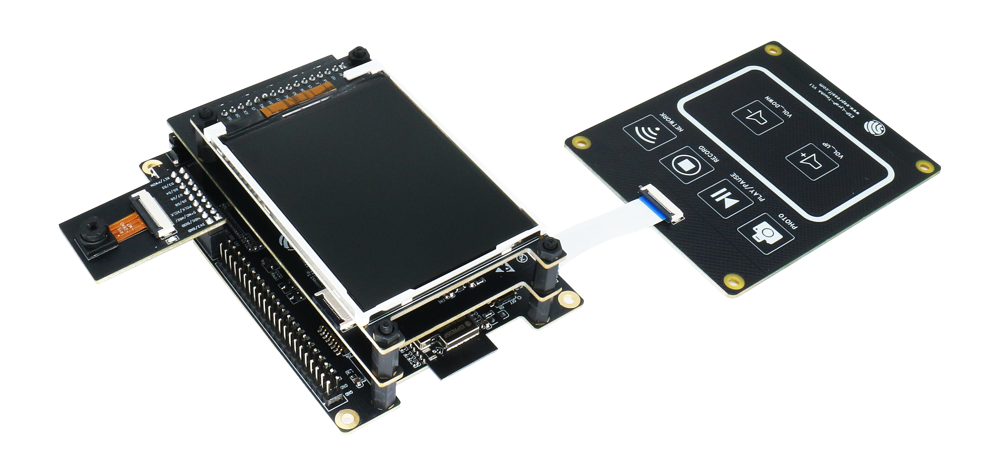
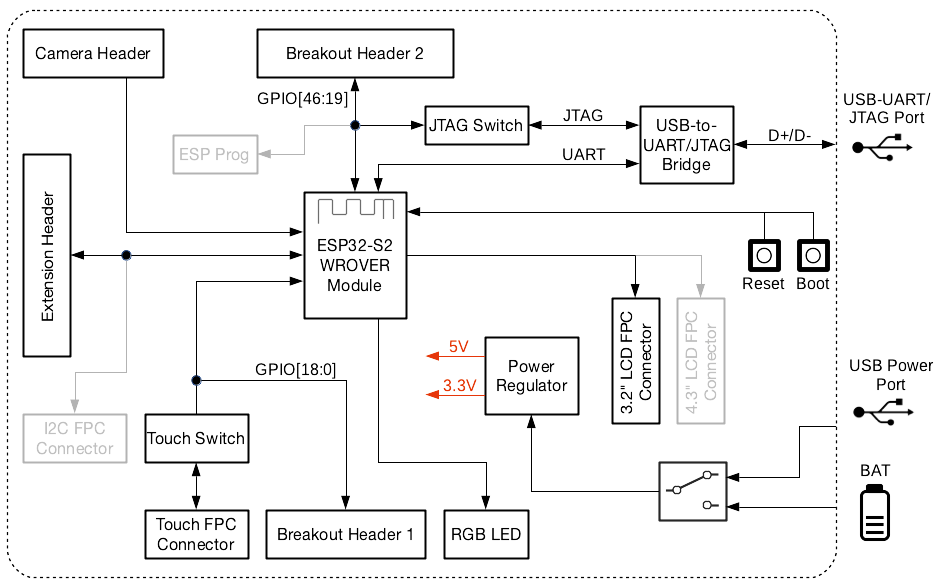

==========================
ESP32-S2-Kaluga-1 Kit v1.3
==========================

The `ESP32-S2-Kaluga-1 kit v1.3 <https://docs.espressif.com/projects/esp-idf/en/latest/esp32s2/hw-reference/esp32s2/user-guide-esp32-s2-kaluga-1-kit.html>`_
is a development kit by Espressif that is mainly created to:

- Demonstrate the ESP32-S2's human-computer interaction functionalities
- Provide the users with the tools for development of human-computer interaction applications based on the ESP32-S2

There are many ways of how the ESP32-S2's abundant functionalities can be used. For starters, the possible use cases may include:

- **Smart home**: From simplest smart lighting, smart door locks, smart sockets, to video streaming devices, security cameras, OTT devices, and home appliances
- **Battery-powered equipment**: Wi-Fi mesh sensor networks, Wi-Fi-networked toys, wearable devices, health management equipment
- **Industrial automation equipment**: Wireless control and robot technology, intelligent lighting, HVAC control equipment, etc.
- **Retail and catering industry**: POS machines and service robots

.. Image of v1.2 is used as there are no visual changes

    ESP32-S2-Kaluga-1-Kit Overview (click to enlarge)

The ESP32-S2-Kaluga-1 kit consists of the following boards:

- Main board: *ESP32-S2-Kaluga-1*
- Extension boards:

  - `ESP-LyraT-8311A <https://docs.espressif.com/projects/esp-idf/en/latest/esp32s2/hw-reference/esp32s2/user-guide-esp-lyrat-8311a_v1.3.html>`_ - Audio player
  - `ESP-LyraP-TouchA <https://docs.espressif.com/projects/esp-idf/en/latest/esp32s2/hw-reference/esp32s2/user-guide-esp-lyrap-toucha-v1.1.html>`_ - Touch buttons
  - `ESP-LyraP-LCD32 <https://docs.espressif.com/projects/esp-idf/en/latest/esp32s2/hw-reference/esp32s2/user-guide-esp-lyrap-lcd32-v1.2.html>`_ - 3.2" LCD screen
  - `ESP-LyraP-CAM <https://docs.espressif.com/projects/esp-idf/en/latest/esp32s2/hw-reference/esp32s2/user-guide-esp-lyrap-cam-v1.1.html>`_ - Camera module

.. Image of v1.2 is used as there are no visual changes

A block diagram below shows the components of the ESP32-S2-Kaluga-1 and their interconnections.

    ESP32-S2-Kaluga-1 block diagram

Features
========

The ESP32-S2-Kaluga-1 main board is the heart of the kit. It integrates the
ESP32-S2-WROVER module and all the connectors for extension boards. This board
is the key tool in prototyping human-computer interaction interfaces.

The ESP32-S2-Kaluga-1 board has connectors for boards with:

- Extension header (ESP-LyraT-8311A, ESP-LyraP-LCD32)
- Camera header (ESP-LyraP-CAM)
- Touch FPC connector (ESP-LyraP-TouchA)
- LCD FPC connector (no official extension boards yet)
- I2C FPC connector (no official extension boards yet)

.. figure:: esp32s2-kaluga-1-v1.3-3d.png
    :align: center
    :width: 3089px
    :height: 2335px
    :scale: 25%
    :alt: ESP32-S2-Kaluga-1
    :figclass: align-center

    ESP32-S2-Kaluga-1 (click to enlarge)

All the four extension boards are specially designed to support the following
features:

* Touch panel control
    * Six touch buttons
    * Supports acrylic panels up to 5 mm
    * Wet hand operation
    * Water rejection, ESP32-S2 can be configured to disable all touchpads
      automatically if multiple pads are simultaneously covered with water
      and to re-enable touchpads if the water is removed

* Audio playback
    * Connect speakers to play audio
    * Use together with the Touch panel to control audio playback and adjust volume

* LCD display
    * LCD interface (8-bit parallel RGB, 8080, and 6800 interface)

* Camera image acquisition
    * Supports OV2640 and OV3660 camera modules
    * 8-bit DVP image sensor interface (ESP32-S2 also supports 16-bit DVP image sensors, you can design it yourself)
    * Clock frequency up to 40 MHz
    * Optimized DMA transmission bandwidth for easier transmission of high-resolution images

Compatibility of Extension Boards
---------------------------------

If you want to use more than one extension board at the same time, please check the table given below.

.. list-table::
   :widths: 20 15 33 32
   :header-rows: 1

   * - Boards Used
     - HW Conflict
     - Limitations
     - Solution
   * - 8311A v1.3 + CAM v1.1
     - I2S Controller
     - ESP32-S2 has only one I2S interface. But both extension boards require connection via the ESP32-S2's I2S interface (LyraT-8311A in Standard mode, ESP-LyraP-CAM in Camera mode).
     - Utilize time division multiple access, or use a different audio module that can be connected via other GPIOs or DAC.
   * - TouchA v1.1 + LCD32 v1.2
     - IO11, IO6
     - Touch actions cannot be triggered because of the multiplexed pin IO11. ESP-LyraP-LCD32 will not be affected because its BLCT pin will be disconnected from IO6.
     - Do not initialize IO11 (NETWORK) for your ESP-LyraP-TouchA, or configure the BLCT pin to `-1` (= do not use BLCT) for your ESP-LyraP-LCD32.
   * - 8311A v1.3 + LCD32 v1.2
     - IO6
     - BLCT pin of ESP32-S2-Kaluga-1 will be disconnected from IO6.
     - Configure the BK pin to `-1` (= do not use BLCT) for your ESP-LyraP-LCD32.
   * - TouchA v1.1 + 8311A v1.3
     - Pin BT_ADC on ESP-LyraT-8311A
     - This pin is required for initialization of the six button on ESP-LyraT-8311A. At the same time, ESP-LyraP-TouchA needs this pin for its touch actions.
     - If you plan to use buttons on ESP-LyraT-8311A, do not initialize pin IO6 (PHOTO) for your ESP-LyraP-TouchA.
   * - TouchA v1.1 + CAM v1.1
     - IO1, IO2, IO3
     - Cannot be used simultaneously because of the mentioned multiplexed pins.
     - For ESP-LyraP-TouchA, do not initialize IO1 (VOL_UP), IO2 (PLAY), and IO3 (VOL_DOWN).
   * - TouchA v1.1 + LCD32 v1.2 + CAM v1.1
     - IO1, IO2, IO3, IO11
     - Conflicts on the mentioned multiplexed pins.
     - For ESP-LyraP-TouchA, do not initialize IO1 (VOL_UP), IO2 (PLAY), IO3 (VOL_DOWN), and IO11 (NETWORK).
   * - TouchA v1.1 + LCD32 v1.2 + 8311A v1.3
     - IO6, IO11
     - If ESP-LyraT-8311A's pin BT_ADC is used to initialize the board's six buttons, IO6 and IO11 will not be available for the other boards.
     - Do not initialize IO11 (NETWORK) for your ESP-LyraP-TouchA. Also, if you need to use BT_ADC, do not initialize IO6 (PHOTO).

Also, all extension boards and the JTAG interface share the same pins IO39, IO40, IO41 and IO42. For this reason, the following may disturb the JTAG operation:

* Plugging in any extension board
* Debugging an application that is using an extension board

Serial Console
==============

UART0 is, by default, the serial console. It connects to the on-board
CP2102 converter and is available on the micro-USB connector (J1).

It will show up as /dev/ttyUSB[n] where [n] will probably be 0.

Buttons and LEDs
================

Board Buttons
-------------

There are two buttons labeled Boot and EN. The EN button is not available
to the software. It pulls the chip enable line that doubles as a reset line.

The BOOT button is connected to IO0. On reset, it is used as a strapping
pin to determine whether the chip boots normally or into the serial
bootloader. After resetting, however, the BOOT button can be used for
software input.

Board LEDs
----------

There are many on-board LEDs. The only one that can be controlled by software
is a WS2812 RGB LED (U21) addressable LED and is driven by GPIO45.

Configurations
==============

All of the configurations presented below can be tested by running the following commands::

    $ ./tools/configure.sh esp32s2-kaluga-1:<config_name>
    $ make flash ESPTOOL_PORT=/dev/ttyUSB1 -j

Where <config_name> is the name of board configuration you want to use, i.e.: nsh, buttons, wifi...
Then use a serial console terminal like ``picocom`` configured to 115200 8N1.

audio
-----

This configuration uses the I2S peripheral and the ES8311 audio
codec to play an audio file. The easiest way of playing an uncompressed file
is embedding into the firmware. This configuration selects
`romfs example <https://github.com/apache/nuttx-apps/tree/master/examples/romfs>`__
to allow that.

**ROMFS example**

Prepare and build the ``audio`` defconfig::

  $ make -j distclean && ./tools/configure.sh esp32s2-kaluga-1:audio && make

This will create a temporary folder in ``apps/examples/romfs/testdir``. Move
a PCM-encoded (``.wav``) audio file with 16 or 24 bits/sample (sampled at 16~48kHz)
to this folder.

.. note:: You can use :download:`this 440 Hz sinusoidal tone <../esp32s2-saola-1/tone.wav>`.
   The audio file should be located at ``apps/examples/romfs/testdir/tone.wav``

Build the project again and flash it (make sure not to clean it, just build)

After successfully built and flashed, load the romfs and play it::

    nsh> romfs
    nsh> nxplayer
    nxplayer> play /usr/share/local/tone.wav

buttons
-------

This configuration shows the use of the buttons subsystem. It can be used by executing
the ``buttons`` application and pressing on any of the available board buttons and touch pads::

    nsh> buttons
    buttons_main: Starting the button_daemon
    buttons_main: button_daemon started
    button_daemon: Running
    button_daemon: Opening /dev/buttons
    button_daemon: Supported BUTTONs 0x7f
    nsh> Sample = 32
    Sample = 0
    Sample = 2
    Sample = 0
    Sample = 4
    Sample = 0
    Sample = 8
    Sample = 0
    Sample = 16
    Sample = 0
    Sample = 64
    Sample = 0

i2c
---

This configuration can be used to scan and manipulate I2C devices.
You can scan for all I2C devices using the following command::

    nsh> i2c dev 0x00 0x7f

lvgl_ili9341
------------

This is a demonstration of the LVGL graphics library running on the NuttX LCD
driver with the ILI9341 display. You can find LVGL here::

    https://www.lvgl.io/
    https://github.com/lvgl/lvgl

This configuration uses the LVGL demonstration at ``apps/examples/lvgldemo`` and
can be executed by running the ``lvgldemo`` application.

lvgl_st7789
-----------

This is a demonstration of the LVGL graphics library running on the NuttX LCD
driver with the ST7799 display. You can find LVGL here::

    https://www.lvgl.io/
    https://github.com/lvgl/lvgl

This configuration uses the LVGL demonstration at ``apps/examples/lvgldemo`` and
can be executed by running the ``lvgldemo`` application.

nsh
---

Basic NuttShell configuration (console enabled in UART0, exposed via
USB connection by means of CP2102 converter, at 115200 bps).

nxlooper
--------

The ``nxlooper`` application captures data from the audio device with receiving
capabilities and forwards the audio data frame to the audio device with transmitting
capabilities.

After successfully built and flashed, run on the boards' terminal::

    nsh> nxlooper
    nxlooper> loopback

.. note:: ``loopback`` command default arguments for the channel configuration,
  the data width and the sample rate are, respectively, 2 channels,
  16 bits/sample and 48KHz. These arguments can be supplied to select
  different audio formats, for instance::

    nxlooper> loopback 2 8 44100

rtc
---

This configuration demonstrates the use of the RTC driver through alarms.
You can set an alarm, check its progress and receive a notification after it expires::

    nsh> alarm 10
    alarm_daemon started
    alarm_daemon: Running
    Opening /dev/rtc0
    Alarm 0 set in 10 seconds
    nsh> alarm -r
    Opening /dev/rtc0
    Alarm 0 is active with 10 seconds to expiration
    nsh> alarm_daemon: alarm 0 received

twai
----

This configuration enables the support for the TWAI (Two-Wire Automotive Interface) driver.
You can test it by connecting TWAI RX and TWAI TX pins which are GPIO0 and GPIO2 by default
to a external transceiver or connecting TWAI RX to TWAI TX pin by enabling
the ``Device Drivers -> CAN Driver Support -> CAN loopback mode`` option and running the ``can`` example::

    nsh> can
    nmsgs: 0
    min ID: 1 max ID: 2047
    Bit timing:
      Baud: 1000000
      TSEG1: 15
      TSEG2: 4
        SJW: 3
      ID:    1 DLC: 1

watchdog
--------

This config test the watchdog timers. It includes the 2 MWDTs,
adds driver support, registers the WDTs as devices and includes the watchdog
example.

To test it, just run the following::

    nsh> wdog -i /dev/watchdogx

Where x is the watchdog instance.

To test the XTWDT(/dev/watchdog3) an interrupt handler needs to be
implemented because XTWDT does not have system reset feature. To implement
an interrupt handler `WDIOC_CAPTURE` command can be used. When interrupt
rises, XTAL32K clock can be restored with `WDIOC_RSTCLK` command.
