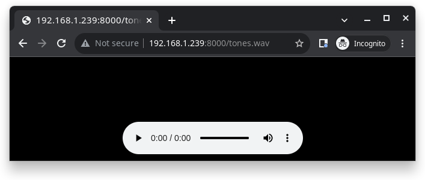

=====================
ESP32-S3-Korvo-2 V3.0
=====================

The ESP32-S3-Korvo-2 is a multimedia development board based on the ESP32-S3 chip. It is equipped with a two-microphone array which is suitable for voice recognition and near/far-field voice wake-up applications. The board integrates multiple peripherals such as LCD, camera, and microSD card. It also supports JPEG video stream processing. With all of its outstanding features, the board is an ideal choice for the development of low-cost and low-power network-connected audio and video products.

    ESP32-S3-Korvo-2 V3.0 with ESP32-S3-WROOM-1 module

This board mainly consists of the following parts:

- Main board: ESP32-S3-Korvo-2
- LCD extension board: `ESP32-S3-Korvo-2-LCD <user-guide-esp32https://docs.espressif.com/projects/esp-adf/en/latest/design-guide/dev-boards/user-guide-esp32-s3-korvo-2-lcd.html>`
- Camera

This document is mostly dedicated to the main board. For detailed information on other parts, click the links above.

The document consists of the following sections:

- `Getting started`_: Overview of the board and hardware/software setup instructions to get started.
- `Hardware Reference`_: More detailed information about the board's hardware.
- `Hardware Revision Details`_: Hardware revision history, known issues, and links to user guides for previous versions (if any) of the board.
- `Related Documents`_: Links to related documentation.

Getting Started
===============

This section provides a brief introduction of ESP32-S3-Korvo-2 V3.0, instructions on how to do the initial hardware setup and how to flash firmware onto it.

Description of Components
-------------------------

.. figure:: esp32-s3-korvo-2-v3.0.png
    :align: center
    :scale: 70%
    :alt: ESP32-S3-Korvo-2 V3.0 (click to enlarge)

    ESP32-S3-Korvo-2 V3.0 (click to enlarge)

The key components of the board are described in a clockwise direction.

.. list-table::
   :widths: 30 70
   :header-rows: 1

   * - Key Component
     - Description
   * - ESP32-S3-WROOM-1 Module
     - The ESP32-S3-WROOM-1 is a powerful, generic Wi-Fi + Bluetooth LE MCU module that is built around the ESP32-S3 series of SoCs. On top of a rich set of peripherals, the acceleration for neural network computing and signal processing workloads provided by the SoC make the modules an ideal choice for a wide variety of application scenarios related to AI and Artificial Intelligence of Things (AIoT), such as wake word detection, speech commands recognition, face detection and recognition, smart home, smart appliances, smart control panel, smart speaker, etc.
   * - Left Microphone
     - Onboard microphone connected to ADC.
   * - Audio ADC Chip
     - `ES7210 <http://www.everest-semi.com/pdf/ES7210%20PB.pdf>`_ is a high-performance, low-power 4-channel audio analog-to-digital converter for microphone array applications. It is very suitable for music and speech applications. In addition, ES7210 can also be used to collect acoustic echo cancellation (AEC) echo reference signals.
   * - Audio Codec Chip
     - The audio codec chip, `ES8311 <http://www.everest-semi.com/pdf/ES8311%20PB.pdf>`_, is a low-power mono audio codec. It consists of 1-channel ADC, 1-channel DAC, low noise pre-amplifier, headphone driver, digital sound effects, analog mixing, and gain functions. It is interfaced with ESP32-S3-WROOM-1 module over I2S and I2C buses to provide audio processing in hardware independently from the audio application.
   * - Audio PA Chip
     - NS4150 is an EMI, 3 W mono Class D audio power amplifier, amplifying audio signals from audio codec chips to drive speakers.
   * - Right Microphone
     - Onboard microphone connected to ADC.
   * - Speaker Output Port
     - Output socket to connect a speaker. The 4-ohm and 3-watt speaker is recommended. The pins have a 2.00 mm/0.08” pitch.
   * - USB-to-UART Bridge Chip
     - A single chip USB-UART bridge CP2102N provides up to 3 Mbps transfer rates for software download and debugging.
   * - USB-to-UART Port
     - Functions as the communication interface between a PC and the ESP32-S3-WROOM-1 module.
   * - USB Power Port
     - Provides power to the board. It is recommended to use at least 5V/2A power adapter to ensure a stable power supply.
   * - Battery Socket
     - Two pins socket to connect a single cell Li-ion battery.
   * - Power Switch
     - Power on/off knob: toggling it down powers the board on; toggling it up powers the board off.
   * - Battery Charger
     - AP5056 is a constant current and constant voltage linear charger for single cell lithium-ion batteries. Used for charging of a battery connected to the Battery Socket over the Micro USB Port.
   * - Function Press Keys
     - Six press keys labeled REC, MUTE, PLAY, SET, VOL- and VOL+. They are routed to ESP32-S3-WROOM-1 module and intended for development and testing of a UI for audio applications using a dedicated API.
   * - Boot/Reset Press Keys
     - | Boot: holding down the Boot key and momentarily pressing the Reset key initiates the firmware upload mode. Then you can upload firmware through the serial port.
       | Reset: pressing this button alone resets the system.
   * - MicroSD Slot
     - The development board supports a microSD card in 1-bit mode, and can store or play audio files in the microSD card.
   * - LCD Connector
     - A FPC connector with 0.5 mm pitch to connect to the LCD extension board.
   * - System LEDs
     - Two general-purpose LEDs (green and red) controlled by ESP32-S3-WROOM-1 module to indicate certain operation states of the audio application using dedicated API.
   * - Camera Connector
     - An external camera module that can be connected to the development board with the connector to transmit images.

Start Application Development
-----------------------------

Before powering up your board, please make sure that it is in good condition with no obvious signs of damage.

Required Hardware
^^^^^^^^^^^^^^^^^

- 1 x ESP32-S3-Korvo-2 V3.0
- 1 x Speaker
- 2 x USB 2.0 cable (Standard-A to Micro-B)

.. note::

  Be sure to use an appropriate USB cable. Some cables are for charging only and do not provide the needed data lines nor work for programming the boards.

Optional Hardware
^^^^^^^^^^^^^^^^^

- 1 x MicroSD card
- 1 x Li-ion battery

.. note::

  Be sure to use a Li-ion battery that has a built-in protection circuit.

Hardware Setup
^^^^^^^^^^^^^^

1. Connect the speaker to the **Speaker Output**.
2. Plug in the USB cables to the PC and to both USB ports of the board.
3. The standby LED (green) should turn on. Assuming that a battery is not connected, the charging LED (red) will blink every couple of seconds.
4. Toggle the **Power Switch**.
5. The red Power On LED should turn on.

Contents and Packaging
----------------------

.. _esp32-s3-korvo-2-v3.0-accessories:

The main board and its accessories can be ordered separately. The accessories include:

- LCD extension board: ESP32-S3-Korvo-2-LCD
- Camera
- Connectors:

  - 20-pin FPC cable

- Fasteners:

  - Copper standoffs (x8)
  - Screws (x4)

Retail Orders
^^^^^^^^^^^^^

If you order a few samples, each board comes in an individual package in either antistatic bag or any packaging depending on your retailer.

For retail orders, please go to https://www.espressif.com/en/company/contact/buy-a-sample.

Wholesale Orders
^^^^^^^^^^^^^^^^

If you order in bulk, the boards come in large cardboard boxes.

For wholesale orders, please go to https://www.espressif.com/en/contact-us/sales-questions.

Hardware Reference
==================

Block Diagram
-------------

The block diagram below shows the components of ESP32-S3-Korvo-2 V3.0 and their interconnections.

    ESP32-S3-Korvo-2 V3.0 Electrical Block Diagram

Notes on Power Distribution
---------------------------

Power Supply over USB and from Battery
^^^^^^^^^^^^^^^^^^^^^^^^^^^^^^^^^^^^^^

The main power supply is 5 V and provided by a USB. The secondary power supply is 3.7 V and provided by an optional battery. The USB power itself is fed with a dedicated cable, separating from a USB cable used for an application upload. To further reduce noise from the USB, the battery may be used instead of the USB.

    ESP32-S3-Korvo-2 V3.0 - Dedicated USB Power Supply Socket

    ESP32-S3-Korvo-2 V3.0 - Power Supply from a Battery

As shown in the figure below, if the USB power supply and battery power supply are connected at the same time with a high VBUS, an off-state Q14, and an automatic cut-off VBAT, the USB becomes the power supply for the system.

    ESP32-S3-Korvo-2 V3.0 - Power Supply Options

Independent Audio and Digital Power Supply
^^^^^^^^^^^^^^^^^^^^^^^^^^^^^^^^^^^^^^^^^^

ESP32-S3-Korvo-2 V3.0 features independent power supplies to the audio components and ESP module. This should reduce noise in the audio signal from digital components and improve overall performance of the components.

.. figure:: esp32-s3-korvo-2-v3.0-digital-ps.png
    :align: center
    :scale: 40%
    :alt: ESP32-S3-Korvo-2 V3.0 - Digital Power Supply

    ESP32-S3-Korvo-2 V3.0 - Digital Power Supply

.. figure:: esp32-s3-korvo-2-v3.0-audio-ps.png
    :align: center
    :scale: 40%
    :alt: ESP32-S3-Korvo-2 V3.0 - Audio Power Supply

    ESP32-S3-Korvo-2 V3.0 - Audio Power Supply

GPIO Allocation Summary
-----------------------

The table below provides allocation of GPIOs exposed on terminals of ESP32-S3-WROOM-1 module to control specific components or functions of the board.

.. list-table:: ESP32-S3-WROOM-1 GPIO Allocation
   :header-rows: 1
   :widths: 10 10 10 10 10 10 10 10 10 10

   * - Pin [#one]_
     - Pin Name
     - ES8311
     - ES7210
     - Camera
     - LCD
     - Keys
     - MicroSD
     - IO Expander
     - Other
   * - 3
     - EN
     -
     -
     -
     -
     - EN_KEY
     -
     -
     -
   * - 4
     - IO4
     -
     -
     -
     -
     -
     - DATA0
     -
     -
   * - 5
     - IO5
     -
     -
     -
     -
     - REC, MUTE, PLAY, SET, VOL-, VOL+
     -
     -
     -
   * - 6
     - IO6
     -
     -
     -
     -
     -
     -
     -
     - BAT_MEAS_ADC
   * - 7
     - IO7
     -
     -
     -
     -
     -
     - CMD
     -
     -
   * - 8
     - IO15
     -
     -
     -
     -
     -
     - CLK
     -
     -
   * - 9
     - IO16
     - I2S0_MCLK
     - MCLK
     -
     -
     -
     -
     -
     -
   * - 10
     - IO17
     - I2C_SDA
     - I2C_SDA
     - SIOD
     - TP_I2C_SDA
     -
     -
     - I2C_SDA
     -
   * - 11
     - IO18
     - I2C_CLK
     - I2C_CLK
     - SIOC
     - TP_I2C_CLK
     -
     -
     - I2C_CLK
     -
   * - 12
     - IO8
     - I2S0_DSDIN
     -
     -
     -
     -
     -
     -
     -
   * - 13
     - IO19
     -
     -
     -
     -
     -
     -
     -
     - ESP_USB_DM (Reserve)
   * - 14
     - IO20
     -
     -
     -
     -
     -
     -
     -
     - ESP_USB_DP (Reserve)
   * - 15
     - IO3
     -
     -
     - D5
     -
     -
     -
     -
     -
   * - 16
     - IO46
     -
     -
     -
     -
     -
     -
     -
     - NC
   * - 17
     - IO9
     - I2S0_SCLK
     - SCLK
     -
     -
     -
     -
     -
     -
   * - 18
     - IO10
     -
     - SDOUT
     -
     -
     -
     -
     -
     -
   * - 19
     - IO11
     -
     -
     - PCLK
     -
     -
     -
     -
     -
   * - 20
     - IO12
     -
     -
     - D6
     -
     -
     -
     -
     -
   * - 21
     - IO13
     -
     -
     - D2
     -
     -
     -
     -
     -
   * - 22
     - IO14
     -
     -
     - D4
     -
     -
     -
     -
     -
   * - 23
     - IO21
     -
     -
     - VSYNC
     -
     -
     -
     -
     -
   * - 24
     - IO47
     -
     -
     - D3
     -
     -
     -
     -
     -
   * - 25
     - IO48
     -
     -
     -
     -
     -
     -
     -
     - PA_CTRL
   * - 26
     - IO45
     - I2S0_LRCK
     - LRCK
     -
     -
     -
     -
     -
     -
   * - 27
     - IO0
     -
     -
     -
     - LCD_SPI_SDA
     - BOOT_KEY
     -
     -
     -
   * - 28
     - IO35
     -
     -
     -
     -
     -
     -
     -
     - NC
   * - 29
     - IO36
     -
     -
     -
     -
     -
     -
     -
     - NC
   * - 30
     - IO37
     -
     -
     -
     -
     -
     -
     -
     - NC
   * - 31
     - IO38
     -
     -
     - HREF
     -
     -
     -
     -
     -
   * - 32
     - IO39
     -
     -
     - D9
     -
     -
     -
     -
     -
   * - 33
     - IO40
     -
     -
     - XCLK
     -
     -
     -
     -
     -
   * - 34
     - IO41
     -
     -
     - D8
     -
     -
     -
     -
     -
   * - 35
     - IO42
     -
     -
     - D7
     -
     -
     -
     -
     -
   * - 36
     - RXD0
     -
     -
     -
     -
     -
     -
     -
     - ESP0_UART0_RX
   * - 37
     - TXD0
     -
     -
     -
     -
     -
     -
     -
     - ESP0_UART0_TX
   * - 38
     - IO2
     -
     -
     -
     - LCD_SPI_DC
     -
     -
     -
     -
   * - 39
     - IO1
     -
     -
     -
     - LCD_SPI_CLK
     -
     -
     -
     -
   * - 41
     - EPAD
     -
     -
     -
     -
     -
     -
     -
     -

.. [#one] Pin - ESP32-S3-WROOM-1 module pin number, GND and power supply pins are not listed.

The GPIOs allocated to the IO expander are further expanded to multiple GPIOs.

.. list-table:: IO Expander GPIO Allocation
   :header-rows: 1
   :widths: 10 10 10 10

   * - IO Expander Pin
     - Pin Name
     - LCD
     - Other
   * - 4
     - P0
     -
     - PA_CTRL
   * - 5
     - P1
     - LCD_CTRL
     -
   * - 6
     - P2
     - LCD_RST
     -
   * - 7
     - P3
     - LCD_CS
     -
   * - 9
     - P4
     - TP_INT
     -
   * - 10
     - P5
     -
     - PERI_PWR_ON
   * - 11
     - P6
     -
     - LED1
   * - 12
     - P7
     -
     - LED2

Connector
---------

Camera Connector
^^^^^^^^^^^^^^^^

===  =============  ============
No.  Camera Signal  ESP32-S3 Pin
===  =============  ============
1    SIOD           GPIO17
2    SIOC           GPIO18
3    D5             GPIO3
4    PCLK           GPIO11
5    D6             GPIO12
6    D2             GPIO13
7    D4             GPIO14
8    VSYNC          GPIO21
9    D3             GPIO47
10   HREF           GPIO38
11   D9             GPIO39
12   XCLK           GPIO40
13   D8             GPIO41
14   D7             GPIO42
===  =============  ============

LCD Connector
^^^^^^^^^^^^^^^^

===  ===========  ============
No.  LCD Signal   ESP32-S3 Pin
===  ===========  ============
1    TP_I2C_SDA   GPIO17
2    TP_I2C_CLK   GPIO18
3    LCD_SPI_SDA  GPIO0
4    LCD_SPI_DC   GPIO2
5    LCD_SPI_CLK  GPIO1
===  ===========  ============

===  ============  ===========
No.  LCD Signal    IO Expander
===  ============  ===========
1    ESP_LCD_CTRL   P1
2    ESP_LCD_RST   P2
3    ESP_LCD_CS    P3
4    ESP_TP_INT    P4
===  ============  ===========

AEC Path
--------

AEC path provides reference signals for AEC algorithm.

ESP32-S3-Korvo-2 provides two compatible echo reference signal source designs. One is Codec (ES8311) DAC output (DAC_AOUTLN/DAC_AOUTLP), the other is PA (NS4150) output (PA_OUTL+/PA_OUTL-). The former is the default and recommended selection. Resistors R132 and R140 marked NC (no component) in the figure below should not be installed.

The echo reference signal is collected by ADC_MIC3P/ADC_MIC3N of ADC (ES7210) and then sent back to ESP32-S3 for AEC algorithm.

    ESP32-S3-Korvo-2 V3.0 - AEC Codec DAC Output (click to enlarge)

.. figure:: esp32-s3-korvo-2-v3.0-aec-pa-o.png
    :align: center
    :scale: 30%
    :alt: ESP32-S3-Korvo-2 V3.0 - AEC PA Output (click to enlarge)

    ESP32-S3-Korvo-2 V3.0 - AEC PA Output (click to enlarge)

.. figure:: esp32-s3-korvo-2-v3.0-aec-signal-collection.png
    :align: center
    :scale: 60%
    :alt: ESP32-S3-Korvo-2 V3.0 - AEC Reference Signal Collection (click to enlarge)

    ESP32-S3-Korvo-2 V3.0 - AEC Reference Signal Collection (click to enlarge)

Hardware Setup Options
----------------------

Using Automatic Upload
^^^^^^^^^^^^^^^^^^^^^^

Entering of the ESP board into upload mode may be done in two ways:

- Manually by pressing both Boot and RST keys and then releasing first RST and then Boot key.
- Automatically by software performing the upload. The software is using DTR and RTS signals of the serial interface to control states of EN and IO0 of the ESP board. For details see `ESP32-S3-Korvo-2 V3.0 Schematic`_ (PDF).

Allocation of ESP Pins to Test Points
-------------------------------------

This section describes the allocation of test points available on the ESP32-S3-Korvo-2 V3.0 board.

The test points are bare through hole solder pads and have a standard 2.54 mm/0.1" pitch. You may need to populate them with pin headers or sockets for easy connection of external hardware.

Codec Test Point/J15
^^^^^^^^^^^^^^^^^^^^^^

===  ==========  ============
No.  Codec Pin   ESP32-S3 Pin
===  ==========  ============
1    MCLK        GPIO16
2    SCLK        GPIO9
3    LRCK        GPIO45
4    DSDIN       GPIO8
5    ASDOUT      –
6    GND         –
===  ==========  ============

ADC Test Point/J16
^^^^^^^^^^^^^^^^^^

===  ==========  ============
No.  ADC Pin     ESP32-S3 Pin
===  ==========  ============
1    MCLK        GPIO16
2    SCLK        GPIO9
3    LRCK        GPIO45
4    SDOUT       GPIO10
5    INT         –
6    GND         –
===  ==========  ============

UART Test Point/J17
^^^^^^^^^^^^^^^^^^^
===  ==========
No.  UART Pin
===  ==========
1    3.3V
2    TXD
3    RXD
4    IO0
5    EN
6    GND
===  ==========

I2C Test Point/J18
^^^^^^^^^^^^^^^^^^
===  ==========  ============
No.  I2C Pin     ESP32-S3 Pin
===  ==========  ============
1    3.3V        –
2    CLK         GPIO18
3    SDA         GPIO17
4    GND         –
===  ==========  ============

Hardware Revision Details
=========================

This is the first revision of this board released.

Related Documents
=================

- `ESP32-S3 Series Datasheet <https://www.espressif.com/sites/default/files/documentation/esp32-s3_datasheet_en.pdf>`_ (PDF)
- `ESP32-S3-WROOM-1/1U Datasheet <https://www.espressif.com/sites/default/files/documentation/esp32-s3-wroom-1_wroom-1u_datasheet_en.pdf>`_ (PDF)
- `ESP32-S3-Korvo-2 V3.0 Schematic`_ (PDF)
- `ESP32-S3-Korvo-2 V3.0 PapplicationsCB Layout <https://dl.espressif.com/dl/schematics/PCB_ESP32-S3-KORVO-2_V3.0_20210918.pdf>`_ (PDF)

For further design documentation for the board, please contact us at `sales@espressif.com <sales@espressif.com>`_.

.. _ESP32-S3-Korvo-2 V3.0 Schematic: https://dl.espressif.com/dl/schematics/SCH_ESP32-S3-KORVO-2_V3_0_20210918.pdf

Configurations
==============

All of the configurations presented below can be tested by running the following commands::

    $ ./tools/configure.sh esp32s3-korvo-2:<config_name>
    $ make flash ESPTOOL_PORT=/dev/ttyUSB0 -j$(nproc)

Where <config_name> is the name of board configuration you want to use, i.e.: nsh, buttons, wifi...
Then use a serial console terminal like ``picocom`` configured to 115200 8N1.

audio
-----

This configuration uses the I2S peripheral and the ES8311 audio codec to play an audio file.

**Simple HTTP server**

Prepare a PCM-encoded (`.wav`) audio file with 16 or 24 bits/sample (sampled at
16~48kHz). This file must be placed into a folder in a computer that could
be accessed on the same Wi-Fi network the ESP32 will be connecting to.

Python provides a simple HTTP server. ``cd`` to the audio file folder on the
PC and run::

    $ python3 -m http.server
    Serving HTTP on 0.0.0.0 port 8000 (http://0.0.0.0:8000/)

Look for your PC IP address and test playing the prepared audio on your
browser:

After successfully built and flashed, connect the board to the Wi-Fi network::

    nsh> wapi psk wlan0 mypasswd 3
    nsh> wapi essid wlan0 myssid 1
    nsh> renew wlan0

Once connected, open NuttX's player and play the file according to the filename
and the IP address of the HTTP server::

    nsh> nxplayer
    nxplayer> play http://192.168.1.239:8000/tones.wav

nsh
---

Basic NuttShell configuration (console enabled in UART0, exposed via
USB connection by means of CP2102 converter, at 115200 bps).

rtptools
--------

**RTP Tools** is a set of small applications that can be used for processing RTP data.

-  ``rtpplay``: play-back RTP sessions recorded by ``rtpdump``
-  ``rtpsend``: generate RTP packets from the textual description, generated by hand or ``rtpdump``
-  ``rtpdump``: parse and print RTP packets, generating output files suitable for ``rtpplay`` and ``rtpsend``
-  ``rtptrans``: RTP translator between unicast and multicast networks

This set of tools enables receiving RTP packets and writing the content to a FIFO. ``nxplayer`` then reads
from the FIFO, enabling using NuttX as a RTP receiver for audio applications.

This is particularly useful to stream uncompressed audio through Wi-Fi to remote speakers.

sdmmc
-----

Based on nsh. Support for sdmmc driver is enabled with following settings:

Enable sdmmc driver::

    CONFIG_ESP32S3_SDMMC=y

GPIO definitions::

    CONFIG_ESP32S3_SDMMC_CMD=7
    CONFIG_ESP32S3_SDMMC_CLK=15
    CONFIG_ESP32S3_SDMMC_D0=4

ESP32-S3-Korvo-2's MicroSD supports only one data port::

    CONFIG_SDIO_WIDTH_D1_ONLY=y

Multiblock limitation due to hardware::

    CONFIG_MMCSD_MULTIBLOCK_LIMIT=128

Use sched_yield instead of usleep due to long tick time::

    CONFIG_MMCSD_CHECK_READY_STATUS_WITHOUT_SLEEP=y

Format and mount the SD/MMC device with following commands::

    mkfatfs -F 32 -r /mnt /dev/mmcsd1
    mount -t vfat /dev/mmcsd1 /mnt

FAT filesystem is enabled in the default configuration. Other filesystems may also work.

**Connect to your Network**

Connect the ESP32-S3-Korvo-2 board to your network to be able to receive RTP packets::

    nsh> wapi psk wlan0 mypasswd 3
    nsh> wapi essid wlan0 myssid 1
    nsh> renew wlan0
    nsh> ifconfig
    wlan0   Link encap:Ethernet HWaddr aa:bb:cc:dd:ff:ee at RUNNING mtu 1504
            inet addr:192.168.1.38 DRaddr:192.168.1.1 Mask:255.255.255.0

                IPv4   TCP   UDP  ICMP
    Received     00d5  0000  00d4  0000
    Dropped      0001  0000  0000  0000
    IPv4        VHL: 0000   Frg: 0000
    Checksum   0000  0000  0000  ----
    TCP         ACK: 0000   SYN: 0000
                RST: 0000  0000
    Type       0000  ----  ----  0000
    Sent         0002  0000  0002  0000
    Rexmit     ----  0000  ----  ----

Please, check your device's IP (``192.168.1.38`` in this example):
RTP packets will be sent to it.

**Sending Audio through pulseaudio**

``pulseaudio`` is able to send RTP packets through the network::

    pactl load-module module-null-sink sink_name=rtp format=s16be channels=2 rate=44100 sink_properties="device.description='RTP'"
    pactl load-module module-rtp-send source=rtp.monitor format=s16le destination_ip=192.168.1.38 port=46998

The loaded sink is used to send PC audio through RTP, using the ``192.168.1.38:46998``
(boards's IP in this example, please adjust accordingly).

**Receiving the RTP packets**

RTP packets will be written to a FIFO: create the FIFO and run ``rtpdump``
on background::

    nsh> mkfifo temp
    nsh> rtpdump -F payload -o temp /46998 &
    rtpdump [31:100]

**Playing Audio**

Finally, run ``nxplayer`` to play from the FIFO::

    nsh> nxplayer
    NxPlayer version 1.05
    h for commands, q to exit

    nxplayer> playraw temp 2 16 44100

This board contains the ES8311 audio codec. Please attach your passive loudspeaker to the Speaker Output Port to listen to the audio
content streamed through the Wi-Fi in CD quality!
