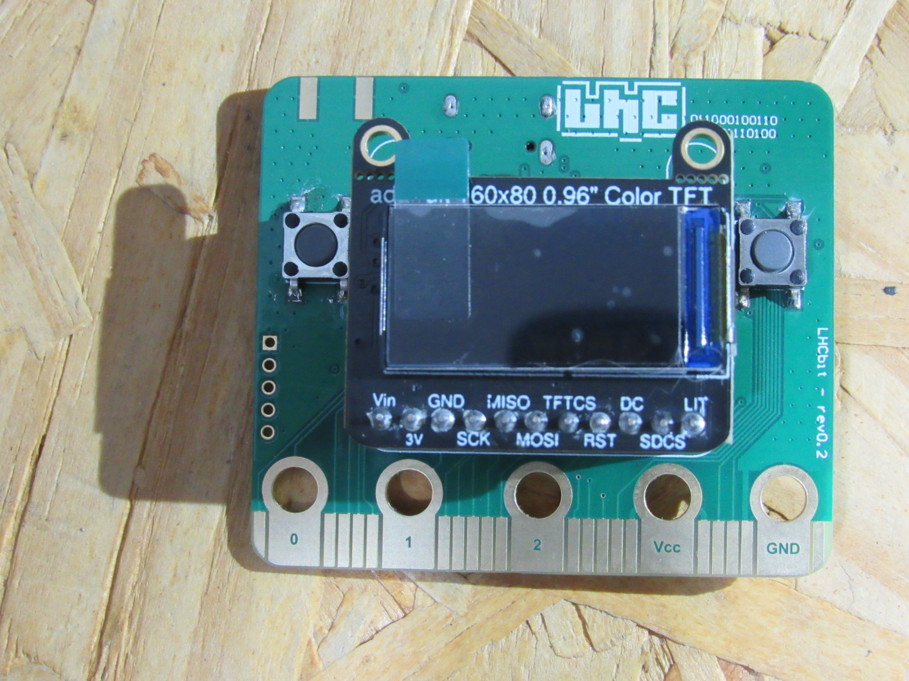
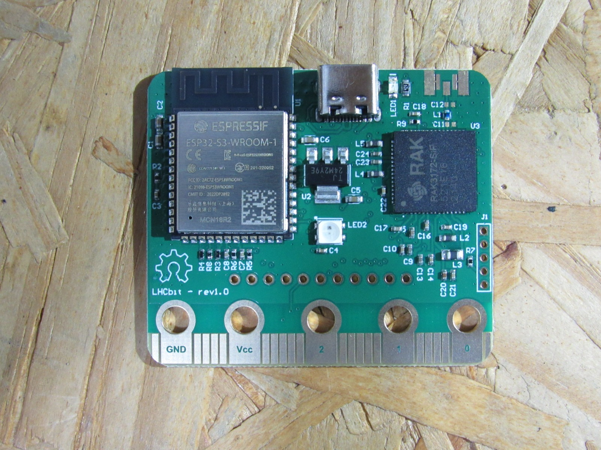

=================
esp32s3-lhcbit
=================

This page discusses issues unique to NuttX configurations for the
ESP32S3-LHCBit board.

Board information
=================

This board was release by Laboratório Hacker de Campinas (LHC) in 2024 and developed based on
ESP32-S3-WROOM-1 module. 

The board features:
  - ESP32-S3-16R8 
  - USB-to-UART bridge via micro USB port
  - SPI FLASH (size varies according to model)
  - Lora module RAK3172-SiP
  - Adafruit Mini TFT - 0.96" 160x80

Board documentation: https://github.com/lhc/Hardware/tree/main/LHCbit

BOARD-RGB LED
==============

The LHCBit board has one LED RGB Addressable

  =======  =====
  LED      PINS
  =======  =====
  LED_RGB  IO14
  =======  =====

BOARD BUTTONS
==============

The LHCBit board has 2 buttons

  ======= =====
  BUTTON  PINS
  ======= =====
  SW1     IO13
  SW2     IO12
  ======= =====

BOARD LORA
==========

The LHCBit board has a RAK3172-SiP lora module with AT command communication via UART

  ========= =====
  LORA      PINS
  ========= =====
  UART1_TX  IO9
  UART1_RX  IO11
  BOOT      IO10
  ========= =====

BOARD DISPLAY
===============

The LHCBit board comes with a 0.96" TFT display with sdcard, both with SPI communication and individual CS pins.

  ========= =====
  SHIELD    PINS
  ========= =====
  SPI_MOSI  IO15
  SPI_MISO  IO16
  TFT_CS    IO21
  TFT_RESET IO48
  TFT_DC    IO37
  SD_CS     IO39
  ========= =====
  
Configurations
==============

All of the configurations presented below can be tested by running the following commands::

    tools/configure.sh esp32s3-lhcbit:<subdir>

  Where <subdir> is one of the following:

Configuration Directories
-------------------------

usbnsh
------

Configures the NuttShell (nsh) located at apps/examples/nsh. This configuration enables a serial console over USB.

After flasing and reboot your board you should see in your dmesg logs::

    $ sudo dmesg | tail
    [ 3315.687219] usb 3-1.1.1: new full-speed USB device number 10 using xhci_hcd
    [ 3315.778666] usb 3-1.1.1: New USB device found, idVendor=0525, idProduct=a4a7, bcdDevice= 1.01
    [ 3315.778684] usb 3-1.1.1: New USB device strings: Mfr=1, Product=2, SerialNumber=3
    [ 3315.778689] usb 3-1.1.1: Product: CDC/ACM Serial
    [ 3315.778694] usb 3-1.1.1: Manufacturer: NuttX
    [ 3315.778697] usb 3-1.1.1: SerialNumber: 0
    [ 3315.829695] cdc_acm 3-1.1.1:1.0: ttyACM0: USB ACM device
    [ 3315.829725] usbcore: registered new interface driver cdc_acm
    [ 3315.829727] cdc_acm: USB Abstract Control Model driver for USB modems and ISDN adapters

You may need to press ENTER 3 times before the NSH show up.

