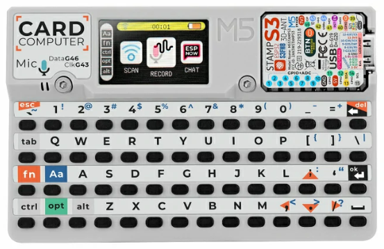
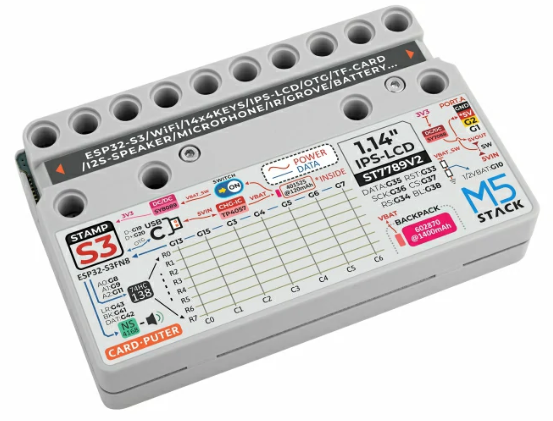

.. _esp32s3-m5-cardputer:

=================
M5Stack Cardputer
=================

.. tags:: chip:esp32, chip:esp32s3, arch:xtensa, vendor:espressif

   M5Stack Cardputer

The `M5Stack Cardputer <https://docs.m5stack.com/en/core/Cardputer>`_ is a
pocket-sized computer kit built around an M5Stamp S3 module (ESP32-S3FN8, dual
Xtensa LX7 @ 240 MHz, 8 MB flash, no PSRAM).  It integrates a 1.14" ST7789
TFT, an NS4168 I2S speaker, an SPM1423 microphone, an IR transmitter, a
microSD slot and a Grove port.

   M5Stack Cardputer

Features
========

* ESP32-S3FN8 (dual Xtensa LX7 @ 240 MHz), 8 MB flash, no PSRAM
* Wi-Fi 4 (2.4 GHz) and Bluetooth LE (native ESP32-S3 radio)
* 1.14" 240x135 ST7789v2 TFT on SPI2
* NS4168 mono I2S Class-D speaker amplifier
* SPM1423 PDM microphone
* IR transmitter, addressable RGB LED (WS2812)
* microSD card slot (SPI) and Grove HY2.0-4P (I2C)
* USB Type-C (native USB-Serial-JTAG)

Serial Console
==============

By default the NSH console runs over the **USB-Serial-JTAG** peripheral exposed
on the USB Type-C connector.  It enumerates on the host as ``/dev/ttyACM0``
(Linux).  No external USB-to-UART bridge is required.

Pin Mapping
===========

=========================== ==========================================
Peripheral                  ESP32-S3 GPIO
=========================== ==========================================
ST7789 SPI2 SCLK/MOSI/CS    36 / 35 / 37
ST7789 DC/RST/backlight     34 / 33 / 38
microSD SPI3 SCK/MISO       40 / 39
microSD SPI3 MOSI/CS        14 / 12
Speaker NS4168 BCK/WS/DOUT  41 / 43 / 42
Microphone SPM1423 DATA/CLK 46 / 43 (CLK shared with speaker WS)
IR transmitter              44
RGB LED (WS2812)            21
Grove I2C SDA/SCL           2 / 1
Battery ADC (1:2 divider)   10
USB D-/D+ (native)          19 / 20
BOOT / user button          0
=========================== ==========================================

Configurations
==============

All configurations use the USB-Serial-JTAG console and can be selected with::

    ./tools/configure.sh esp32s3-m5-cardputer:<config>

nsh
    Basic NuttShell over USB-Serial-JTAG.  Open the console
    (``/dev/ttyACM0``) and interact with the shell::

        nsh> help
        nsh> ls /dev

sdcard
    NSH plus the microSD card on SPI3 (FAT), registered as ``/dev/mmcsd0``.
    Mount it and access the files::

        nsh> mount -t vfat /dev/mmcsd0 /mnt
        nsh> ls /mnt
        nsh> echo "hello" > /mnt/test.txt

fb
    ST7789 display exposed as a framebuffer (``/dev/fb0``).  Run the framebuffer
    example to draw test patterns on the screen::

        nsh> fb

wifi
    Wi-Fi station.  Associate with an access point and obtain an address over
    DHCP (replace ``<ssid>``/``<passphrase>`` with your network)::

        nsh> wapi psk wlan0 <passphrase> 3
        nsh> wapi essid wlan0 <ssid> 1
        nsh> renew wlan0
        nsh> ifconfig
        nsh> ping 8.8.8.8

softap
    Wi-Fi SoftAP with a DHCP server.  The board starts the access point
    ``NuttX`` (WPA2/WPA3-SAE, passphrase ``nuttx12345``) at 10.0.0.1.  Start the
    DHCP server so stations that join get an address::

        nsh> ifconfig
        nsh> dhcpd wlan0

    Then connect a client to the ``NuttX`` network; it receives an address in
    the 10.0.0.0/24 range and can reach the board at 10.0.0.1.

lvgl
    Graphics support with LVGL on the ST7789 display.  Run the LVGL demo::

        nsh> lvgldemo
