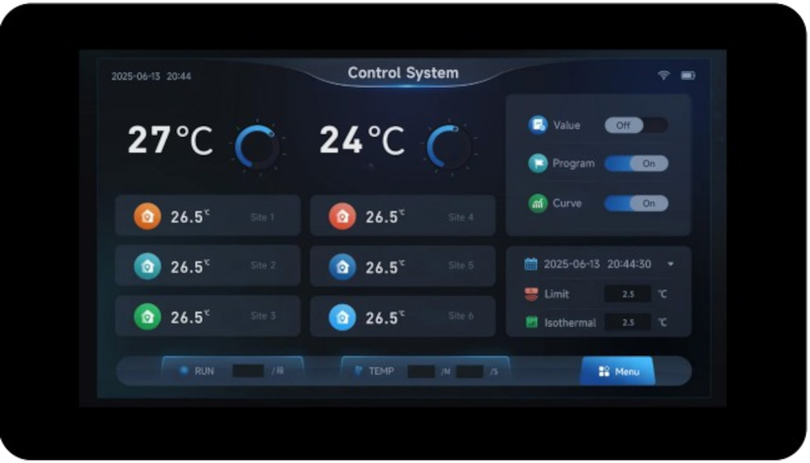
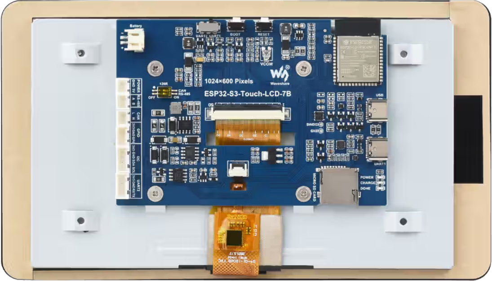

==================
esp32s3-touch-lcd7
==================

.. tags:: chip:esp32, chip:esp32s3

This page discusses issues unique to NuttX configurations for the
ESP32S3-Touch-LCD-7 board.

The Waveshare ESP32-S3-Touch-LCD-7 is a feature rich board based on
ESP32-S3-WROOM-1 module. 

Features
========

  - ESP32-S3-16R8 
  - USB-to-UART bridge via micro USB port
  - 8MB SPI FLASH
  - 8MB PSRAM
  - Onboard 7" LCD screen with 800 × 480 resolution, 65K colors
  - Onboard CAN, RS485, I2C interfaces, TF card slot, and integrated full-speed USB

Board documentation: https://docs.waveshare.com/ESP32-S3-Touch-LCD-7

BOARD LED
=========

The board has three LEDs: POWER, CHARGE, DONE, but none programmable.

BOARD BUTTONS
==============

The board has 2 buttons:

  ======= =====
  BUTTON  PINS
  ======= =====
  RESET   RST
  BOOT    IO0
  ======= =====

BOARD DISPLAY
===============

The board has a 7-inch LCD:

  ========= ======== =========================
  ESP32-S3  LCD      Description
  ========= ======== =========================
  GPIO0     G3       Green data bit 3
  GPIO1     R3       Red data bit 3
  GPIO2     R4       Red data bit 4
  GPIO3     VSYNC    Vertical sync signal
  GPIO5     DE       Data enable signal
  GPIO7     PCLK     Pixel clock signal
  GPIO10    B7       Blue data bit 7
  GPIO14    B3       Blue data bit 3
  GPIO17    B6       Blue data bit 6
  GPIO18    B5       Blue data bit 5
  GPIO21    G7       Green data bit 7
  GPIO38    B4       Blue data bit 4
  GPIO39    G2       Green data bit 2
  GPIO40    R7       Red data bit 7
  GPIO41    R6       Red data bit 6
  GPIO42    R5       Red data bit 5
  GPIO45    G4       Green data bit 4
  GPIO46    HSYNC    Horizontal sync signal
  GPIO47    G6       Green data bit 6
  GPIO48    G5       Green data bit 5
  CH422G    LCD      -
  EXIO2     DISP     Backlight enable pin
  ========= ======== =========================

The panel is an EK9716 driven over a 16-bit parallel RGB565 bus by the
LCD_CAM peripheral.  Its timing is:

  ==================== =======
  Parameter            Value
  ==================== =======
  Resolution           800x480
  Pixel clock          16 MHz
  HSYNC pulse width    4
  HSYNC back porch     8
  HSYNC front porch    8
  VSYNC pulse width    4
  VSYNC back porch     8
  VSYNC front porch    8
  ==================== =======

The RGB bus takes most of the usable pins, so the panel reset and the
display enable are not wired to GPIOs.  They hang off a CH422G I/O
expander, reached over the I2C bus shared with the touch controller:

  ========= ============ ==================================
  Signal    Connection   Description
  ========= ============ ==================================
  SDA       GPIO8        I2C data, expander and touch
  SCL       GPIO9        I2C clock, expander and touch
  TP_RST    CH422G EXIO1 GT911 touch controller reset
  DISP      CH422G EXIO2 Display and backlight enable
  LCD_RST   CH422G EXIO3 Panel reset
  SD_CS     CH422G EXIO4 TF card chip select
  USB_SEL   CH422G EXIO5 USB / CAN transceiver select
  ========= ============ ==================================

A 800x480 RGB565 framebuffer is 768000 bytes and does not fit in internal
RAM, so any configuration that drives the panel must also enable the
onboard 8MB octal PSRAM and leave it in the common heap.

Configurations
==============

All of the configurations presented below can be tested by running the following commands:

.. code-block:: console

   $ ./tools/configure.sh esp32s3-touch-lcd7:<config-name>

  Where <subdir> is one of the following:

Configuration Directories
-------------------------

lcd
---

Brings up the onboard 7 inch 800x480 panel as a framebuffer character
driver at ``/dev/fb0``, on top of the ``usbnsh`` console.  The CH422G I/O
expander is used to take the panel out of reset and to switch the display
on once the framebuffer exists, and the PSRAM the framebuffer is allocated
from is enabled.

Note that the console is on UART0, GPIO43 and GPIO44, reached through the
USB-to-UART bridge on the UART USB-C connector.  It is deliberately not on
the native USB peripheral, because that is the connector a USB host
configuration drives.

``apps/examples/fb`` is included to prove the panel out.  It reports the
geometry of the framebuffer it found and then draws a series of nested
rectangles over the whole display::

    nsh> fb
    VideoInfo:
          fmt: 11
         xres: 800
         yres: 480
      nplanes: 1
    PlaneInfo (plane 0):
        fbmem: 0x3c050040
        fblen: 1536000
       stride: 1600
      display: 0
          bpp: 16
    Mapped FB: 0x3c050040
    Use consecutive fbmem2 = 0x3c10b840, yoffset = 480
     0: (  0,  0) (800,480)
     1: ( 72, 43) (656,394)
     2: (144, 86) (512,308)
     3: (216,129) (368,222)
     4: (288,172) (224,136)
     5: (360,215) ( 80, 50)
    Test finished

The framebuffer is in PSRAM, which is why ``fbmem`` is in the 0x3c000000
range, and ``fblen`` is 1536000 rather than 768000 because the driver is
double buffered by default.

usbnsh
------

Configures the NuttShell (nsh) located at apps/examples/nsh. This configuration enables a serial console over USB.

After flashing and reboot your board you should see in your dmesg logs::

    $ sudo dmesg | tail
    [ 3315.687219] usb 3-1.1.1: new full-speed USB device number 10 using xhci_hcd
    [ 3315.778666] usb 3-1.1.1: New USB device found, idVendor=0525, idProduct=a4a7, bcdDevice= 1.01
    [ 3315.778684] usb 3-1.1.1: New USB device strings: Mfr=1, Product=2, SerialNumber=3
    [ 3315.778689] usb 3-1.1.1: Product: CDC/ACM Serial
    [ 3315.778694] usb 3-1.1.1: Manufacturer: NuttX
    [ 3315.778697] usb 3-1.1.1: SerialNumber: 0
    [ 3315.829695] cdc_acm 3-1.1.1:1.0: ttyACM0: USB ACM device
    [ 3315.829725] usbcore: registered new interface driver cdc_acm
    [ 3315.829727] cdc_acm: USB Abstract Control Model driver for USB modems and ISDN adapters

You may need to press ENTER 3 times before the NSH show up.

