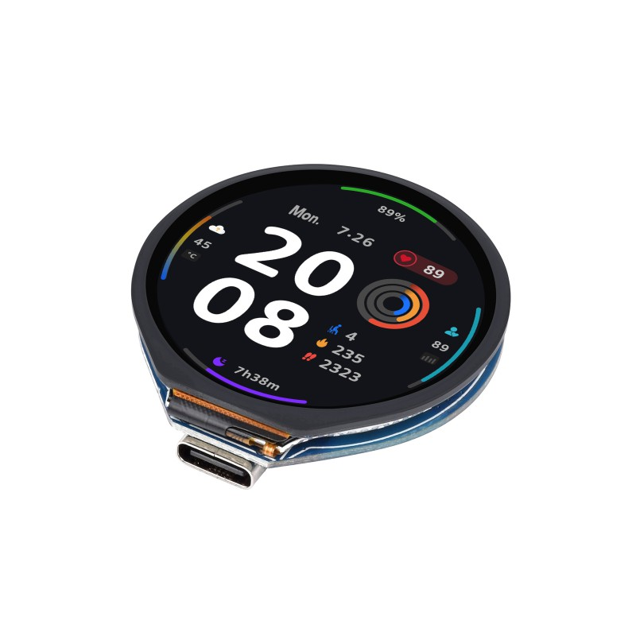

=================
ESP32S3-WS-LCD128
=================

.. tags:: chip:esp32s3

This board definition is a starting point for development with 
`ESP32-S3-LCD-1.28 <https://www.waveshare.com/esp32-s3-lcd-1.28.htm>`__ and
`ESP32-S3-Touch-LCD-1.28 <https://www.waveshare.com/esp32-s3-touch-lcd-1.28.htm>`__
which are low-cost ($16/$22) open-source hardware designed by
`WaveShare <https://www.waveshare.com/>`_. High-performance Xtensa based
ESP32-S3 MCU, small size, onboard round 1.28" LCD display, capacitive touch
screen (Touch version only), Li-ion accumulator charge manager, 6-axis sensor
(3-axis accelerometer and 3-axis gyroscope), and quick module attachmend
1.27mm connectors (non-Touch version only), makes it a perfect candidate 
for integration into your projects and products quickly.

.. list-table::
   :width: 100%
   :class: borderless

   * - .. figure:: ESP32-S3-LCD-1.28-details-intro.jpg
          :target: https://www.waveshare.com/wiki/ESP32-S3-LCD-1.28
          :align: center

          ESP32-S3-LCD-1.28.

     - .. figure:: ESP32-S3-Touch-LCD-1.28-details-intro.jpg
          :target: https://www.waveshare.com/wiki/ESP32-S3-Touch-LCD-1.28
          :align: center

          ESP32-S3-Touch-LCD-1.28.

These boards are almost identical. Touch version has touch screen,
while non-Touch version has two connectors exposing more GPIOs at the bottom,
thus slightly different signal routes. See Pinouts and GPIO sections below
for details.

Because of that similarity, a single board definition is provided by NuttX,
while features and configuration details are build time Kconfig selectable:

* ``CONFIG_ARCH_BOARD_ESP32S3_WS_LCD128_TOUCH`` selects Touch variant.
* ``CONFIG_ARCH_BOARD_ESP32S3_WS_LCD128_NOTOUCH`` selects Non-Touch variant.

Both boards are based on existing :ref:`esp32s3` chip implementation.
WaveShare WIKI contains board details, generic examples, documentation, and
schematics for the
`ESP32-S3-LCD-1.28 <https://www.waveshare.com/wiki/ESP32-S3-LCD-1.28>`__ and
`ESP32-S3-Touch-LCD-1.28 <https://www.waveshare.com/wiki/ESP32-S3-Touch-LCD-1.28>`__.

.. note:: Implementation is experimental and still early stage of development!

Features
========

  - ESP32-S3R2 Xtensa® 32-bit LX7 dual-core processor, up to 240MHz frequency.
  - 2.4GHz Wi-Fi (802.11 b/g/n) and Bluetooth® 5 (BLE) with onboard antenna.
  - Built in 512KB of SRAM and 384KB ROM, on-chip 2MB PSRAM, external 16MB
    W25Q128JVSIQ NOR Flash memory.
  - USB-C connector and CH343P USB-to-UART converter (flashing, console).
  - Onboard GC9A01A controlled round 1.28" 240×240 resolution 65K color LCD.
  - Onboard QMI8658 6-axis IMU (3-axis accelerometer and 3-axis gyroscope).
  - Onboard 3.7V MX1.25 lithium battery re/discharge header, ETA6096 charger.
  - Touch version:

    - CST816S capacitive touch display controller.
    - 6 × GPIO exposed over SH1.0 connector.

  - Non-Touch version:

    - 32 x GPIO exposed over 2 x 2x10 1.27mm female connectors.

Dimensions
==========

  - ESP32-S3-LCD-1.28:

    .. figure:: ESP32-S3-LCD-1.28-details-size.jpg
       :align: center

  - ESP32-S3-Touch-LCD-1.28:

     .. figure:: ESP32-S3-Touch-LCD-1.28-details-size-1.jpg
        :align: center

     .. figure:: ESP32-S3-Touch-LCD-1.28-details-size-2.jpg
        :align: center

Pinouts
=======

  - ESP32-S3-LCD-1.28:

    .. figure:: ESP32-S3-LCD-1.28-details-inter.jpg
       :align: center

  - ESP32-S3-Touch-LCD-1.28:

     .. figure:: ESP32-S3-Touch-LCD-1.28-details-inter.jpg
        :align: center

GPIO
====

.. warning:: ESP32-S3-LCD-1.28 pinout on the picture above is different from
             the schematics (picture has H2 rotated numbering but the signal
             names are valid)! Schematics and table below shows correct data.
             Issue is reported to vendor, we are waiting for the fix / update.

+------------+----------------------+-------------------------+
| ESP32-S3R2 | ESP32-S3-LCD-1.28    | ESP32-S3-Touch-LCD-1.28 |
+============+======================+=========================+
| GND        | H1.20, H2.1, H2.2    | P2.1, P2.5              |
+------------+----------------------+-------------------------+
| VSYS(USB5V)| H1.18, H2.3          | P2.2                    |
+------------+----------------------+-------------------------+
| 3V3        | BAT_ADC / H2.4       | P2.6                    |
+------------+----------------------+-------------------------+
| CHIP_PU    | RUN/RESET / H2.8     | RUN/RESET / P2.3        |
+------------+----------------------+-------------------------+
| GPIO0      | BOOT / H2.6, H2.10   | BOOT / P2.4             |
+------------+----------------------+-------------------------+
| GPIO1      | BAT_ADC / H2.12      | BAT_ADC / P2.6          |
+------------+----------------------+-------------------------+
| GPIO2      | GPIO2 / H2.14        | LCD_BL                  |
+------------+----------------------+-------------------------+
| GPIO3      | GPIO3 / H2.16        | IMU_INT2                |
+------------+----------------------+-------------------------+
| GPIO4      | GPIO4 / H2.18        | IMU_INT1                |
+------------+----------------------+-------------------------+
| GPIO5      | GPIO5 / H2.20        | TP_INT                  |
+------------+----------------------+-------------------------+
| GPIO6      | IMU_SDA / H2.5       | IMU_SDA,TP_SDA          |
+------------+----------------------+-------------------------+
| GPIO7      | IMU_SCL / H2.7       | IMU_SCL,TP_SCL          |
+------------+----------------------+-------------------------+
| GPIO8      | LCD_DC / H2.9        | LCD_DC                  |
+------------+----------------------+-------------------------+
| GPIO9      | LCD_CS / H2.11       | LCD_CS                  |
+------------+----------------------+-------------------------+
| GPIO10     | LCD_CLK / H2.13      | CLD_CLK                 |
+------------+----------------------+-------------------------+
| GPIO11     | LCD_DIN / H2.15      | LCD_MOSI                |
+------------+----------------------+-------------------------+
| GPIO12     | LCD_RST / H2.17      | LCD_MISO                |
+------------+----------------------+-------------------------+
| GPIO13     | GPIO13 / H2.19       | TP_RST                  |
+------------+----------------------+-------------------------+
| GPIO14     | GPIO14 / H1.19       | LCD_RST                 |
+------------+----------------------+-------------------------+
| GPIO15     | GPIO15 / H1.17       | GPIO15 / P2.7           |
+------------+----------------------+-------------------------+
| GPIO16     | GPIO16 / H1.15       | GPIO16 / P2.8           |
+------------+----------------------+-------------------------+
| GPIO17     | GPIO17 / H1.13       | GPIO17 / P2.9           |
+------------+----------------------+-------------------------+
| GPIO18     | GPIO18 / H1.11       | GPIO18 / P2.10          |
+------------+----------------------+-------------------------+
| GPIO21     | GPIO21 / H1.9        | GPIO21 / P2.11          |
+------------+----------------------+-------------------------+
| GPIO33     | GPIO33 / H1.7        | GPIO33 / P2.12          |
+------------+----------------------+-------------------------+
| GPIO34     | GPIO34 / H1.5        |                         |
+------------+----------------------+-------------------------+
| GPIO35     | GPIO35 / H1.3        |                         |
+------------+----------------------+-------------------------+
| GPIO36     | GPIO36 / H1.1        |                         |
+------------+----------------------+-------------------------+
| GPIO37     | GPIO37 / H1.16       |                         |
+------------+----------------------+-------------------------+
| GPIO38     | GPIO38 / H1.14       |                         |
+------------+----------------------+-------------------------+
| GPIO39     | GPIO39 / H1.12       |                         |
+------------+----------------------+-------------------------+
| GPIO40     | LCD_BL / H1.10       |                         |
+------------+----------------------+-------------------------+
| GPIO41     | GPIO41 / H1.8        |                         |
+------------+----------------------+-------------------------+
| GPIO42     | GPIO42 / H1.6        |                         |
+------------+----------------------+-------------------------+
| GPIO45     | GPIO45 / H1.4        |                         |
+------------+----------------------+-------------------------+
| GPIO46     | GPIO46 / H1.2        |                         |
+------------+----------------------+-------------------------+
| GPIO47     | IMU_INT1             |                         |
+------------+----------------------+-------------------------+
| GPIO48     | IMU_INT2             |                         |
+------------+----------------------+-------------------------+

Board Buttons
-------------

There are two buttons labeled BOOT and RESET (both are exposed on board
connectors):

* RESET (active low) button is not available to the software and can be used
  as manual hardware reset trigger.

* BOOT button is connected to GPIO0. On reset/power-on it can be used to
  trigger BootROM serial bootloader when pressed (active low) in order to
  flash new firmware. After reset BOOT button can be used as software input.

Serial Console
==============

UART0 is by default used for the serial console. It connects to the on-board
CH343P converter and is available on the USB-C connector that can be also used
for firmware flashing.

Configurations
==============

All of the available configurations provide basic testing utilities or serve
as an example starting point for your own projects.
Use them by running the following commands::

    $ ./tools/configure.sh esp32s3-ws-lcd128:<config_name>
    $ make flash -j ESPTOOL_PORT=<serial_port_device>

Notes:

  - ``<config_name>`` is the name of board configuration you want to use
    (i.e. nsh, lvgl). Then use a serial console terminal like ``cu`` or
    ``minicom`` configured to 115200 8N1.
  - ``<serial_port_device>`` is usually ``/dev/ttyUSB0`` or ``/dev/cuaU0``
    depending on the OS you are using.
  - On BSD systems use GNU Make (``gmake``) in place of ``make``.

coremark
--------

Provides :ref:`coremark <CoreMark>` benchmarking utility on boot::

  Running CoreMark...
  2K performance run parameters for coremark.
  CoreMark Size    : 666
  Total ticks      : 2313
  Total time (secs): 23.130000
  Iterations/Sec   : 951.145698
  Iterations       : 22000
  Compiler version : GCC14.2.0
  Compiler flags   : -O3 -fno-strict-aliasing -fomit-frame-pointer -ffunction-sections -fdata-sections -fno-strength-reduce
  Parallel PThreads : 2
  Memory location  : HEAP
  seedcrc          : 0xe9f5
  [0]crclist       : 0xe714
  [1]crclist       : 0xe714
  [0]crcmatrix     : 0x1fd7
  [1]crcmatrix     : 0x1fd7
  [0]crcstate      : 0x8e3a
  [1]crcstate      : 0x8e3a
  [0]crcfinal      : 0x33ff
  [1]crcfinal      : 0x33ff
  Correct operation validated. See README.md for run and reporting rules.
  CoreMark 1.0 : 951.145698 / GCC14.2.0 -O3 -fno-strict-aliasing -fomit-frame-pointer -ffunction-sections -fdata-sections -fno-strength-reduce / HEAP / 2:PThreads

notouch-lvgl
------------

This is a demonstration of the :ref:`lvgl <lvgl>` graphics library running on the
NuttX's :ref:`GC9A01A <gc9a01>` LCD driver. Demo will launch itself on boot
and you should see it on the screen right away.
This configuration uses the :ref:`lvgldemo <lvgldemo>` application.

.. note::

   1. This configuration has ``CONFIG_ARCH_BOARD_ESP32S3_WS_LCD128_NOTOUCH``
      set. It selects LCD pins valid for the Non-Touch board variant.

   2. Colors are invalid. Pixel format to be fixed. Work in progress.

nsh
---

Provides :ref:`nsh <nsh>` NuttShell as default application.
Console runs on UART0 at 115200bps and is exposed via USB over CH343P chip.

qmi8658
-------

Provides onboard :ref:`QMI8658` IMU and internal ESP32S3 temperature
:ref:`uorb <uorb>` sensors example. Sensors are registered under
``/dev/urob/`` and its data can be obtained with :ref:`uorb_listener`
application::

    nsh> ls /dev/uorb
    /dev/uorb:
    sensor_accel0
    sensor_gyro0
    sensor_temp0

    nsh> uorb_listener -n 10

    Monitor objects num:3
    object_name:sensor_temp, object_instance:0
    object_name:sensor_gyro, object_instance:0
    object_name:sensor_accel, object_instance:0
    sensor_temp(now:144950000):timestamp:144950000,temperature:36.000000
    sensor_temp(now:145960000):timestamp:145960000,temperature:37.000000
    sensor_gyro(now:145960000):timestamp:145960000,x:-4.750000,y:-0.437500,z:0.156250,temperature:32.261719
    sensor_accel(now:145960000):timestamp:145960000,x:0.031250,y:-0.088867,z:-1.051392,temperature:32.261719
    sensor_temp(now:146970000):timestamp:146970000,temperature:37.000000
    sensor_gyro(now:146970000):timestamp:146970000,x:-4.937500,y:-0.562500,z:0.218750,temperature:32.281250
    sensor_accel(now:146970000):timestamp:146970000,x:0.031738,y:-0.088623,z:-1.046265,temperature:32.281250
    sensor_temp(now:147980000):timestamp:147980000,temperature:37.000000
    sensor_gyro(now:147980000):timestamp:147980000,x:-4.750000,y:0.031250,z:0.437500,temperature:32.273438
    sensor_accel(now:147980000):timestamp:147980000,x:0.031005,y:-0.088745,z:-1.049683,temperature:32.273438
    Object name:sensor_temp0, received:4
    Object name:sensor_gyro0, received:3
    Object name:sensor_accel0, received:3
    Total number of received Message:10/10

ostest
------

Provides :ref:`ostest <ostest>` NuttX self-test utility::

  nsh> ostest
  stdio_test: write fd=1
  stdio_test: Standard I/O Check: printf
  stdio_test: write fd=2
  stdio_test: Standard I/O Check: fprintf to stderr
  ostest_main: putenv(Variable1=BadValue3)
  ostest_main: setenv(Variable1, GoodValue1, TRUE)
  ostest_main: setenv(Variable2, BadValue1, FALSE)
  ostest_main: setenv(Variable2, GoodValue2, TRUE)
  ostest_main: setenv(Variable3, GoodValue3, FALSE)
  ostest_main: setenv(Variable3, BadValue2, FALSE)
  show_variable: Variable=Variable1 has value=GoodValue1
  show_variable: Variable=Variable2 has value=GoodValue2
  show_variable: Variable=Variable3 has value=GoodValue3
  ostest_main: Started user_main at PID=3

  (..)

  End of test memory usage:
  VARIABLE  BEFORE   AFTER
  ======== ======== ========
  arena       5d378    5d378
  ordblks         5        5
  mxordblk    542d0    542d0
  uordblks     47e8     47e8
  fordblks    58b90    58b90

  Final memory usage:
  VARIABLE  BEFORE   AFTER
  ======== ======== ========
  arena       5d378    5d378
  ordblks         1        5
  mxordblk    58c28    542d0
  uordblks     4750     47e8
  fordblks    58c28    58b90
  user_main: Exiting
  ostest_main: Exiting with status 0

touch-lvgl
----------

This is a demonstration of the :ref:`lvgl <lvgl>` graphics library running on the
NuttX's :ref:`GC9A01A <gc9a01>` LCD driver. Demo will launch itself on boot and you
should see it on the screen right away.
This configuration uses the :ref:`lvgldemo <lvgldemo>` application.

.. note::

   1. This configuration has ``CONFIG_ARCH_BOARD_ESP32S3_WS_LCD128_TOUCH``
      set. It selects LCD pins valid for the Touch board variant.

   2. Colors are invalid. Pixel format to be fixed. Work in progress.

   3. Touch screen driver (I2C/CST816S) is not yet implemented!
      Work in progress.

watchdog
--------

Provides :ref:`watchdog <watchdog>` testing utility::

  nsh> wdog
   ping elapsed=0
   ping elapsed=500
   ping elapsed=1000
   ping elapsed=1500
   ping elapsed=2000
   ping elapsed=2500
   ping elapsed=3000
   ping elapsed=3500
   ping elapsed=4000
   ping elapsed=4500
   NO ping elapsed=5000
   NO ping elapsed=5500
   NO ping elapsed=6000

   ESP-ROM:esp32s3-20210327
   Build:Mar 27 2021
   rst:0x7 (TG0WDT_SYS_RST),boot:0x18 (SPI_FAST_FLASH_BOOT)

