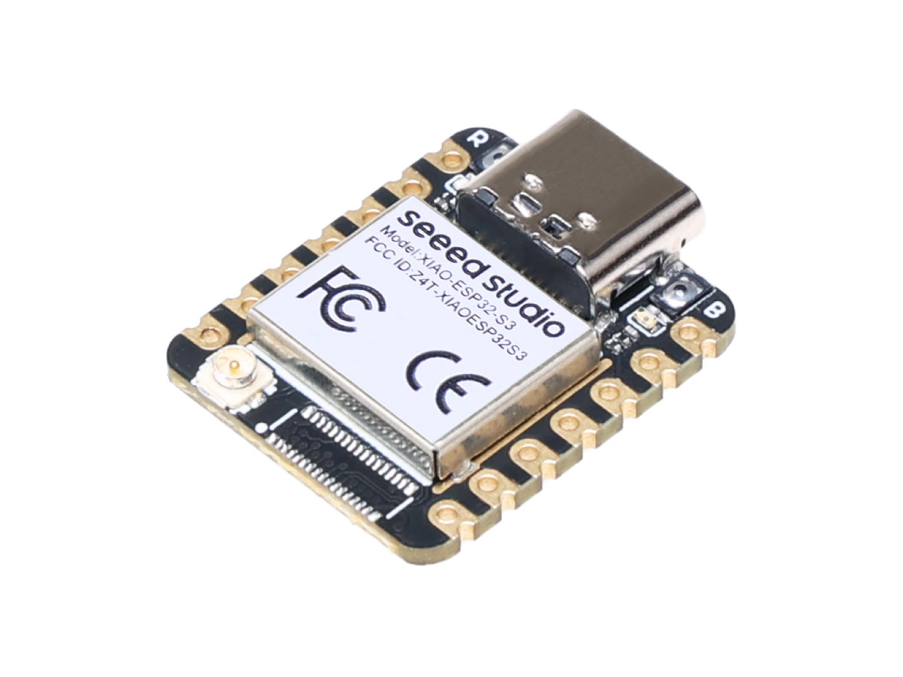

=========================
Seeed Studio XIAO ESP32S3
=========================

.. tags:: chip:esp32, chip:esp32s3

The `Seeed Studio XIAO ESP32S3 <https://wiki.seeedstudio.com/xiao_esp32s3_getting_started/>`_ is a general purpose board supplied by
Seeed Studio and it is compatible with the Espressif ESP32S3 ecosystem, sharing the same MCU as ESP32-S3-DevKitC.

Features
========

* ESP32-S3R8 Xtensa LX7 dual-core, 32-bit processor that operates at up to 240 MHz
* On-chip 8M PSRAM & 8MB Flash
* USB Type-C interface
* Wireless: Complete 2.4GHz Wi-Fi subsystem;
* BLE: Bluetooth 5.0, Bluetooth mesh
* 1x UART, 1x I2C, 1x I2S, 1x SPI, 11x GPIOs (PWM), 9x ADC
* 1 user LED, 1 power LED
* 1 RESET button, 1 BOOT button

NSH Console
===========

The NuttShell (NSH) console is available over USB using the CDC/ACM
serial interface. To access the console, connect via a terminal emulator
at 115200 baud, 8 data bits, no parity, and 1 stop bit (115200-8N1).

User LED
========

The USER LED, a yellow LED located on the XIAO ESP32S3 board, is
connected to GPIO21 as indicated in the board's schematic. This LED
can be controlled through NuttX by configuring GPIO21 as an output
and toggling its state.

Buttons
=======

The RESET and BOOT buttons can be used to enter "Bootloader" mode by
press and hold the BOOT key while powering up and then press the RESET key once.

Pin Mapping
===========
Pads numbered anticlockwise from USB connector.

===== ========== ==========
Pad   Signal     Notes
===== ========== ==========
0     GPIO01     D0/A0
1     GPIO02     D1/A1
2     GPIO03     D2/A2
3     GPIO04     D3/A3
4     GPIO05     D4/SDA
5     GPIO06     D5/SCL
6     GPIO43     D6/Default TX for UART0 serial console
7     GPIO44     D7/Default RX for UART0 serial console
8     GPIO07     D8/SCK
9     GPIO08     D9/MISO
10    GPIO09     D10/MOSI
11    3V3        Power output to peripherals
12    Ground
13    VIN        +5V Supply to board
===== ========== ==========

Power Supply
============
The working voltage of the MCU is 3.3V. Voltage input connected to
general I/O pins may cause chip damage if it’s higher than 3.3V.

Installation
============

1. Configure and build NuttX:

.. code-block:: console

  $ git clone https://github.com/apache/nuttx.git nuttx
  $ git clone https://github.com/apache/nuttx-apps.git apps
  $ cd nuttx
  $ make distclean
  $ ./tools/configure.sh xiao-esp32s3:usbnsh
  $ make V=1

2. Connect the Seeed Studio XIAO ESP32S3, and enter "Bootloader" mode,
then, flash the ``nuttx.hex`` file using ``esptool``:
(https://docs.espressif.com/projects/esptool/en/latest/esp32/)

Example command:

.. code-block:: bash

    make flash ESPTOOL_PORT=/dev/ttyACM0 ESPTOOL_BINDIR=./

Configurations
==============

usbnsh
------
Basic NuttShell configuration using CDC/ACM serial (console enabled in USB Port,
at 115200 bps).

.. code-block:: console

  NuttShell (NSH) NuttX-12.8.0
  nsh> uname -a
  NuttX 12.8.0 2c845426da-dirty Apr  6 2025 22:53:57 xtensa esp32s3-xiao

combo
-----
This configuration enabled NuttShell via USB and enabled led and gpio examples:

Testing leds:

.. code-block:: console

  nsh> leds
  leds_main: Starting the led_daemon
  leds_main: led_daemon started

  led_daemon (pid# 10): Running
  led_daemon: Opening /dev/userleds
  led_daemon: Supported LEDs 0x01
  led_daemon: LED set 0x01
  nsh> led_daemon: LED set 0x00
  led_daemon: LED set 0x01
  led_daemon: LED set 0x00
  led_daemon: LED set 0x01
  led_daemon: LED set 0x00

Testing gpios:

========   ======   ==========
PIN/GPIO    Mode      Device
========   ======   ==========
D1/GPIO2   Output   /dev/gpio0
D0/GPIO1   Input    /dev/gpio1
D2/GPIO3   Input    /dev/gpio2
========   ======   ==========

.. code-block:: console

  nsh> ls /dev
  /dev:
   console
   gpio0
   gpio1
   gpio2
   null
   ttyACM0
   ttyS0
   userleds
   zero
  nsh> gpio -o 1 /dev/gpio0
  Driver: /dev/gpio0
    Output pin:    Value=0
    Writing:       Value=1
    Verify:        Value=1
  nsh> gpio -o 0 /dev/gpio0
    Driver: /dev/gpio0
    Output pin:    Value=1
    Writing:       Value=0
    Verify:        Value=0
  nsh> gpio /dev/gpio1
  Driver: /dev/gpio1
    Input pin:     Value=0
  nsh> gpio /dev/gpio1
  Driver: /dev/gpio1
    Input pin:     Value=1
  nsh> gpio /dev/gpio1
  Driver: /dev/gpio1
    Input pin:     Value=0
  nsh> gpio -w 1 /dev/gpio2
  Driver: /dev/gpio2
    Interrupt pin: Value=0
    Verify:        Value=1
  nsh> gpio -w 1 /dev/gpio2
  Driver: /dev/gpio2
    Interrupt pin: Value=0
    Verify:        Value=1

