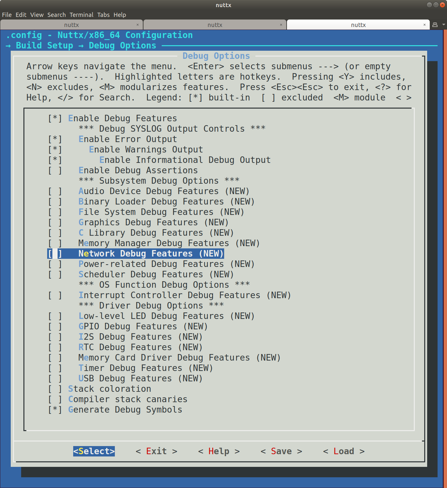

.. include:: /substitutions.rst
.. _debugging:

=========
Debugging
=========

Finding and fixing bugs is an important part of the hardware and software development process. Sometimes you also need
to use debugging techniques to understand how the system works. Two tools that are helpful are debug logging and
debugging using the GNU Debugger (gdb).

Debug Logging
=============

NuttX has a powerful system logging facility (syslog) with ``info``, ``warn``, and ``error`` levels. You can enable
debugging for your build for the subsystem or feature by using the ``menuconfig`` system.

The debug options are available under :menuselection:`Build Setup --> Debug Options`. You will most likely have to enable the
following options:

* :menuselection:`Enable Debug Features` — selecting this will turn on subsystem-level debugging options, they will become visible
  on the page below. You can then select the ones you want.
* :menuselection:`Enable Error Output` — this will only log errors.
* :menuselection:`Enable Warnings Output` — this will log warnings and errors.
* :menuselection:`Enable Informational Debug Output` — this will produce informational output, warnings, and errors.

You can then select from the subsystems that are available, Network, Scheduler, USB, etc. Note that you will need to
separately enable the subsystem elsewhere in the ``menuconfig`` system. To see the ``CONFIG`` define that is set,
use the arrow keys to highlight the subsystem (for instance, :menuselection:`Network Debug Features`) and type :kbd:`?`. This will show
you that the C macro that is set is called ``CONFIG_DEBUG_NET``. ``debug.h`` defines the ``netinfo()`` logging
function that will log output if this macro is set. You can search the source code for ``netinfo`` to see how it is
used.

Note that enabling all these will produce an incredible amount of logging output. Enable the level you want and
the area you're interested in, and leave the rest disabled, save the config, and then recompile. You can see the full
list of debug feature logging functions in the file
`debug.h <https://github.com/apache/nuttx/blob/master/include/debug.h>`__.

Syslog timestamps can be enabled in the configuration in :menuselection:`Device Drivers --> System Logging --> Prepend
timestamp to syslog message` (``CONFIG_SYSLOG_TIMESTAMP``).

You may need to do a little bit of experimenting to find the combination of logging settings that work for the problem
you're trying to solve. See the file `debug.h <https://github.com/apache/nuttx/blob/master/include/debug.h>`_
for available debug settings that are available.

There are also subsystems that enable USB trace debugging, and you can log to memory too, if you need the logging to be
faster than what the console can output.

Debugging with ``openocd`` and ``gdb``
======================================

To debug our Nucleo board using its embedded SWD debug adapter,
start ``openocd`` with the following command:

.. code-block:: console

  $ openocd -f interface/stlink-v2.cfg -f target/stm32f1x.cfg

This will start a ``gdb`` server. Then, start ``gdb`` with:

.. code-block:: console

  $ cd nuttx/
  $ gdb-multiarch nuttx/nuttx

Inside ``gdb`` console, connect to the ``gdb`` server with:

.. code-block::

  (gdb) target extended-remote :3333

You can now use standard ``gdb`` commands. For example, to
reset the board:

.. code-block::

  (gdb) mon reset

To halt the board:

.. code-block::

  (gdb) mon halt
  
To set a breakpoint:

.. code-block::

  (gdb) breakpoint nsh_main

and to finally start nuttx:

.. code-block::

  (gdb) continue
  Continuing.

  Breakpoint 1, nsh_main (argc=1, argv=0x200ddfac) at nsh_main.c:208
  208	  sched_getparam(0, &param);
  (gdb) continue
  Continuing.
  
.. tip::

  You can abbreviate ``gdb`` commands: ``info b`` is a shortcut for
  ``information breakpoints``; ``c`` works the same as ``continue``, etc.

NuttX aware debugging
---------------------

Since NuttX is actually an RTOS, it is useful to have ``gdb`` be aware of the different
tasks/threads that are running. There are two ways to do this: via ``openocd``
itself or via ``gdb``. Note that in both cases, you need to enable debug symbols
(``CONFIG_DEBUG_SYMBOLS``).

With openocd
~~~~~~~~~~~~

``openocd`` supports various RTOS directly, including NuttX. It works by reading
into internal NuttX symbols which define the active tasks and their properties.
As a result, the ``gdb`` server will directly be aware of each task as a different
`thread`. The downside of this approach is that it depends on how you build NuttX
as there are some options hardcoded into
opencd. By default, it assumes:

  * ``CONFIG_DISABLE_MQUEUE=y``
  * ``CONFIG_PAGING=n``
  
If you need these options to be set differently, you will have to edit ``./src/rtos/nuttx_header.h`` from ``openocd``, 
change the corresponding settings and then rebuild it.

Finally, to enable NuttX integration, you need to supply an additional ``openocd`` argument:

.. code-block:: console

  $ openocd -f interface/stlink-v2.cfg -f target/stm32f1x.cfg -c '$_TARGETNAME configure -rtos nuttx'
  
Since ``openocd`` also needs to know the memory layout of certain datastructures, you need to have ``gdb``
run the following commands once the ``nuttx`` binary is loaded:

.. code-block::

  eval "monitor nuttx.pid_offset %d", &((struct tcb_s *)(0))->pid
  eval "monitor nuttx.xcpreg_offset %d", &((struct tcb_s *)(0))->xcp.regs
  eval "monitor nuttx.state_offset %d", &((struct tcb_s *)(0))->task_state
  eval "monitor nuttx.name_offset %d", &((struct tcb_s *)(0))->name
  eval "monitor nuttx.name_size %d", sizeof(((struct tcb_s *)(0))->name)
  
One way to do this is to define a gdb `hook` function that will be called when running ``file`` command:

.. code-block::

  define hookpost-file
    eval "monitor nuttx.pid_offset %d", &((struct tcb_s *)(0))->pid
    eval "monitor nuttx.xcpreg_offset %d", &((struct tcb_s *)(0))->xcp.regs
    eval "monitor nuttx.state_offset %d", &((struct tcb_s *)(0))->task_state
    eval "monitor nuttx.name_offset %d", &((struct tcb_s *)(0))->name
    eval "monitor nuttx.name_size %d", sizeof(((struct tcb_s *)(0))->name)
  end
  
You will see that ``openocd`` has received the memory offsets in its output:

.. code-block::

  Open On-Chip Debugger 0.10.0+dev-01514-ga8edbd020-dirty (2020-11-20-14:23)
  Licensed under GNU GPL v2
  For bug reports, read
	  http://openocd.org/doc/doxygen/bugs.html
  Info : auto-selecting first available session transport "swd". To override use 'transport select <transport>'.
  Info : target type name = cortex_m
  Info : Listening on port 6666 for tcl connections
  Info : Listening on port 4444 for telnet connections
  15:41:23: Debugging starts
  Info : CMSIS-DAP: SWD  Supported
  Info : CMSIS-DAP: FW Version = 1.10
  Info : CMSIS-DAP: Interface Initialised (SWD)
  Info : SWCLK/TCK = 1 SWDIO/TMS = 1 TDI = 0 TDO = 0 nTRST = 0 nRESET = 1
  Info : CMSIS-DAP: Interface ready
  Info : clock speed 1000 kHz
  Info : SWD DPIDR 0x2ba01477
  Info : nrf52.cpu: hardware has 6 breakpoints, 4 watchpoints
  Info : starting gdb server for nrf52.cpu on 3333
  Info : Listening on port 3333 for gdb connections
  Info : accepting 'gdb' connection on tcp/3333
  Error: No symbols for NuttX
  Info : nRF52832-QFAA(build code: B0) 512kB Flash, 64kB RAM
  undefined debug reason 8 - target needs reset
  Warn : Prefer GDB command "target extended-remote 3333" instead of "target remote 3333"
  Info : pid_offset: 12
  Info : xcpreg_offset: 132
  Info : state_offset: 26
  Info : name_offset: 208
  Info : name_size: 32
  target halted due to debug-request, current mode: Thread 
  xPSR: 0x01000000 pc: 0x000000dc msp: 0x20000cf0
  target halted due to debug-request, current mode: Thread xPSR: 0x01000000 pc: 0x000000dc msp: 0x20000cf0
  
.. note:: You will probably see the ``Error: No symbols for NuttX`` error appear once at startup. This is OK
  unless you see it every time you step the debugger. In this case, it would mean you did not enable debug symbols.

Now, You can now inspect threads:

.. code-block::

  (gdb) info threads
    Id   Target Id         Frame 
  * 1    Remote target     nx_start_application () at init/nx_bringup.c:261  
  (gdb) info registers
  r0             0x0                 0
  r1             0x2f                47
  r2             0x0                 0
  r3             0x0                 0
  r4             0x0                 0
  r5             0x0                 0
  r6             0x0                 0
  r7             0x20000ca0          536874144
  r8             0x0                 0
  r9             0x0                 0
  r10            0x0                 0
  r11            0x0                 0
  r12            0x9                 9
  sp             0x20000c98          0x20000c98
  lr             0x19c5              6597
  pc             0x1996              0x1996 <nx_start_application+10>
  xPSR           0x41000000          1090519040
  fpscr          0x0                 0
  msp            0x20000c98          0x20000c98
  psp            0x0                 0x0 <_vectors>
  primask        0x0                 0
  basepri        0xe0                -32
  faultmask      0x0                 0
  control        0x0                 0

With gdb
~~~~~~~~

You can also do NuttX aware debugging using ``gdb`` scripting support.
The benefit is that it works also for the sim build where ``openocd`` is
not applicable. For this to work, you will need to enable PROC filesystem support
which will expose required task information (``CONFIG_FS_PROCFS=y``).

To use this approach, you can load the ``nuttx/tools/gdb/__init__.py`` file. An
easy way to do this is to  add an extra command:

.. code-block:: console

  $ gdb nuttx -ex "nuttx/tools/gdb/__init__.py"

gdb can need to set the current elf support architecture, for example,
the prefix is arm-ebai-none-.

.. code-block::

  (gdb) info threads
  Id   Thread                Info                                                                             Frame
  *0   Thread 0x20000398     (Name: Idle Task, State: Running, Priority: 0, Stack: 1000)                      0x80001ac __start() at chip/stm32_start.c:111
  1    Thread 0x10000188     (Name: nsh_main, State: Waiting,Semaphore, Priority: 100, Stack: 2000)           0x800aa06 sys_call2() at /home/ajh/work/vela_all/nuttx/include/arch/syscall.h:187

The python script has extended many commands like ``thread <id>`` ,
``thread apply <all|id list> cmd``, ``nxsetargs`` etc.
You can use ``help <command>`` to get help.

Note that if you need to continue debugging after using the thread command,
please use ``c`` instead of ``continue``, because thread will force the register to be set,
and the `c` command will restore the register before conitune.
